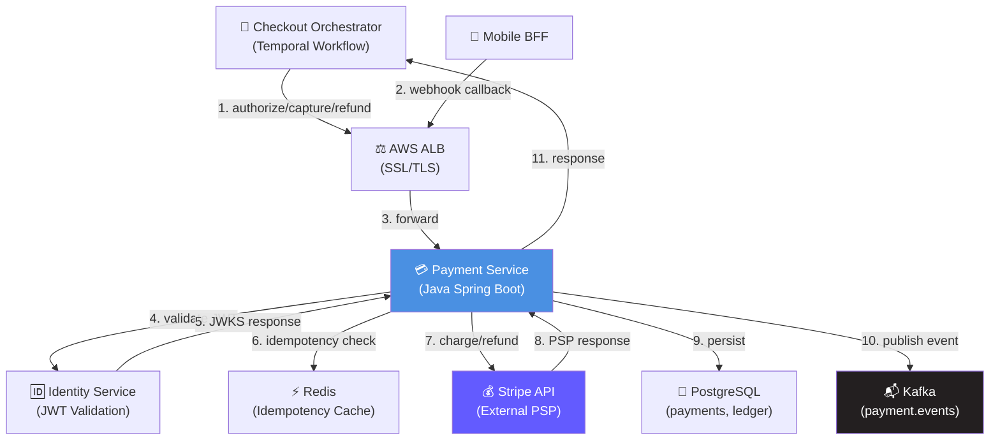
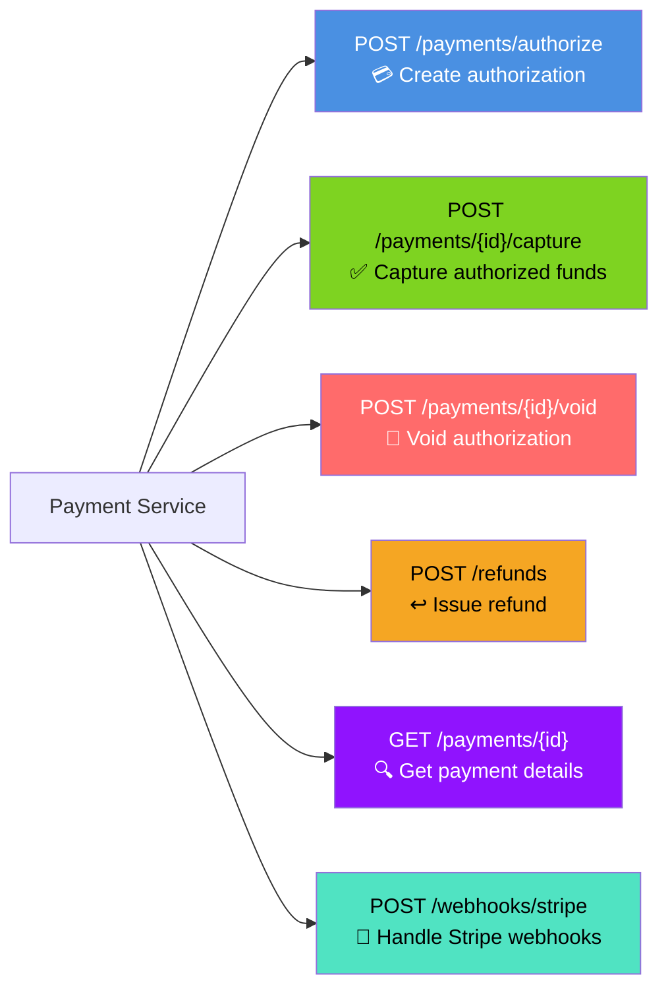
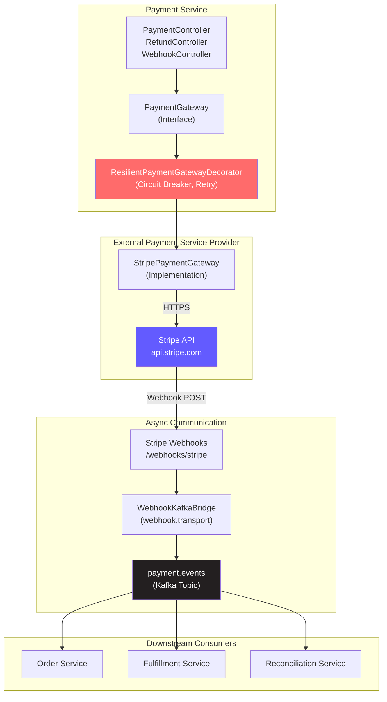
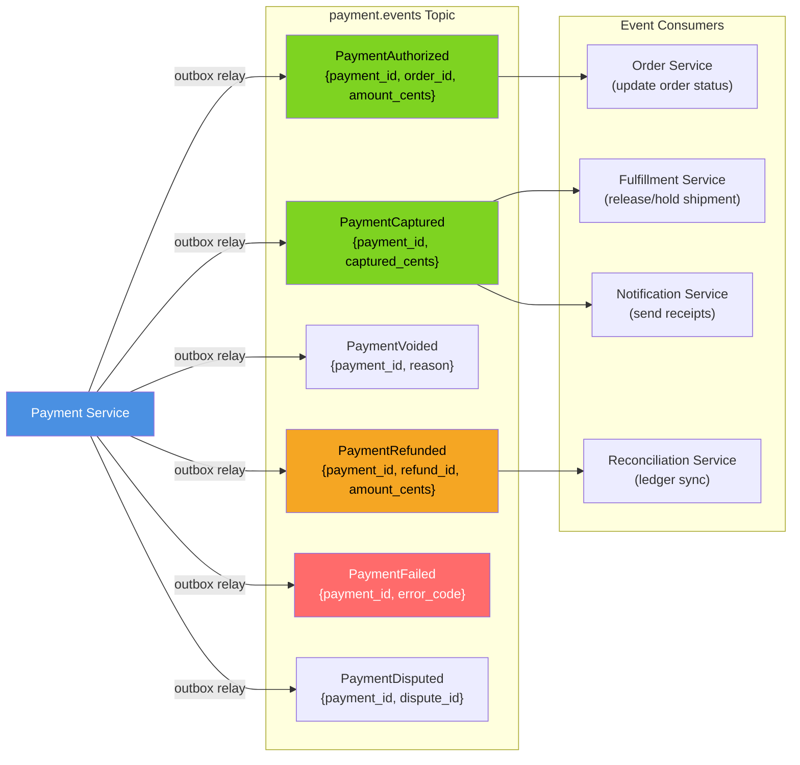
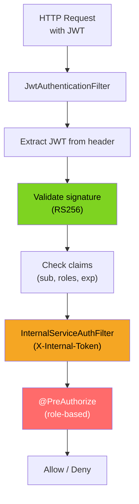
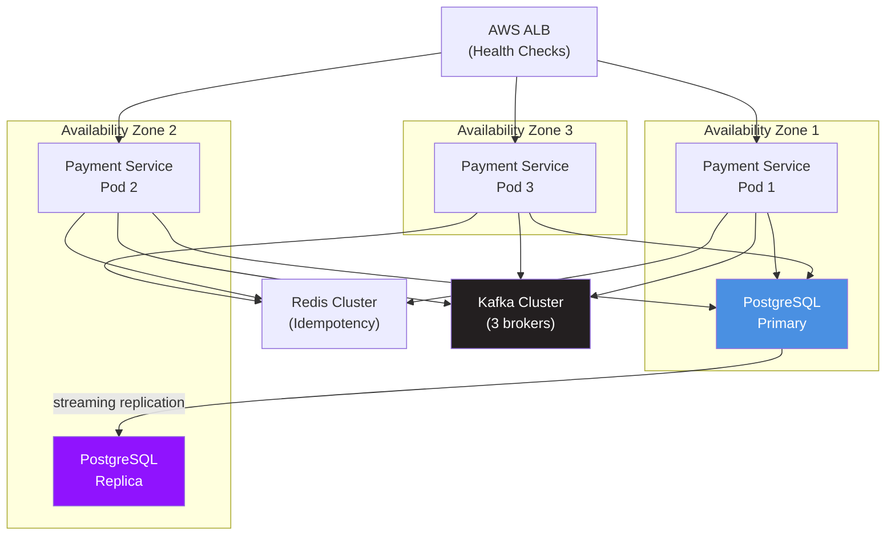

# Payment Service - High-Level Design

```mermaid
graph TB
    Client["🛒 Checkout Orchestrator<br/>(Temporal Workflow)"]
    MobileBFF["📱 Mobile BFF"]
    ALB["⚖️ AWS ALB<br/>(SSL/TLS)"]
    PaymentService["💳 Payment Service<br/>(Java Spring Boot)"]
    StripeAPI["💰 Stripe API<br/>(External PSP)"]
    PostgreSQL["🐘 PostgreSQL<br/>(payments, ledger)"]
    Redis["⚡ Redis<br/>(Idempotency Cache)"]
    Kafka["📬 Kafka<br/>(payment.events)"]
    IdentityService["🆔 Identity Service<br/>(JWT Validation)"]

    Client -->|1. authorize/capture/refund| ALB
    MobileBFF -->|2. webhook callback| ALB
    ALB -->|3. forward| PaymentService
    PaymentService -->|4. validate JWT| IdentityService
    IdentityService -->|5. JWKS response| PaymentService
    PaymentService -->|6. idempotency check| Redis
    PaymentService -->|7. charge/refund| StripeAPI
    StripeAPI -->|8. PSP response| PaymentService
    PaymentService -->|9. persist| PostgreSQL
    PaymentService -->|10. publish event| Kafka
    PaymentService -->|11. response| Client

    style PaymentService fill:#4A90E2,color:#fff
    style StripeAPI fill:#635BFF,color:#fff
    style Kafka fill:#231F20,color:#fff
```

## Payment API Endpoints

```mermaid
graph LR
    Gateway["Payment Service"]

    AuthEP["POST /payments/authorize<br/>💳 Create authorization"]
    CaptureEP["POST /payments/{id}/capture<br/>✅ Capture authorized funds"]
    VoidEP["POST /payments/{id}/void<br/>🚫 Void authorization"]
    RefundEP["POST /refunds<br/>↩️ Issue refund"]
    GetEP["GET /payments/{id}<br/>🔍 Get payment details"]
    WebhookEP["POST /webhooks/stripe<br/>📨 Handle Stripe webhooks"]

    Gateway --> AuthEP
    Gateway --> CaptureEP
    Gateway --> VoidEP
    Gateway --> RefundEP
    Gateway --> GetEP
    Gateway --> WebhookEP

    style AuthEP fill:#4A90E2,color:#fff
    style CaptureEP fill:#7ED321,color:#000
    style VoidEP fill:#FF6B6B,color:#fff
    style RefundEP fill:#F5A623,color:#000
    style GetEP fill:#9013FE,color:#fff
    style WebhookEP fill:#50E3C2,color:#000
```

## External Integrations

```mermaid
graph TB
    subgraph PaymentService["Payment Service"]
        Controller["PaymentController<br/>RefundController<br/>WebhookController"]
        Gateway["PaymentGateway<br/>(Interface)"]
        ResilientDecorator["ResilientPaymentGatewayDecorator<br/>(Circuit Breaker, Retry)"]
    end

    subgraph ExternalPSP["External Payment Service Provider"]
        StripeGateway["StripePaymentGateway<br/>(Implementation)"]
        StripeAPI["Stripe API<br/>api.stripe.com"]
    end

    subgraph Async["Async Communication"]
        WebhookEndpoint["Stripe Webhooks<br/>/webhooks/stripe"]
        KafkaBridge["WebhookKafkaBridge<br/>(webhook.transport)"]
        PaymentEvents["payment.events<br/>(Kafka Topic)"]
    end

    subgraph Downstream["Downstream Consumers"]
        OrderService["Order Service"]
        FulfillmentService["Fulfillment Service"]
        ReconciliationService["Reconciliation Service"]
    end

    Controller --> Gateway
    Gateway --> ResilientDecorator
    ResilientDecorator --> StripeGateway
    StripeGateway -->|HTTPS| StripeAPI
    
    StripeAPI -->|Webhook POST| WebhookEndpoint
    WebhookEndpoint --> KafkaBridge
    KafkaBridge --> PaymentEvents
    PaymentEvents --> OrderService
    PaymentEvents --> FulfillmentService
    PaymentEvents --> ReconciliationService

    style StripeAPI fill:#635BFF,color:#fff
    style PaymentEvents fill:#231F20,color:#fff
    style ResilientDecorator fill:#FF6B6B,color:#fff
```

## Kafka Event Publishing

```mermaid
graph LR
    PaymentService["Payment Service"]
    
    subgraph Events["payment.events Topic"]
        AuthorizedEvent["PaymentAuthorized<br/>{payment_id, order_id, amount_cents}"]
        CapturedEvent["PaymentCaptured<br/>{payment_id, captured_cents}"]
        VoidedEvent["PaymentVoided<br/>{payment_id, reason}"]
        RefundedEvent["PaymentRefunded<br/>{payment_id, refund_id, amount_cents}"]
        FailedEvent["PaymentFailed<br/>{payment_id, error_code}"]
        DisputeEvent["PaymentDisputed<br/>{payment_id, dispute_id}"]
    end

    subgraph Consumers["Event Consumers"]
        OrderConsumer["Order Service<br/>(update order status)"]
        FulfillmentConsumer["Fulfillment Service<br/>(release/hold shipment)"]
        ReconcileConsumer["Reconciliation Service<br/>(ledger sync)"]
        NotificationConsumer["Notification Service<br/>(send receipts)"]
    end

    PaymentService -->|outbox relay| AuthorizedEvent
    PaymentService -->|outbox relay| CapturedEvent
    PaymentService -->|outbox relay| VoidedEvent
    PaymentService -->|outbox relay| RefundedEvent
    PaymentService -->|outbox relay| FailedEvent
    PaymentService -->|outbox relay| DisputeEvent

    AuthorizedEvent --> OrderConsumer
    CapturedEvent --> FulfillmentConsumer
    RefundedEvent --> ReconcileConsumer
    CapturedEvent --> NotificationConsumer

    style PaymentService fill:#4A90E2,color:#fff
    style AuthorizedEvent fill:#7ED321,color:#000
    style CapturedEvent fill:#7ED321,color:#000
    style RefundedEvent fill:#F5A623,color:#000
    style FailedEvent fill:#FF6B6B,color:#fff
```

## Security & Authentication

```mermaid
graph TD
    Request["HTTP Request<br/>with JWT"]
    JwtFilter["JwtAuthenticationFilter"]
    Extract["Extract JWT from header"]
    Validate["Validate signature<br/>(RS256)"]
    CheckClaims["Check claims<br/>(sub, roles, exp)"]
    InternalAuth["InternalServiceAuthFilter<br/>(X-Internal-Token)"]
    AuthzCheck["@PreAuthorize<br/>(role-based)"]
    AllowOrDeny["Allow / Deny"]

    Request --> JwtFilter
    JwtFilter --> Extract
    Extract --> Validate
    Validate --> CheckClaims
    CheckClaims --> InternalAuth
    InternalAuth --> AuthzCheck
    AuthzCheck --> AllowOrDeny

    style Validate fill:#7ED321,color:#000
    style InternalAuth fill:#F5A623,color:#000
    style AuthzCheck fill:#FF6B6B,color:#fff
```

## High-Availability Architecture

```mermaid
graph TB
    subgraph Zone1["Availability Zone 1"]
        PS1["Payment Service<br/>Pod 1"]
        PG1["PostgreSQL<br/>Primary"]
    end

    subgraph Zone2["Availability Zone 2"]
        PS2["Payment Service<br/>Pod 2"]
        PG2["PostgreSQL<br/>Replica"]
    end

    subgraph Zone3["Availability Zone 3"]
        PS3["Payment Service<br/>Pod 3"]
    end

    ALB["AWS ALB<br/>(Health Checks)"]
    Redis["Redis Cluster<br/>(Idempotency)"]
    Kafka["Kafka Cluster<br/>(3 brokers)"]

    ALB --> PS1
    ALB --> PS2
    ALB --> PS3

    PS1 --> PG1
    PS2 --> PG1
    PS3 --> PG1

    PG1 -->|streaming replication| PG2

    PS1 --> Redis
    PS2 --> Redis
    PS3 --> Redis

    PS1 --> Kafka
    PS2 --> Kafka
    PS3 --> Kafka

    style PG1 fill:#4A90E2,color:#fff
    style PG2 fill:#9013FE,color:#fff
    style Kafka fill:#231F20,color:#fff
```
