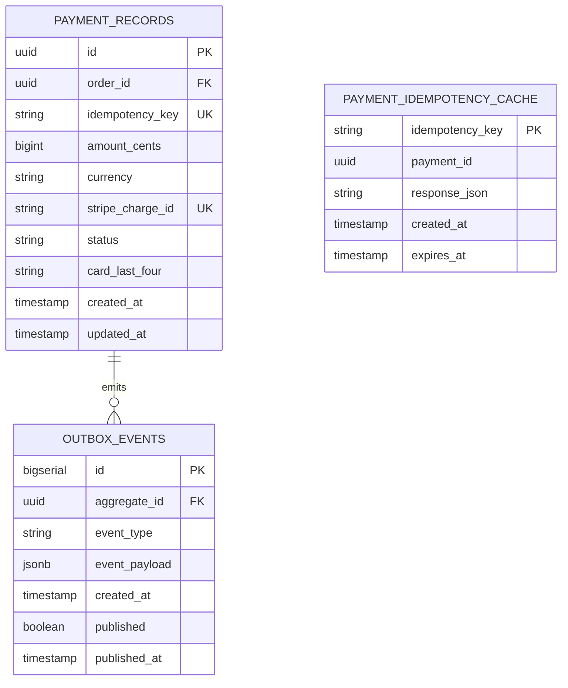

# Payment Service - ER Diagram & Database Schema

## Entity Relationship Diagram



## Full Database Schema (DDL)

```sql
-- Main payment records table
CREATE TABLE payment_records (
    id UUID PRIMARY KEY DEFAULT gen_random_uuid(),
    order_id UUID NOT NULL,
    idempotency_key VARCHAR(255) NOT NULL,
    amount_cents BIGINT NOT NULL CHECK (amount_cents > 0),
    currency VARCHAR(3) NOT NULL DEFAULT 'USD',
    stripe_charge_id VARCHAR(255),
    status VARCHAR(50) NOT NULL
        CHECK (status IN ('PENDING', 'AUTHORIZED', 'CAPTURED', 'VOIDED', 'REFUNDED', 'FAILED', 'REFUND_FAILED')),
    card_last_four VARCHAR(4),
    card_brand VARCHAR(50),
    created_at TIMESTAMP NOT NULL DEFAULT NOW(),
    updated_at TIMESTAMP NOT NULL DEFAULT NOW(),

    -- Foreign key (loosely coupled; no hard FK to orders)
    -- FOREIGN KEY (order_id) REFERENCES orders(id) ON DELETE CASCADE

    CONSTRAINT payment_records_unique_idempotency UNIQUE (idempotency_key)
);

CREATE INDEX idx_payment_records_order_id ON payment_records(order_id);
CREATE INDEX idx_payment_records_stripe_id ON payment_records(stripe_charge_id);
CREATE INDEX idx_payment_records_status ON payment_records(status);
CREATE INDEX idx_payment_records_created_at ON payment_records(created_at);

-- Outbox table for CDC (Change Data Capture)
CREATE TABLE outbox_events (
    id BIGSERIAL PRIMARY KEY,
    aggregate_id UUID NOT NULL,  -- payment_id
    aggregate_type VARCHAR(100) NOT NULL DEFAULT 'Payment',
    event_type VARCHAR(100) NOT NULL,
    event_payload JSONB NOT NULL,
    created_at TIMESTAMP NOT NULL DEFAULT NOW(),
    published BOOLEAN NOT NULL DEFAULT FALSE,
    published_at TIMESTAMP,

    CONSTRAINT outbox_unique_event UNIQUE (aggregate_id, created_at, event_type)
);

CREATE INDEX idx_outbox_events_published ON outbox_events(published, created_at);
CREATE INDEX idx_outbox_events_aggregate_id ON outbox_events(aggregate_id);

-- Idempotency cache (in-app, TTL 24 hours)
-- (Alternatively, can be Redis; shown here for completeness)
CREATE TABLE payment_idempotency_cache (
    idempotency_key VARCHAR(255) PRIMARY KEY,
    payment_id UUID NOT NULL,
    response_json JSONB NOT NULL,
    created_at TIMESTAMP NOT NULL DEFAULT NOW(),
    expires_at TIMESTAMP NOT NULL DEFAULT NOW() + INTERVAL '24 hours'
);

CREATE INDEX idx_idempotency_cache_expires ON payment_idempotency_cache(expires_at);
```

## Data Model (JSON Representations)

```json
{
  "payment_records": {
    "id": "f47ac10b-58cc-4372-a567-0e02b2c3d479",
    "order_id": "a1b2c3d4-e5f6-4g7h-8i9j-0k1l2m3n4o5p",
    "idempotency_key": "order:a1b2c3d4:checkout:20260321T084500Z",
    "amount_cents": 295999,
    "currency": "USD",
    "stripe_charge_id": "ch_1ABC123ABC123",
    "status": "AUTHORIZED",
    "card_last_four": "4242",
    "card_brand": "Visa",
    "created_at": "2026-03-21T08:45:00Z",
    "updated_at": "2026-03-21T08:45:00Z"
  },

  "outbox_event_sample": {
    "id": 12345,
    "aggregate_id": "f47ac10b-58cc-4372-a567-0e02b2c3d479",
    "aggregate_type": "Payment",
    "event_type": "PaymentAuthorizedEvent",
    "event_payload": {
      "payment_id": "f47ac10b-58cc-4372-a567-0e02b2c3d479",
      "order_id": "a1b2c3d4-e5f6-4g7h-8i9j-0k1l2m3n4o5p",
      "amount_cents": 295999,
      "currency": "USD",
      "stripe_charge_id": "ch_1ABC123ABC123",
      "timestamp": "2026-03-21T08:45:00Z"
    },
    "created_at": "2026-03-21T08:45:00Z",
    "published": false,
    "published_at": null
  }
}
```

## Concurrency & Constraints

- **Pessimistic lock**: None (payment_records uses optimistic concurrency via timestamps)
- **Unique constraints**: `idempotency_key` (ensures at-most-once semantics)
- **Stripe charge_id**: Unique (1:1 mapping to payment_records)
- **Outbox constraint**: `(aggregate_id, created_at, event_type)` unique (prevents duplicate event emission)
- **Check constraint**: `amount_cents > 0` (no zero/negative payments)

## Archival & Retention

- **Hot data**: Last 90 days (active settlement window)
- **Archive**: Older records moved to `payment_records_archive` table (for compliance)
- **Retention policy**: 7 years (financial compliance; PCI DSS)

---

**Normalization**: 3NF (all non-key attributes fully depend on primary key)
**Replica sync**: Async (read replicas lag ≤5s behind primary)
