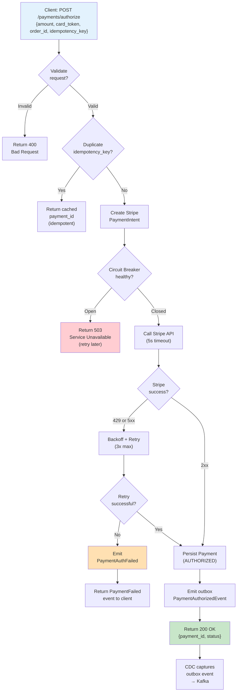
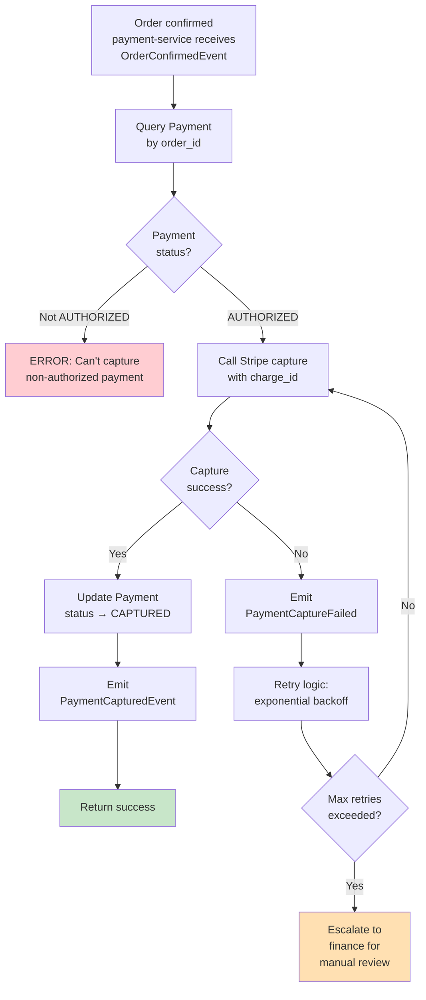
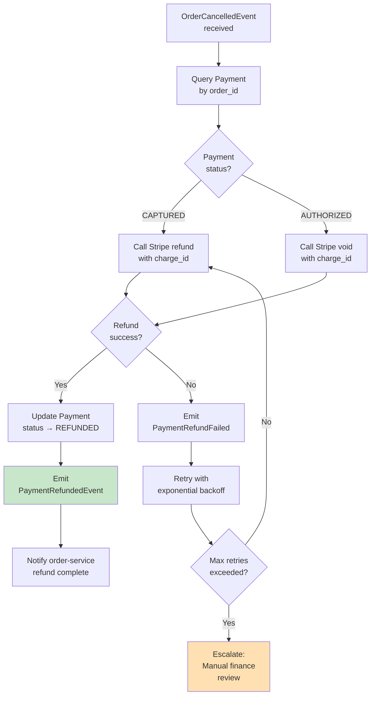

# Payment Service - Flowchart

## Authorization Flow

```mermaid
flowchart TD
    A["Client: POST /payments/authorize<br/>{amount, card_token, order_id, idempotency_key}"] --> B{"Validate<br/>request?"}
    B -->|Invalid| B1["Return 400<br/>Bad Request"]
    B -->|Valid| C{"Duplicate<br/>idempotency_key?"}
    C -->|Yes| C1["Return cached<br/>payment_id<br/>(idempotent)"]
    C -->|No| D["Create Stripe<br/>PaymentIntent"]
    D --> E{"Circuit Breaker<br/>healthy?"}
    E -->|Open| E1["Return 503<br/>Service Unavailable<br/>(retry later)"]
    E -->|Closed| F["Call Stripe API<br/>(5s timeout)"]
    F --> G{"Stripe<br/>success?"}
    G -->|429 or 5xx| G1["Backoff + Retry<br/>(3x max)"]
    G1 --> H{"Retry<br/>successful?"}
    H -->|No| H1["Emit<br/>PaymentAuthFailed"]
    H1 --> H2["Return PaymentFailed<br/>event to client"]
    H -->|Yes| I["Persist Payment<br/>(AUTHORIZED)"]
    G -->|2xx| I
    I --> J["Emit outbox<br/>PaymentAuthorizedEvent"]
    J --> K["Return 200 OK<br/>{payment_id, status}"]
    K --> L["CDC captures<br/>outbox event<br/>→ Kafka"]

    style A fill:#E3F2FD
    style K fill:#C8E6C9
    style E1 fill:#FFCDD2
    style H1 fill:#FFE0B2
```

## Capture Flow (Post-Confirm)

```mermaid
flowchart TD
    C1["Order confirmed<br/>payment-service receives<br/>OrderConfirmedEvent"] --> C2["Query Payment<br/>by order_id"]
    C2 --> C3{"Payment<br/>status?"}
    C3 -->|Not AUTHORIZED| C4["ERROR: Can't capture<br/>non-authorized payment"]
    C3 -->|AUTHORIZED| C5["Call Stripe capture<br/>with charge_id"]
    C5 --> C6{"Capture<br/>success?"}
    C6 -->|Yes| C7["Update Payment<br/>status → CAPTURED"]
    C7 --> C8["Emit<br/>PaymentCapturedEvent"]
    C8 --> C9["Return success"]
    C6 -->|No| C10["Emit<br/>PaymentCaptureFailed"]
    C10 --> C11["Retry logic:<br/>exponential backoff"]
    C11 --> C12{"Max retries<br/>exceeded?"}
    C12 -->|No| C5
    C12 -->|Yes| C13["Escalate to<br/>finance for<br/>manual review"]

    style C9 fill:#C8E6C9
    style C4 fill:#FFCDD2
    style C13 fill:#FFE0B2
```

## Refund Flow (On Order Cancellation)

```mermaid
flowchart TD
    R1["OrderCancelledEvent<br/>received"] --> R2["Query Payment<br/>by order_id"]
    R2 --> R3{"Payment<br/>status?"}
    R3 -->|CAPTURED| R4["Call Stripe refund<br/>with charge_id"]
    R3 -->|AUTHORIZED| R5["Call Stripe void<br/>with charge_id"]
    R4 --> R6{"Refund<br/>success?"}
    R5 --> R6
    R6 -->|Yes| R7["Update Payment<br/>status → REFUNDED"]
    R7 --> R8["Emit<br/>PaymentRefundedEvent"]
    R6 -->|No| R9["Emit<br/>PaymentRefundFailed"]
    R9 --> R10["Retry with<br/>exponential backoff"]
    R10 --> R11{"Max retries<br/>exceeded?"}
    R11 -->|No| R4
    R11 -->|Yes| R12["Escalate:<br/>Manual finance<br/>review"]
    R8 --> R13["Notify order-service<br/>refund complete"]

    style R8 fill:#C8E6C9
    style R12 fill:#FFE0B2
```
