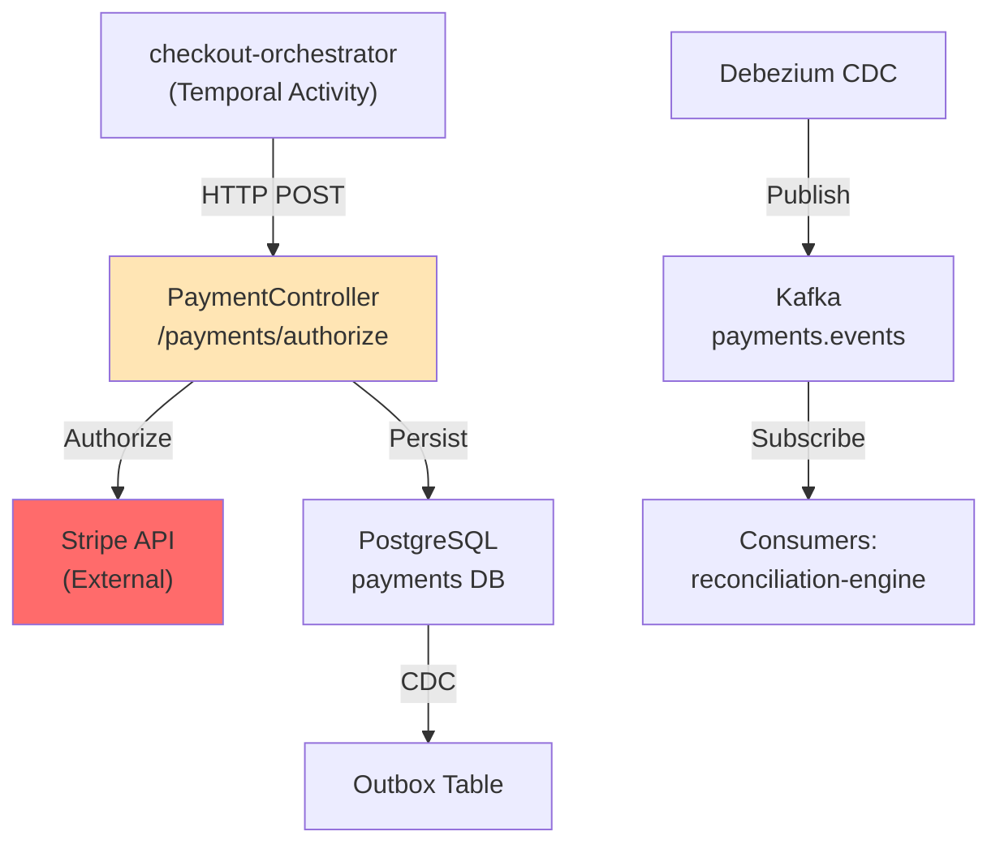

# Payment Service - HLD & LLD

## High-Level Design



## Low-Level Components

### PaymentController
**Endpoints**: authorize, capture, void, get (admin)

**Key Logic**:
- AuthorizeRequest validation
- Stripe API call with circuit breaker + retry
- Persist Payment entity with AUTHORIZED status
- Generate OutboxEvent
- Return PaymentResponse

### PaymentService
**Core Operations**:
- authorize(request) → Call Stripe, persist, return PaymentId
- capture(id, amountCents) → Verify AUTHORIZED, call capture on Stripe, update status
- voidAuth(id) → Verify AUTHORIZED, void on Stripe, update status
- get(id) → Query from DB (admin only)

### Stripe Integration
**Library**: com.stripe:stripe-java
**Circuit Breaker**: paymentGateway (50% threshold, 30s wait)
**Retry**: maxAttempts=3, waitDuration=1s
**Timeout**: 5 seconds

### Recovery Jobs
- **StalePendingRecovery**: Every 5 minutes, batch capture AUTHORIZED payments >30 min old
- **StalePendingRefundRecovery**: Every 10 minutes, process stuck REFUNDING payments
- **LedgerIntegrityVerification**: Every 15 minutes, validate debit/credit balance

### Ledger Table
```java
@Entity
public class PaymentLedger {
    @Id private UUID id;
    private UUID paymentId;
    private Long amountCents;
    private String operation;  // AUTHORIZE, CAPTURE, VOID, REFUND
    private Instant timestamp;
}
```

**Invariant**: Sum(AUTHORIZE) - Sum(VOID) = Sum(CAPTURE) - Sum(REFUND)

---

## Database Schema

```sql
CREATE TABLE payments (
    id UUID PRIMARY KEY,
    order_id UUID NOT NULL,
    user_id UUID NOT NULL,
    amount_cents BIGINT NOT NULL,
    currency VARCHAR(3) NOT NULL DEFAULT 'INR',
    status VARCHAR(20) NOT NULL,  -- AUTHORIZED, CAPTURED, VOIDED, REFUNDED, FAILED
    idempotency_key VARCHAR(64) UNIQUE NOT NULL,
    stripe_charge_id VARCHAR(255),
    created_at TIMESTAMPTZ NOT NULL DEFAULT now(),
    updated_at TIMESTAMPTZ NOT NULL DEFAULT now(),
    version BIGINT NOT NULL DEFAULT 0
);

CREATE TABLE payment_ledger (
    id UUID PRIMARY KEY,
    payment_id UUID NOT NULL REFERENCES payments(id),
    amount_cents BIGINT NOT NULL,
    operation VARCHAR(20) NOT NULL,
    timestamp TIMESTAMPTZ NOT NULL DEFAULT now()
);

CREATE TABLE outbox_events (
    id UUID PRIMARY KEY,
    aggregate_type VARCHAR(50) NOT NULL,
    aggregate_id VARCHAR(255) NOT NULL,
    event_type VARCHAR(50) NOT NULL,
    payload JSONB NOT NULL,
    created_at TIMESTAMPTZ NOT NULL DEFAULT now(),
    sent BOOLEAN NOT NULL DEFAULT false
);

CREATE INDEX idx_payments_order ON payments(order_id);
CREATE INDEX idx_payments_user ON payments(user_id);
CREATE INDEX idx_payments_status ON payments(status);
CREATE INDEX idx_outbox_unsent ON outbox_events(sent) WHERE sent = false;
CREATE INDEX idx_ledger_payment ON payment_ledger(payment_id);
```

---

## API Examples

### Authorize Payment
```bash
POST /payments/authorize
{
  "orderId": "550e8400-...",
  "userId": "550e8400-...",
  "amountCents": 99999,
  "currency": "INR",
  "idempotencyKey": "checkout-abc-123"
}

Response (201):
{
  "id": "pay-550e8400-...",
  "status": "AUTHORIZED",
  "amountCents": 99999
}
```

### Capture Payment
```bash
POST /payments/{id}/capture
{
  "amountCents": 99999,
  "idempotencyKey": "capture-abc-456"
}

Response (200):
{
  "id": "pay-550e8400-...",
  "status": "CAPTURED",
  "amountCents": 99999
}
```

---

## Kafka Events

### PaymentAuthorized
```json
{
  "eventType": "PaymentAuthorized",
  "aggregateId": "pay-550e8400-...",
  "payload": {
    "paymentId": "pay-550e8400-...",
    "orderId": "order-550e8400-...",
    "amountCents": 99999,
    "stripeChargeId": "ch_1234567890"
  }
}
```

### PaymentCaptured
```json
{
  "eventType": "PaymentCaptured",
  "aggregateId": "pay-550e8400-...",
  "payload": {
    "paymentId": "pay-550e8400-...",
    "amountCents": 99999,
    "capturedAt": "2026-03-21T10:00:00Z"
  }
}
```

---

## Resilience Strategy

**Circuit Breaker** (paymentGateway):
- Protects Stripe API calls
- Open after 50% failure rate on 20 calls
- Stays open 30s, then trials 5 calls

**Retry Policy**:
- 3 attempts with exponential backoff (1s initial)
- Idempotent via idempotencyKey

**Recovery Jobs**:
- Capture stuck AUTHORIZED payments
- Handle failed refunds gracefully
- Ledger integrity self-healing
