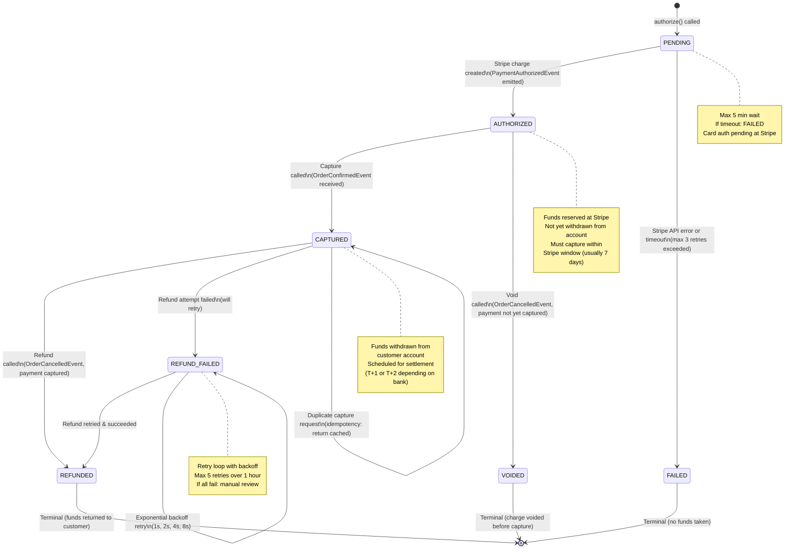

# Payment Service - State Machine

## State Transition Matrix

| From | To | Trigger | Event Emitted | Action |
|------|-----|---------|--------------|--------|
| PENDING | AUTHORIZED | Stripe succeed | PaymentAuthorizedEvent | Save charge_id, emit outbox event |
| PENDING | FAILED | Stripe fail x3 | PaymentAuthorizationFailedEvent | No funds taken; log failure |
| AUTHORIZED | CAPTURED | Capture API call | PaymentCapturedEvent | Call Stripe capture; update status |
| AUTHORIZED | VOIDED | Void API call | PaymentVoidedEvent | Call Stripe void; no funds taken |
| CAPTURED | REFUNDED | Refund API call | PaymentRefundedEvent | Call Stripe refund; emit event |
| CAPTURED | REFUND_FAILED | Refund fails | PaymentRefundFailedEvent | Schedule retry with backoff |
| REFUND_FAILED | REFUNDED | Retry succeeds | PaymentRefundedEvent | Success; emit event |

## Idempotency & Replay

- **PENDING state with duplicate authorize**: Query by `idempotency_key`; if exists, return cached payment_id (don't retry Stripe)
- **AUTHORIZED state with duplicate capture**: Query by `payment_id`; if already CAPTURED, return success response (don't call Stripe again)
- **Outbox replay**: If CDC fails to publish, Debezium connector retries; Kafka consumer handles duplicates via `event_id` deduplication

---

**Terminal States**: FAILED, VOIDED, REFUNDED (no further transitions)
**Idempotency Window**: 24 hours (server-side cache)
