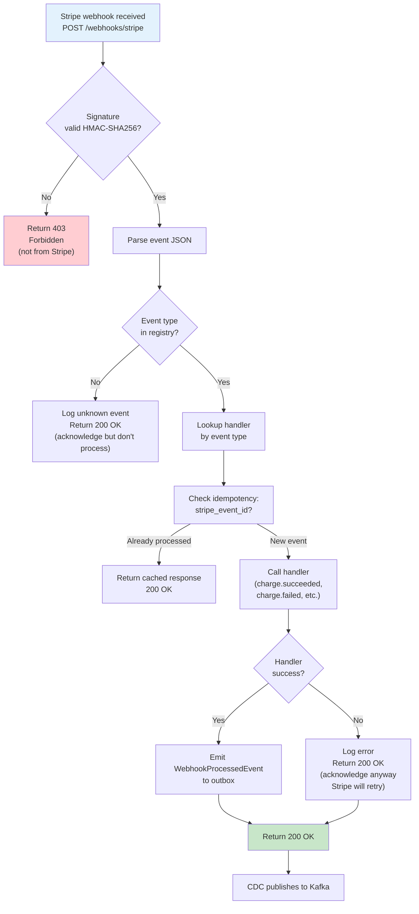
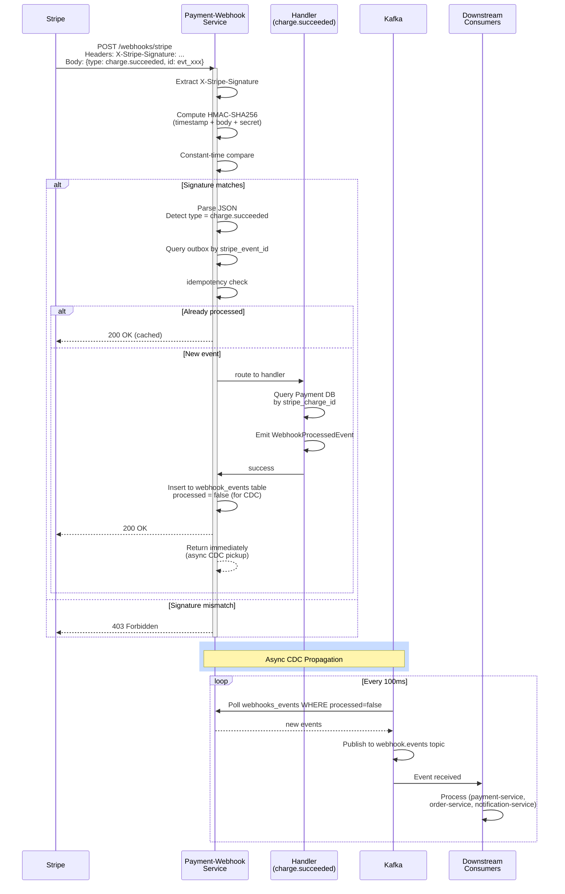

# Payment-Webhook-Service - Flowchart & Sequence

## Flowchart

```mermaid
flowchart TD
    A["Stripe webhook received<br/>POST /webhooks/stripe"] --> B{"Signature<br/>valid HMAC-SHA256?"}
    B -->|No| B1["Return 403<br/>Forbidden<br/>(not from Stripe)"]
    B -->|Yes| C["Parse event JSON"]
    C --> D{"Event type<br/>in registry?"}
    D -->|No| D1["Log unknown event<br/>Return 200 OK<br/>(acknowledge but don't process)"]
    D -->|Yes| E["Lookup handler<br/>by event type"]
    E --> F["Check idempotency:<br/>stripe_event_id?"]
    F -->|Already processed| F1["Return cached response<br/>200 OK"]
    F -->|New event| G["Call handler<br/>(charge.succeeded,<br/>charge.failed, etc.)"]
    G --> H{"Handler<br/>success?"}
    H -->|Yes| I["Emit WebhookProcessedEvent<br/>to outbox"]
    H -->|No| J["Log error<br/>Return 200 OK<br/>(acknowledge anyway<br/>Stripe will retry)"]
    I --> K["Return 200 OK"]
    J --> K
    K --> L["CDC publishes to Kafka"]

    style A fill:#E3F2FD
    style B1 fill:#FFCDD2
    style K fill:#C8E6C9
```

## Sequence Diagram

```mermaid
sequenceDiagram
    participant Stripe
    participant Webhook as Payment-Webhook<br/>Service
    participant Handler as Handler<br/>(charge.succeeded)
    participant Kafka
    participant Consumer as Downstream<br/>Consumers

    Stripe->>Webhook: POST /webhooks/stripe<br/>Headers: X-Stripe-Signature: ...<br/>Body: {type: charge.succeeded, id: evt_xxx}
    activate Webhook

    Webhook->>Webhook: Extract X-Stripe-Signature
    Webhook->>Webhook: Compute HMAC-SHA256<br/>(timestamp + body + secret)
    Webhook->>Webhook: Constant-time compare

    alt Signature matches
        Webhook->>Webhook: Parse JSON<br/>Detect type = charge.succeeded
        Webhook->>Webhook: Query outbox by stripe_event_id
        Webhook->>Webhook: idempotency check

        alt Already processed
            Webhook-->>Stripe: 200 OK (cached)
        else New event
            Webhook->>Handler: route to handler
            Handler->>Handler: Query Payment DB<br/>by stripe_charge_id
            Handler->>Handler: Emit WebhookProcessedEvent
            Handler->>Webhook: success
            Webhook->>Webhook: Insert to webhook_events table<br/>processed = false (for CDC)
            Webhook-->>Stripe: 200 OK
            Webhook-->>Webhook: Return immediately<br/>(async CDC pickup)
        end
    else Signature mismatch
        Webhook-->>Stripe: 403 Forbidden
    end
    deactivate Webhook

    rect rgb(200, 220, 255)
        Note over Webhook,Kafka: Async CDC Propagation
    end

    loop Every 100ms
        Kafka->>Webhook: Poll webhooks_events WHERE processed=false
        Webhook-->>Kafka: new events
        Kafka->>Kafka: Publish to webhook.events topic
        Kafka->>Consumer: Event received
        Consumer->>Consumer: Process (payment-service,<br/>order-service, notification-service)
    end
```
