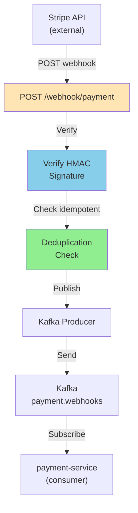

# Payment Webhook Service - Architecture & Implementation

## High-Level Architecture



## Components

### Webhook Handler (Go)
**File**: handler/webhook.go

```go
type WebhookRequest struct {
    ID       string                 `json:"id"`
    Type     string                 `json:"type"`
    Created  int64                  `json:"created"`
    Data     map[string]interface{} `json:"data"`
    Livemode bool                   `json:"livemode"`
}

func HandleWebhook(w http.ResponseWriter, r *http.Request) {
    // 1. Verify signature
    // 2. Dedup check
    // 3. Publish to Kafka
    // 4. Return 200 OK
}
```

### Signature Verification (Go)
**File**: handler/verify.go

```go
func VerifySignature(payload []byte, signature string, secret string) bool {
    mac := hmac.New(sha256.New, []byte(secret))
    mac.Write(payload)
    computedSig := hex.EncodeToString(mac.Sum(nil))
    return subtle.ConstantTimeCompare([]byte(signature), []byte(computedSig)) == 1
}
```

**Header**: `Stripe-Signature: t=<timestamp>,v1=<signature>`

### Deduplication (Go)
**File**: handler/dedup.go

```go
type DeduplicatorMemory struct {
    events map[string]int64  // eventId → timestamp
    mu     sync.RWMutex
}

func (d *DeduplicatorMemory) IsDuplicate(eventID string) bool {
    d.mu.RLock()
    defer d.mu.RUnlock()

    if ts, exists := d.events[eventID]; exists {
        // If within 24h, it's a duplicate
        return time.Now().Unix() - ts < 86400
    }
    return false
}

func (d *DeduplicatorMemory) Record(eventID string) {
    d.mu.Lock()
    defer d.mu.Unlock()
    d.events[eventID] = time.Now().Unix()
}
```

**TTL**: 24 hours (Stripe events older than this are considered new)

### Kafka Producer (Go)
**File**: main.go

```go
producer, _ := kafka.NewWriter(kafka.WriterConfig{
    Brokers:  []string{"kafka:9092"},
    Topic:    "payment.webhooks",
    Balancer: &kafka.LeastBytes{},
})

type WebhookMessage struct {
    ID             string          `json:"id"`
    Type           string          `json:"type"`
    Timestamp      int64           `json:"timestamp"`
    StripeMetadata json.RawMessage `json:"data"`
}

// Publish to Kafka
err := producer.WriteMessages(context.Background(),
    kafka.Message{
        Key:   []byte(webhookID),
        Value: marshaled,
    },
)
```

---

## Configuration

```bash
# Environment Variables
PORT=8120                    # Server port
STRIPE_WEBHOOK_SECRET=whsec_... # From Stripe dashboard
KAFKA_BROKERS=kafka:9092,kafka2:9092,kafka3:9092
KAFKA_TOPIC=payment.webhooks
KAFKA_CONSUMER_GROUP=payment-webhook-service
```

---

## API

### Receive Webhook
```bash
POST /webhook/payment
Content-Type: application/json
Stripe-Signature: t=1234567890,v1=abcd1234...

{
  "id": "evt_1234567890",
  "object": "event",
  "api_version": "2023-02-16",
  "created": 1234567890,
  "data": {
    "object": {
      "id": "ch_1234567890",
      "object": "charge",
      "amount": 99999,
      "currency": "inr",
      "status": "succeeded"
    }
  },
  "livemode": false,
  "pending_webhooks": 1,
  "request": { "id": null, "idempotency_key": null },
  "type": "charge.succeeded"
}
```

**Response (200 OK)**:
```json
{
  "status": "received",
  "eventId": "evt_1234567890"
}
```

### Health Check
```bash
GET /health

Response (200):
{
  "status": "up",
  "version": "1.0.0"
}
```

---

## Supported Webhook Events

| Event Type | Handler | Kafka Topic |
|------------|---------|------------|
| charge.succeeded | PublishWebhookEvent | payment.webhooks |
| charge.failed | PublishWebhookEvent | payment.webhooks |
| refund.created | PublishWebhookEvent | payment.webhooks |
| refund.updated | PublishWebhookEvent | payment.webhooks |
| customer.subscription.updated | PublishWebhookEvent | payment.webhooks |

---

## Metrics (Prometheus)

```
webhook_received_total{type="charge.succeeded"} = 1000
webhook_processed_total{type="charge.succeeded"} = 999
webhook_duplicate_total{type="charge.succeeded"} = 1
webhook_processing_duration_ms{type="charge.succeeded"} quantiles [50, 95, 99]
kafka_publish_errors_total{topic="payment.webhooks"} = 0
```

---

## Error Handling

| Error | Response | Action |
|-------|----------|--------|
| Invalid signature | 403 Forbidden | Reject |
| Duplicate (24h) | 200 OK | Skip publish |
| Kafka down | 503 Service Unavailable | Retry (Stripe will retry) |
| Unmarshalling error | 400 Bad Request | Reject (DLQ) |

---

## Deployment

**Docker**:
```dockerfile
FROM golang:1.24-alpine AS builder
WORKDIR /app
COPY . .
RUN go build -o webhook .

FROM alpine:3.20
COPY --from=builder /app/webhook /
EXPOSE 8120
ENTRYPOINT ["/webhook"]
```

**Port Mapping**:
- Container: 8120
- K8s Service: 8120
- Internal routing: 8106

---

## Performance

- **Throughput**: 10,000 webhooks/minute (per Go goroutine)
- **Latency**: P99 < 100ms (dedup + Kafka write)
- **Memory**: ~50MB (dedup map for 24h events)
- **Concurrency**: Goroutine-based (thousands concurrent)
