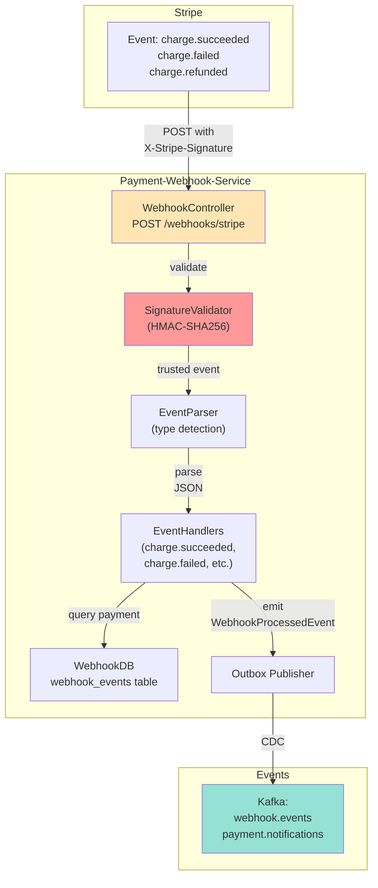

# Payment-Webhook-Service - LLD (Low-Level Design)



## Key Components

### WebhookController
- Endpoint: `POST /webhooks/stripe`
- Validates `X-Stripe-Signature` header
- Returns 200 OK for acknowledged events
- Returns 403 Forbidden for invalid signatures

### SignatureValidator
- HMAC-SHA256 verification
- Uses Stripe signing secret from environment
- Prevents man-in-the-middle attacks
- Stateless (can be called from any instance)

### EventParser & Handlers
- Detects event type (charge.succeeded, charge.failed, etc.)
- Routes to appropriate handler
- Each handler idempotent (event_id deduplication)
- Can safely process duplicate webhooks

### Webhook Schema
```sql
CREATE TABLE webhook_events (
    id UUID PRIMARY KEY,
    stripe_event_id VARCHAR(255) UNIQUE NOT NULL,
    event_type VARCHAR(100) NOT NULL,
    event_payload JSONB NOT NULL,
    received_at TIMESTAMP DEFAULT NOW(),
    processed BOOLEAN DEFAULT FALSE,
    processed_at TIMESTAMP
);
```

---

**SLO**: <100ms to return 200 OK; <5s to process and emit Kafka event
