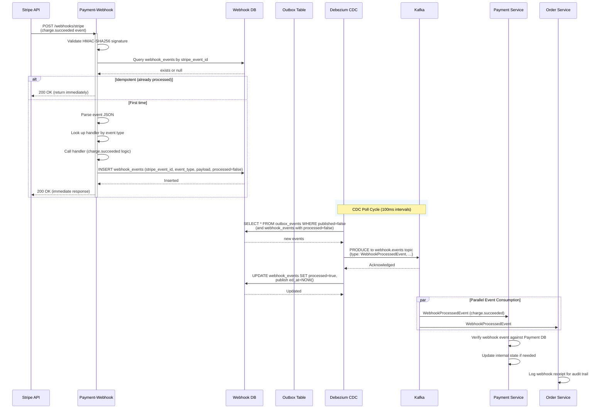

# Payment-Webhook-Service - Sequence

```mermaid
sequenceDiagram
    participant Stripe as Stripe API
    participant Webhook as Payment-Webhook
    participant DB as Webhook DB
    participant Outbox as Outbox Table
    participant CDC as Debezium CDC
    participant Kafka as Kafka
    participant Payment as Payment Service
    participant Order as Order Service

    Stripe->>Webhook: POST /webhooks/stripe<br/>(charge.succeeded event)
    activate Webhook

    Webhook->>Webhook: Validate HMAC-SHA256 signature
    Webhook->>DB: Query webhook_events by stripe_event_id
    DB-->>Webhook: exists or null

    alt Idempotent (already processed)
        Webhook-->>Stripe: 200 OK (return immediately)
    else First time
        Webhook->>Webhook: Parse event JSON
        Webhook->>Webhook: Look up handler by event type
        Webhook->>Webhook: Call handler (charge.succeeded logic)
        Webhook->>DB: INSERT webhook_events (stripe_event_id, event_type, payload, processed=false)
        DB-->>Webhook: Inserted
        Webhook-->>Stripe: 200 OK (immediate response)
    end

    deactivate Webhook

    rect rgb(240, 248, 255)
        Note over CDC,Kafka: CDC Poll Cycle (100ms intervals)
    end

    CDC->>DB: SELECT * FROM outbox_events WHERE published=false  <br/>(and webhook_events with processed=false)
    DB-->>CDC: new events

    CDC->>Kafka: PRODUCE to webhook.events topic<br/>{type: WebhookProcessedEvent, ...}
    Kafka-->>CDC: Acknowledged

    CDC->>DB: UPDATE webhook_events SET processed=true,  <br/>publish ed_at=NOW()
    DB-->>CDC: Updated

    par Parallel Event Consumption
        Kafka->>Payment: WebhookProcessedEvent (charge.succeeded)
        Kafka->>Order: WebhookProcessedEvent
    end

    Payment->>Payment: Verify webhook event against Payment DB
    Payment->>Payment: Update internal state if needed

    Order->>Order: Log webhook receipt for audit trail
```
