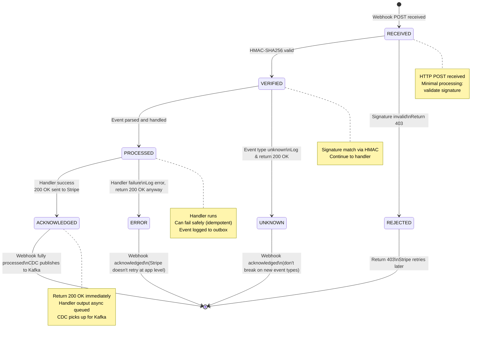
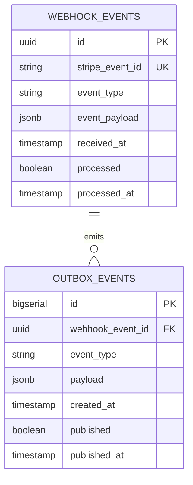
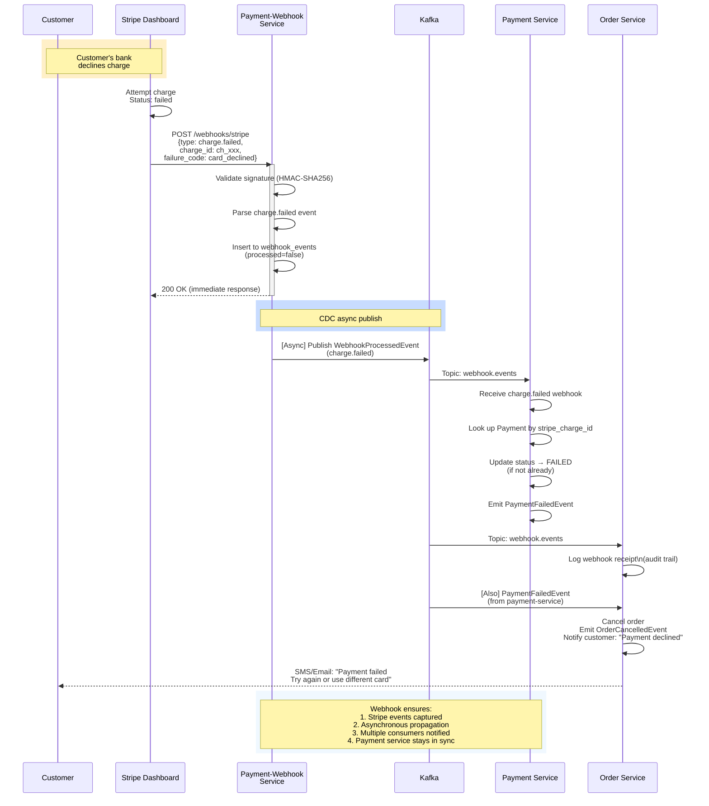

# Payment-Webhook-Service - State Machine, ER, End-to-End

## State Machine

## ER Diagram

## End-to-End: Webhook → Payment Update

---

**Key Principles**:
1. **Fast response**: Return 200 OK within 100ms
2. **Idempotency**: stripe_event_id deduplication ensures safety
3. **Async processing**: CDC handles downstream Kafka publishing
4. **Resilience**: Return 200 OK even if handler fails; Stripe won't retry on 2xx
