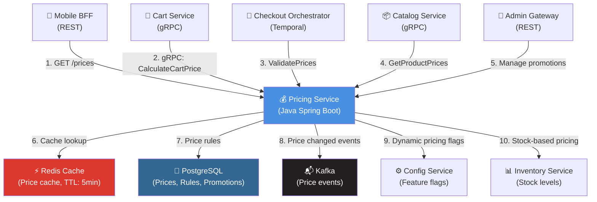
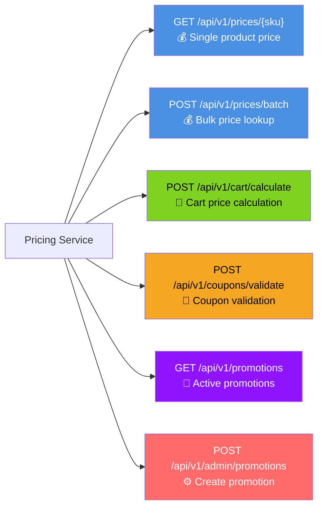
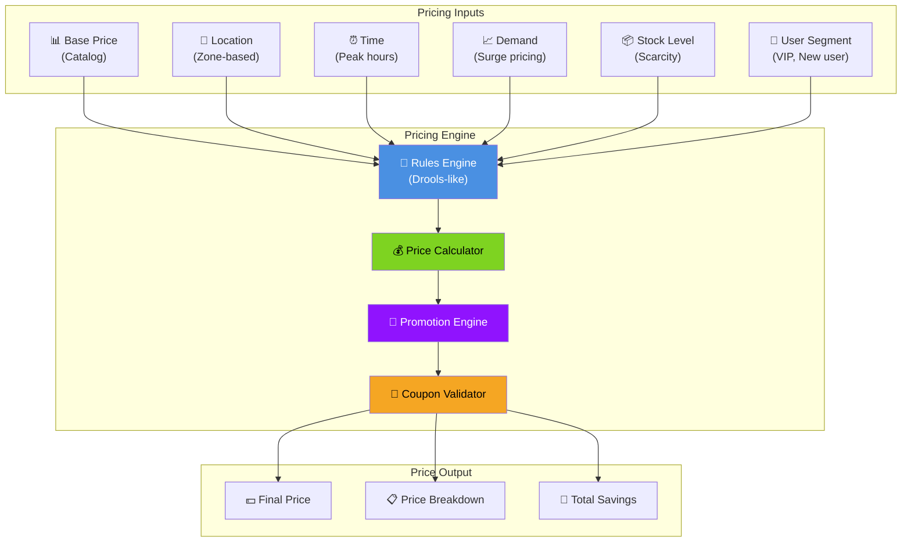
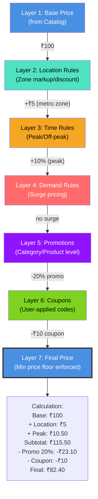
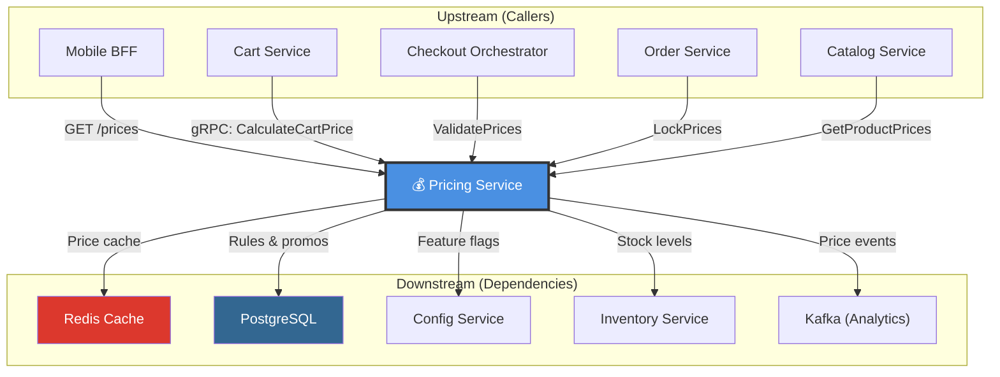

# Pricing Service - High-Level Design

```mermaid
graph TB
    MobileBFF["📱 Mobile BFF<br/>(REST)"]
    CartService["🛒 Cart Service<br/>(gRPC)"]
    CheckoutOrch["🔄 Checkout Orchestrator<br/>(Temporal)"]
    CatalogService["📦 Catalog Service<br/>(gRPC)"]
    AdminGateway["🔐 Admin Gateway<br/>(REST)"]

    PricingService["💰 Pricing Service<br/>(Java Spring Boot)"]

    Redis["⚡ Redis Cache<br/>(Price cache, TTL: 5min)"]
    PostgreSQL["🐘 PostgreSQL<br/>(Prices, Rules, Promotions)"]
    Kafka["📬 Kafka<br/>(Price events)"]
    ConfigService["⚙️ Config Service<br/>(Feature flags)"]
    InventoryService["📊 Inventory Service<br/>(Stock levels)"]

    MobileBFF -->|1. GET /prices| PricingService
    CartService -->|2. gRPC: CalculateCartPrice| PricingService
    CheckoutOrch -->|3. ValidatePrices| PricingService
    CatalogService -->|4. GetProductPrices| PricingService
    AdminGateway -->|5. Manage promotions| PricingService

    PricingService -->|6. Cache lookup| Redis
    PricingService -->|7. Price rules| PostgreSQL
    PricingService -->|8. Price changed events| Kafka
    PricingService -->|9. Dynamic pricing flags| ConfigService
    PricingService -->|10. Stock-based pricing| InventoryService

    style PricingService fill:#4A90E2,color:#fff
    style PostgreSQL fill:#336791,color:#fff
    style Redis fill:#DC382D,color:#fff
    style Kafka fill:#231F20,color:#fff
```

## Core API Endpoints

```mermaid
graph LR
    PricingService["Pricing Service"]

    GetPrice["GET /api/v1/prices/{sku}<br/>💰 Single product price"]
    GetPrices["POST /api/v1/prices/batch<br/>💰 Bulk price lookup"]
    CalcCart["POST /api/v1/cart/calculate<br/>🛒 Cart price calculation"]
    ApplyCoupon["POST /api/v1/coupons/validate<br/>🎫 Coupon validation"]
    GetPromos["GET /api/v1/promotions<br/>🎁 Active promotions"]
    AdminPromos["POST /api/v1/admin/promotions<br/>⚙️ Create promotion"]

    PricingService --> GetPrice
    PricingService --> GetPrices
    PricingService --> CalcCart
    PricingService --> ApplyCoupon
    PricingService --> GetPromos
    PricingService --> AdminPromos

    style GetPrice fill:#4A90E2,color:#fff
    style GetPrices fill:#4A90E2,color:#fff
    style CalcCart fill:#7ED321,color:#000
    style ApplyCoupon fill:#F5A623,color:#000
    style GetPromos fill:#9013FE,color:#fff
    style AdminPromos fill:#FF6B6B,color:#fff
```

## Dynamic Pricing Architecture

```mermaid
graph TB
    subgraph inputs["Pricing Inputs"]
        BasePrice["📊 Base Price<br/>(Catalog)"]
        Location["📍 Location<br/>(Zone-based)"]
        Time["⏰ Time<br/>(Peak hours)"]
        Demand["📈 Demand<br/>(Surge pricing)"]
        Stock["📦 Stock Level<br/>(Scarcity)"]
        Segment["👤 User Segment<br/>(VIP, New user)"]
    end

    subgraph engine["Pricing Engine"]
        RulesEngine["🔧 Rules Engine<br/>(Drools-like)"]
        PriceCalculator["💰 Price Calculator"]
        PromotionEngine["🎁 Promotion Engine"]
        CouponValidator["🎫 Coupon Validator"]
    end

    subgraph output["Price Output"]
        FinalPrice["💵 Final Price"]
        Breakdown["📋 Price Breakdown"]
        Savings["💸 Total Savings"]
    end

    BasePrice --> RulesEngine
    Location --> RulesEngine
    Time --> RulesEngine
    Demand --> RulesEngine
    Stock --> RulesEngine
    Segment --> RulesEngine

    RulesEngine --> PriceCalculator
    PriceCalculator --> PromotionEngine
    PromotionEngine --> CouponValidator

    CouponValidator --> FinalPrice
    CouponValidator --> Breakdown
    CouponValidator --> Savings

    style RulesEngine fill:#4A90E2,color:#fff
    style PriceCalculator fill:#7ED321,color:#000
    style PromotionEngine fill:#9013FE,color:#fff
    style CouponValidator fill:#F5A623,color:#000
```

## Pricing Hierarchy & Precedence

```mermaid
graph TD
    L1["Layer 1: Base Price<br/>(from Catalog)"]
    L2["Layer 2: Location Rules<br/>(Zone markup/discount)"]
    L3["Layer 3: Time Rules<br/>(Peak/Off-peak)"]
    L4["Layer 4: Demand Rules<br/>(Surge pricing)"]
    L5["Layer 5: Promotions<br/>(Category/Product level)"]
    L6["Layer 6: Coupons<br/>(User-applied codes)"]
    L7["Layer 7: Final Price<br/>(Min price floor enforced)"]

    L1 -->|"₹100"| L2
    L2 -->|"+₹5 (metro zone)"| L3
    L3 -->|"+10% (peak)"| L4
    L4 -->|"no surge"| L5
    L5 -->|"-20% promo"| L6
    L6 -->|"-₹10 coupon"| L7

    Calculation["Calculation:<br/>Base: ₹100<br/>+ Location: ₹5<br/>+ Peak: ₹10.50<br/>Subtotal: ₹115.50<br/>- Promo 20%: -₹23.10<br/>- Coupon: -₹10<br/>Final: ₹82.40"]

    L7 --> Calculation

    style L1 fill:#4A90E2,color:#fff
    style L2 fill:#50E3C2,color:#000
    style L3 fill:#F5A623,color:#000
    style L4 fill:#FF6B6B,color:#fff
    style L5 fill:#9013FE,color:#fff
    style L6 fill:#7ED321,color:#000
    style L7 fill:#4A90E2,color:#fff,stroke:#333,stroke-width:3px
```

## Service Dependencies

```mermaid
graph TB
    PricingService["💰 Pricing Service"]

    subgraph upstream["Upstream (Callers)"]
        MobileBFF["Mobile BFF"]
        CartService["Cart Service"]
        CheckoutOrch["Checkout Orchestrator"]
        OrderService["Order Service"]
        CatalogService["Catalog Service"]
    end

    subgraph downstream["Downstream (Dependencies)"]
        Redis["Redis Cache"]
        PostgreSQL["PostgreSQL"]
        ConfigService["Config Service"]
        InventoryService["Inventory Service"]
        AnalyticsKafka["Kafka (Analytics)"]
    end

    MobileBFF -->|"GET /prices"| PricingService
    CartService -->|"gRPC: CalculateCartPrice"| PricingService
    CheckoutOrch -->|"ValidatePrices"| PricingService
    OrderService -->|"LockPrices"| PricingService
    CatalogService -->|"GetProductPrices"| PricingService

    PricingService -->|"Price cache"| Redis
    PricingService -->|"Rules & promos"| PostgreSQL
    PricingService -->|"Feature flags"| ConfigService
    PricingService -->|"Stock levels"| InventoryService
    PricingService -->|"Price events"| AnalyticsKafka

    style PricingService fill:#4A90E2,color:#fff,stroke:#333,stroke-width:3px
    style Redis fill:#DC382D,color:#fff
    style PostgreSQL fill:#336791,color:#fff
```
