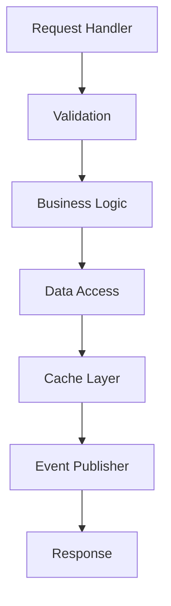

# Pricing - Low-Level Design

## Component Architecture

## Key Components

- **RequestHandler**: REST/gRPC endpoint layer
- **Validation**: Input validation + business rules
- **BusinessLogic**: Core algorithm implementation
- **DataAccess**: ORM layer (JPA/GORM)
- **CacheLayer**: Redis + local cache
- **EventPublisher**: Kafka event emission
- **ErrorHandling**: Structured error responses
- **CircuitBreaker**: Resilience pattern

## Dependencies

- PostgreSQL: Primary store
- Redis: Caching layer
- Kafka: Event streaming
- External APIs (if any)
