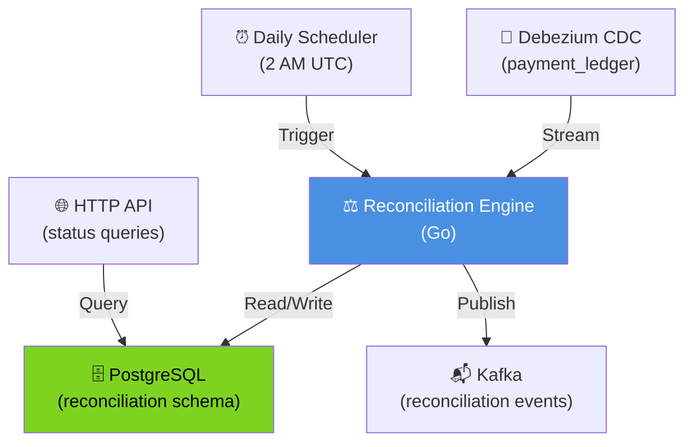
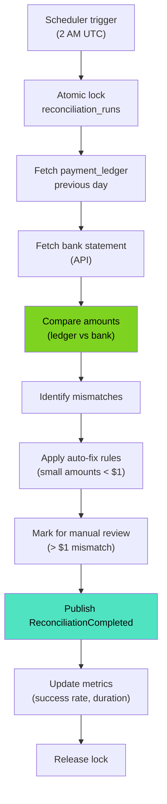
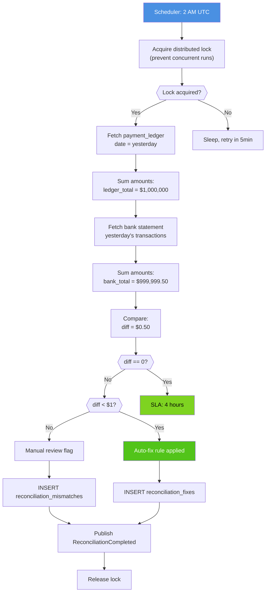
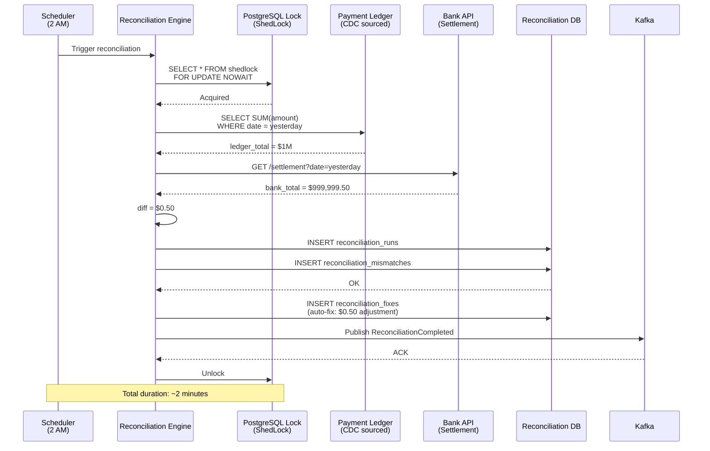
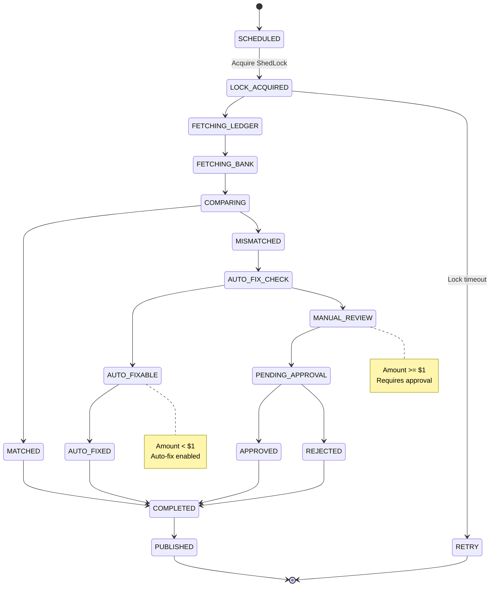
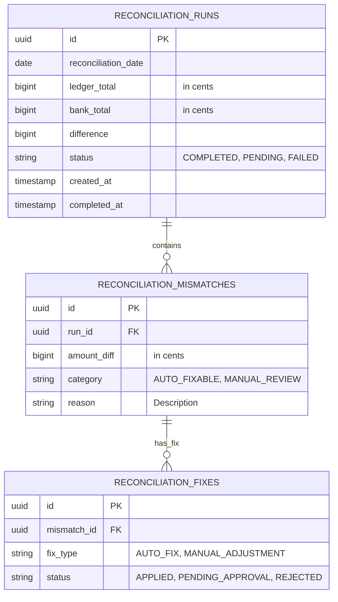
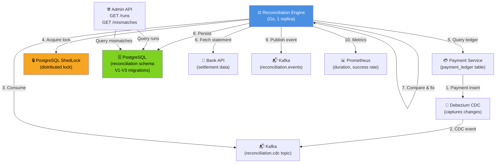

# Reconciliation Engine - All 7 Diagrams

## 1. High-Level Design

## 2. Low-Level Design

## 3. Flowchart - Daily Reconciliation

## 4. Sequence - Reconciliation Flow

## 5. State Machine

## 6. ER - Reconciliation Schema

## 7. End-to-End

