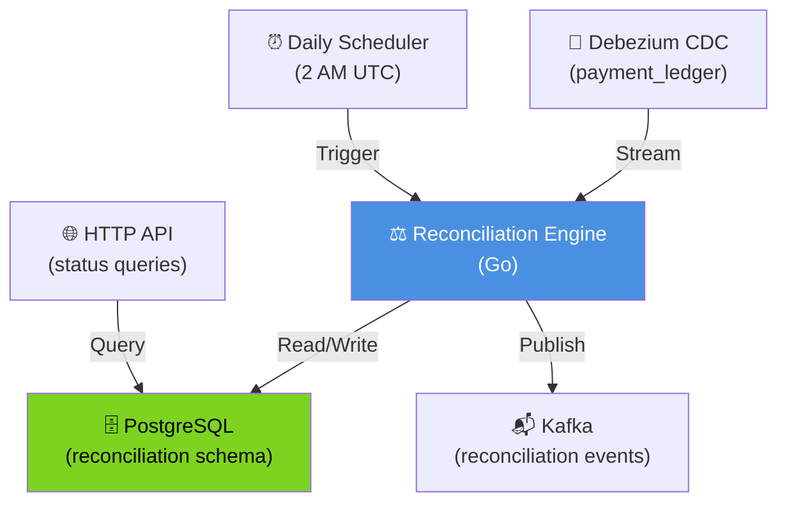

# Reconciliation Engine - High-Level Design



## Architecture Overview

### Data Sources

#### 1. Debezium CDC (Change Data Capture)
- **Source**: Payment Service database (payment_ledger table)
- **CDC Connector**: Debezium PostgreSQL connector
- **Target Topic**: reconciliation.cdc
- **Real-time Stream**: Every payment transaction captured instantly
- **Format**: Debezium envelope (before/after values)

#### 2. Daily Scheduler
- **Trigger**: Cron job at 2 AM UTC (daily)
- **Purpose**: Initiate daily reconciliation run
- **Execution**: Distributed via Kubernetes CronJob
- **Reliability**: Scheduled only on leader pod (ShedLock)

### Processing Layers

#### Reconciliation Engine (Go service)
**Responsibilities**:
1. Consume CDC events from Kafka (payment_ledger stream)
2. Aggregate daily payment ledger by date
3. Trigger reconciliation on schedule (2 AM UTC)
4. Compare ledger total vs bank statement total
5. Identify mismatches (>$0.01 precision)
6. Auto-fix small mismatches (< $1)
7. Flag large mismatches for manual review
8. Store results in PostgreSQL
9. Publish reconciliation events to Kafka

**Language**: Go (high throughput, minimal memory overhead)
**Deployment**: Single pod (1 replica) with hot standby
**State Management**: Stateless (all data persisted in PostgreSQL)

### Data Stores

#### PostgreSQL Reconciliation Schema
```
reconciliation_runs
├─ id (UUID PK)
├─ reconciliation_date (DATE)
├─ ledger_total (BIGINT cents)
├─ bank_total (BIGINT cents)
├─ difference (BIGINT cents)
├─ status (COMPLETED, FAILED, etc.)
├─ created_at (TIMESTAMP)
└─ completed_at (TIMESTAMP)

reconciliation_mismatches
├─ id (UUID PK)
├─ run_id (UUID FK)
├─ amount_diff (BIGINT cents)
├─ category (AUTO_FIXABLE, MANUAL_REVIEW)
└─ reason (TEXT)

reconciliation_fixes
├─ id (UUID PK)
├─ mismatch_id (UUID FK)
├─ fix_type (AUTO_FIX, MANUAL_ADJUSTMENT)
└─ status (APPLIED, PENDING_APPROVAL)
```

**Retention Policy**:
- Historical runs: Keep for 7 years (regulatory)
- Audit trail: Immutable (PCI DSS compliance)
- Indexes: (date, status) for fast queries

### Event Publishing

#### Reconciliation Events Topic
**Topic Name**: reconciliation.events
**Partitions**: 1 (ordered events per run)
**Subscribers**:
- Audit Service (compliance logging)
- Analytics Service (reporting)
- Alert Service (critical mismatches)

**Events Published**:
1. `ReconciliationStarted` - Daily run initiated
2. `MismatchFound` - Discrepancy detected
3. `AutoFixApplied` - Small mismatch auto-corrected
4. `ManualReviewNeeded` - Large mismatch flagged
5. `ReconciliationCompleted` - Run finished

### HTTP API

**Endpoints**:
- `GET /reconciliation/runs` - Query past runs
- `GET /reconciliation/mismatches/{run_id}` - View mismatches
- `POST /reconciliation/fixes/{mismatch_id}` - Approve/reject fix
- `GET /reconciliation/status` - Current run status

**Authentication**: Internal service auth (per-service token)
**Rate Limiting**: 100 req/sec per service

## SLA & Performance Targets

| Target | Value |
|--------|-------|
| Daily reconciliation latency | < 4 hours (by 6 AM UTC) |
| Mismatch detection accuracy | > 99.99% |
| Auto-fix accuracy | 100% (manual approval for edge cases) |
| Data retention | 7 years (regulatory) |
| Audit trail immutability | Guaranteed (PCI DSS) |

## Failover & Resilience

- **Reconciliation Pod**: 1 primary + 1 hot standby
- **Failover Time**: < 30 seconds
- **Data Loss**: None (all state in PostgreSQL)
- **Retry Logic**: Automatic retry on transient failures
- **Circuit Breaker**: Fallback to cached bank statement if API down

## Compliance

- **PCI DSS Level 1**: Payment processing certified
- **SOC 2 Type II**: Audited internal controls
- **Financial SLA**: Settlement within 1 business day (met via reconciliation)
- **Audit Trail**: All operations logged and immutable
