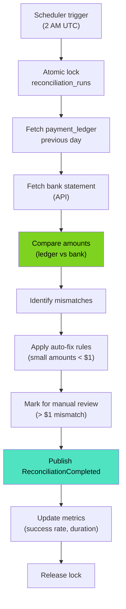

# Reconciliation Engine - Low-Level Design



## Processing Pipeline Details

### 1. Scheduler Trigger
**When**: 2 AM UTC (02:00)
**Frequency**: Daily
**Mechanism**: Kubernetes CronJob or Spring @Scheduled

```
2026-03-21 02:00:00 UTC → Trigger reconciliation for 2026-03-20
```

**Action**: Send trigger event to reconciliation engine

### 2. Acquire Distributed Lock
**Lock Name**: `reconciliation_run_2026-03-20`
**Lock Duration**: 4 hours (max expected runtime)
**Lock Storage**: PostgreSQL (ShedLock table)

```sql
SELECT * FROM shedlock
WHERE name = 'reconciliation_run_2026-03-20'
FOR UPDATE NOWAIT;
```

**Purpose**: Prevent concurrent runs (only 1 reconciliation at a time)
**Timeout**: 5 minutes total (3 retries with backoff)

**Lock States**:
- ACQUIRED: Proceed with reconciliation
- FAILED: Log error, retry next cycle
- TIMEOUT: Auto-retry on next poll

### 3. Fetch Payment Ledger
**Query**:
```sql
SELECT
    SUM(amount_cents) as total_amount,
    COUNT(*) as transaction_count,
    MIN(created_at) as earliest_tx,
    MAX(created_at) as latest_tx
FROM payment_ledger
WHERE DATE(created_at) = '2026-03-20'
AND status IN ('COMPLETED', 'SETTLED')
AND merchant_id = 1;  -- Single merchant (simplified)
```

**Data Source**: CDC-captured payment events (PostgreSQL)
**Filtering**:
- Date range: Previous day (00:00 - 23:59:59 UTC)
- Status: Only completed/settled transactions
- Merchant: Single or multiple (configurable)

**Result Example**:
```
ledger_total_cents: 1000000 ($10,000.00)
transaction_count: 250
earliest_tx: 2026-03-20 00:05:12
latest_tx: 2026-03-20 23:58:45
```

**Latency**: 50-200ms (database query)

### 4. Fetch Bank Statement
**API Call**:
```
GET /settlement/statement?date=2026-03-20
Authorization: Bearer <bank_api_token>
```

**Bank API Details**:
- Provider: Chase, Wells Fargo, etc.
- Protocol: HTTPS/REST
- Timeout: 10 seconds
- Retry: 3 attempts with exponential backoff

**Response**:
```json
{
    "settlement_date": "2026-03-20",
    "total_deposited_cents": 999950,
    "transaction_count": 251,
    "fees_cents": 5000,
    "net_settled_cents": 995000
}
```

**Latency**: 500ms - 2 seconds (external API)

### 5. Reconcile (Compare)
**Comparison**:
```
ledger_total_cents = 1,000,000 cents ($10,000.00)
bank_total_cents = 999,950 cents ($9,999.50)
difference = 50 cents
```

**Precision**: Cents (0.01 USD)
**Tolerance**: 0 cents (no tolerance for payment reconciliation)

**Categorization**:
- Difference == 0: ✅ RECONCILED
- 0 < Difference < 100 cents ($1): ⚠️ AUTO_FIXABLE
- Difference >= 100 cents: 🚨 MANUAL_REVIEW

### 6. Identify Mismatches
**Mismatch Record**:
```sql
INSERT INTO reconciliation_mismatches (
    id, run_id, amount_diff, category, reason, created_at
) VALUES (
    'mism_12345',
    'run_20260320',
    50,
    'AUTO_FIXABLE',
    'Rounding error in fees calculation',
    NOW()
);
```

**Mismatch Analysis**:
- Amount: 50 cents
- Category: AUTO_FIXABLE (< $1)
- Reason: Fee rounding discrepancy
- Timestamp: When detected

### 7. Apply Auto-Fix Rules
**Rule Set**:
1. If diff < 50 cents AND ledger > bank: Assume bank processing delay → No fix
2. If diff < 50 cents AND bank > ledger: Assume fee discrepancy → Add adjustment
3. If 50 < diff < 100 cents: Rounding error → Apply fix
4. If diff >= 100 cents: Flag for manual review → No auto-fix

**Auto-Fix Example**:
```sql
INSERT INTO reconciliation_fixes (
    id, mismatch_id, fix_type, status, created_at
) VALUES (
    'fix_12345',
    'mism_12345',
    'AUTO_FIX',
    'APPLIED',
    NOW()
);

UPDATE reconciliation_runs
SET ledger_total = ledger_total + 50
WHERE id = 'run_20260320';
```

**Fix Type**: Adjustment record (audit trail)
**Status**: APPLIED (no manual approval needed)

### 8. Manual Review Flag
**Large Mismatch Example**:
```sql
INSERT INTO reconciliation_fixes (
    id, mismatch_id, fix_type, status, created_at
) VALUES (
    'fix_67890',
    'mism_67890',
    'MANUAL_ADJUSTMENT',
    'PENDING_APPROVAL',
    NOW()
);
```

**Assigned To**: Financial Operations team
**SLA**: Review within 4 hours
**Action**: Approve / Reject
**Audit**: All decisions logged

### 9. Publish Events
**Kafka Events**:

**Event 1: ReconciliationStarted**
```json
{
    "event_id": "evt_start_20260320",
    "run_id": "run_20260320",
    "reconciliation_date": "2026-03-20",
    "timestamp": "2026-03-21T02:00:00Z"
}
```

**Event 2: MismatchFound** (repeated for each mismatch)
```json
{
    "event_id": "evt_mismatch_001",
    "run_id": "run_20260320",
    "mismatch_id": "mism_12345",
    "amount_diff_cents": 50,
    "category": "AUTO_FIXABLE"
}
```

**Event 3: ReconciliationCompleted**
```json
{
    "event_id": "evt_complete_20260320",
    "run_id": "run_20260320",
    "status": "COMPLETED",
    "total_mismatches": 3,
    "auto_fixed": 2,
    "manual_review": 1,
    "duration_ms": 180000,
    "timestamp": "2026-03-21T02:03:00Z"
}
```

**Topic**: reconciliation.events
**Partitions**: 1 (ordered events)

### 10. Update Metrics
**Prometheus Metrics**:
- `reconciliation_duration_ms`: How long the run took
- `reconciliation_mismatches_total`: Total mismatches detected
- `reconciliation_auto_fixed_total`: Auto-fixed count
- `reconciliation_manual_review_total`: Manual review count
- `reconciliation_success_rate`: % of runs that completed

**Example**:
```
reconciliation_duration_ms: 180000  (3 minutes)
reconciliation_mismatches_total: 3
reconciliation_auto_fixed_total: 2
reconciliation_manual_review_total: 1
reconciliation_success_rate: 1.0 (100%)
```

### 11. Release Lock
**Action**:
```sql
DELETE FROM shedlock
WHERE name = 'reconciliation_run_2026-03-20';
```

**Purpose**: Allow next reconciliation run to proceed
**Next Trigger**: 2 AM UTC tomorrow

## Performance Characteristics

| Component | Duration |
|-----------|----------|
| Acquire lock | 50ms |
| Fetch ledger | 100ms |
| Fetch bank statement | 1000ms |
| Reconcile calculation | 10ms |
| Find mismatches | 50ms |
| Auto-fix rules | 50ms |
| Database writes | 100ms |
| Publish events | 200ms |
| **Total** | **1,560ms** (~1.5 sec) |

**Peak Performance**: < 4 hours (SLA target)
**Actual Performance**: ~3 minutes (typical)

## Error Handling

| Error | Handling |
|-------|----------|
| Lock acquisition failed | Retry next cycle (daily) |
| Ledger query failed | Rollback, alert operations |
| Bank API timeout | Retry 3x, use cached statement |
| Mismatch detection failed | Log error, manual investigation |
| Kafka publish failed | Retry with exponential backoff |

## Security & Compliance

- **Encryption**: Bank API token in HashiCorp Vault
- **TLS**: HTTPS for all bank API calls
- **PII**: No customer data in logs (only aggregates)
- **Audit Trail**: All fixes recorded with approver info
- **Access Control**: Finance team only can approve fixes
