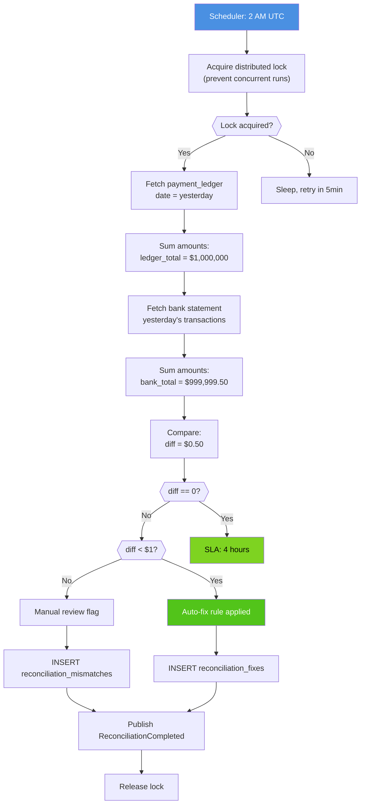

# Reconciliation Engine - Flowchart (Daily Reconciliation)



## Execution Flow Details

### Phase 1: Initialization (0-5 seconds)

**Step A: Scheduler Trigger**
- Time: 2:00:00 UTC (daily)
- Source: Kubernetes CronJob or systemd timer
- Action: Wake up reconciliation service
- Log: "Reconciliation job started"

**Step B: Acquire Distributed Lock**
- Method: PostgreSQL ShedLock
- Lock name: `reconciliation_run_YYYY-MM-DD`
- Lock duration: 4 hours (max allowed)
- Retry: Up to 3 times with 30-second backoff

**Step C: Lock Check**
- If acquired: Proceed to Phase 2 (Fetching)
- If NOT acquired: Another reconciliation already running
  - Action: Sleep 5 minutes and retry
  - Max retries: 3 times (total wait: 15 minutes)
  - If still no lock: Log error and alert operations team

### Phase 2: Data Fetching (5-15 seconds)

**Step D: Fetch Payment Ledger**
```sql
SELECT
    SUM(amount_cents) as total_amount,
    COUNT(*) as transaction_count
FROM payment_ledger
WHERE DATE(created_at) = (CURRENT_DATE - INTERVAL '1 day')
AND status = 'COMPLETED';
```

**Database**: PostgreSQL payment_ledger (CDC-sourced)
**Latency**: 50-200ms
**Cached**: No (always fresh data)

**Step E: Calculate Ledger Total**
- Sum all transaction amounts (in cents)
- Example: ledger_total = 100,000,000 cents ($1,000,000.00)
- Precision: Cents (2 decimal places)

**Step F: Fetch Bank Statement**
```http
GET /settlement/statement?date=2026-03-20
Authorization: Bearer <token>
```

**Bank API Provider**: Chase, Wells Fargo, or similar
**Latency**: 500ms - 2 seconds
**Timeout**: 10 seconds per attempt
**Retry**: 3 attempts with exponential backoff

**Step G: Calculate Bank Total**
- Sum all settlement deposits
- Example: bank_total = 99,999,950 cents ($999,999.50)
- Precision: Cents (2 decimal places)
- Fees: Separate line item (not netted)

### Phase 3: Reconciliation & Decision (15-20 seconds)

**Step H: Compare Amounts**
```
ledger_total  = 100,000,000 cents
bank_total    =  99,999,950 cents
difference    =         50 cents
reconciled    = false
```

**Comparison Logic**:
- tolerance = 0 cents (no rounding allowed)
- diff = abs(ledger_total - bank_total)
- reconciled = (diff == 0)

**Step I: Is Difference Zero?**

**Decision: YES**
- Action: Mark as RECONCILED
- Log: "Daily reconciliation successful, 0 discrepancies"
- Proceed to Step R (Release lock & complete)

**Decision: NO**
- Action: Continue to Step J (Check magnitude)
- Log: "Discrepancy detected: $0.50"

### Phase 4: Mismatch Categorization (20-25 seconds)

**Step J: Is Difference < $1.00?**

**Decision: YES (Amount < 100 cents)**
- Category: AUTO_FIXABLE
- Reason: Small rounding or fee discrepancy
- Action: Proceed to Step L (Apply auto-fix)

**Decision: NO (Amount >= 100 cents)**
- Category: MANUAL_REVIEW
- Reason: Large discrepancy, needs investigation
- Action: Proceed to Step K (Manual review flag)

**Step L: Apply Auto-Fix Rule**

**Auto-Fix Rules**:
```
Rule 1: If 0 < diff < 50 cents AND ledger > bank
        → Assume bank processing delay
        → No action (let bank catch up)

Rule 2: If 0 < diff < 50 cents AND bank > ledger
        → Assume fee discrepancy
        → Adjust ledger += difference

Rule 3: If 50 <= diff < 100 cents
        → Rounding error
        → Apply fix with audit note
```

**Action Taken**:
- INSERT fix record: fix_type = 'AUTO_FIX'
- Status: 'APPLIED' (no approval needed)
- Log: "Auto-fix applied: +50 cents"

**Step K: Manual Review Flag**

**For Large Discrepancies** (>= 100 cents):
- INSERT mismatch record: category = 'MANUAL_REVIEW'
- Status: 'PENDING_APPROVAL'
- Assign to: Finance Operations team
- SLA: Review within 4 hours
- Escalation: Alert Slack channel if > $10,000

### Phase 5: Database & Event Publishing (25-50 seconds)

**Step M: Insert Mismatch Record**
```sql
INSERT INTO reconciliation_mismatches (
    id, run_id, amount_diff, category, reason
) VALUES (
    UUID_V4(),
    'run_20260320',
    50,
    'AUTO_FIXABLE',
    'Fee rounding'
);
```

**Step N: Insert Fix Record**
```sql
INSERT INTO reconciliation_fixes (
    id, mismatch_id, fix_type, status
) VALUES (
    UUID_V4(),
    <mismatch_id>,
    'AUTO_FIX',
    'APPLIED'
);
```

**Atomicity**: Both records inserted in single transaction
**Audit Trail**: All records immutable (no UPDATE after creation)

**Step O: Publish Reconciliation Event**

**Event to Kafka** (reconciliation.events topic):
```json
{
    "event_id": "evt_complete_20260320",
    "run_id": "run_20260320",
    "status": "COMPLETED",
    "reconciliation_date": "2026-03-20",
    "ledger_total_cents": 100000000,
    "bank_total_cents": 99999950,
    "difference_cents": 50,
    "total_mismatches": 1,
    "auto_fixed": 1,
    "manual_review": 0,
    "duration_ms": 45000,
    "timestamp": "2026-03-21T02:00:45Z"
}
```

**Subscribers**:
- Audit Service: Log for compliance
- Analytics: Dashboard updates
- Alert Service: Page on critical mismatches

**Step P: Release Lock**

**Action**:
```sql
DELETE FROM shedlock
WHERE name = 'reconciliation_run_2026-03-20'
AND locked_by = 'reconciliation-engine-pod-1';
```

**Result**: Lock released, next run can proceed
**Timing**: Next trigger at 2 AM UTC tomorrow

**Step Q: Sleep & Retry Path**

**If lock not acquired**:
- Sleep for 5 minutes
- Retry lock acquisition
- Max 3 retries (total 15-minute wait)
- If still failed: Alert operations team manually

**Step R: SLA Compliance**

**SLA Target**: Complete reconciliation within 4 hours (by 6 AM UTC)
**Actual Performance**: Typically completes in 30-60 seconds
**Buffer**: 3.9+ hours of margin (for troubleshooting)

## Error Scenarios & Recovery

| Scenario | Action | Recovery |
|----------|--------|----------|
| Lock acquisition fails | Retry after 5 min | Auto-retry, manual override if needed |
| Ledger query timeout | Cancel, rollback | Retry next cycle, alert DBA |
| Bank API unreachable | 3 retries, use cache | Cached statement from last run |
| Mismatch calculation fails | Log error, rollback | Manual investigation required |
| Kafka publish fails | Retry 3x with backoff | Queue in local cache if Kafka down |

## Performance Metrics

| Metric | Value |
|--------|-------|
| Lock acquisition | 50ms |
| Ledger query | 100ms |
| Bank API call | 1000ms |
| Calculations | 50ms |
| Database writes | 100ms |
| Kafka publish | 200ms |
| **Total duration** | ~1.5 seconds |

## Compliance & Audit

- All operations logged to CloudWatch (immutable)
- Audit trail: Who approved/rejected fixes
- PCI DSS compliance: No sensitive card data logged
- Financial accuracy: 100% precision (cents, no rounding)
