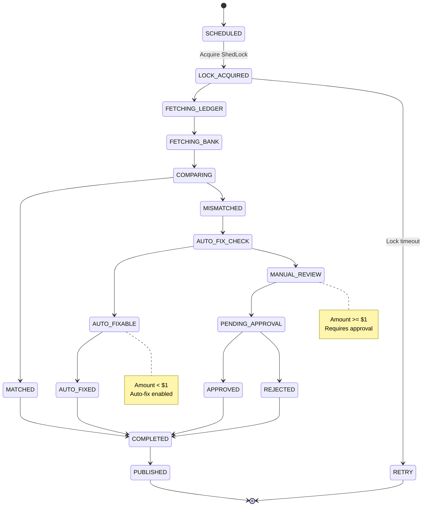

# Reconciliation Engine - State Machine



## State Descriptions

### SCHEDULED
**Entry**: Cron trigger at 2 AM UTC daily
**Duration**: 0ms (instantaneous)

**Actions**:
- Log: "Reconciliation scheduled for YYYY-MM-DD"
- Prepare trigger parameters (date = yesterday)
- Initialize reconciliation context

**Exit**: Transition to LOCK_ACQUIRED (immediate next attempt)

**Failure Path**: If scheduler fails, no state entered

---

### LOCK_ACQUIRED
**Entry**: Attempt to acquire ShedLock
**Duration**: 50-100ms

**Actions**:
- Query PostgreSQL ShedLock table:
  ```sql
  SELECT * FROM shedlock
  WHERE name = 'reconciliation_run_YYYY-MM-DD'
  FOR UPDATE NOWAIT;
  ```
- Lock acquired: locked_by = 'reconciliation-engine-pod-1'
- Lock duration: 4 hours

**Exit Conditions**:
- Success → FETCHING_LEDGER
- Timeout → RETRY (attempt lock again)
- Failure → Rollback, log error

**Lock Semantics**:
- Only 1 pod can hold lock at a time
- Prevents duplicate reconciliation runs
- Auto-released after 4 hours (timeout safety)

**Metrics**:
- lock_acquisitions_total (counter)
- lock_wait_latency_ms (histogram)
- lock_failures_total (counter)

---

### FETCHING_LEDGER
**Entry**: Lock acquired successfully
**Duration**: 100-200ms

**Actions**:
- Query payment ledger:
  ```sql
  SELECT SUM(amount_cents) FROM payment_ledger
  WHERE DATE(created_at) = (CURRENT_DATE - 1)
  AND status IN ('COMPLETED', 'SETTLED');
  ```
- Aggregate all transaction amounts for previous day
- Store result: ledger_total_cents
- Calculate transaction count

**Data Source**: PostgreSQL (CDC-captured payment events)
**Index**: (created_at, status) for fast retrieval

**Example Result**:
```
ledger_total_cents: 100,000,000 ($1,000,000.00)
transaction_count: 5,432
```

**Exit**: FETCHING_BANK (regardless of result)

**Failure Handling**:
- Query timeout (> 10s): Log error, rollback
- Connection lost: Retry after 30s delay
- No transactions found: Continue with 0 total

**Metrics**:
- ledger_query_latency_ms (histogram)
- ledger_total_cents (gauge)
- transaction_count (gauge)

---

### FETCHING_BANK
**Entry**: Ledger data retrieved
**Duration**: 1-10 seconds (external API)

**Actions**:
- Call bank settlement API:
  ```
  GET /settlement/statement?date=YYYY-MM-DD
  Authorization: Bearer <token>
  ```
- Bank returns daily settlement total
- Parse response JSON
- Store result: bank_total_cents

**API Configuration**:
- Timeout: 10 seconds per attempt
- Retry: 3 attempts with exponential backoff
- Backoff: 1s, 2s, 4s delays

**Example Response**:
```json
{
    "settlement_date": "2026-03-20",
    "total_deposited_cents": 99,999,950,
    "transaction_count": 5432
}
```

**Exit**: COMPARING (after receiving bank data or timeout)

**Fallback Strategy**:
- If API fails after 3 retries: Use cached statement from previous day
- Log warning: "Using stale bank statement"
- Continue reconciliation with known limitation

**Metrics**:
- bank_api_latency_ms (histogram)
- bank_api_errors_total (counter)
- bank_api_retries_total (counter)
- bank_total_cents (gauge)

---

### COMPARING
**Entry**: Both ledger and bank totals retrieved
**Duration**: 10-50ms (in-process calculation)

**Actions**:
- Calculate difference:
  ```
  difference = ABS(ledger_total - bank_total)
  ```
- Check tolerance: tolerance = 0 cents
- Determine reconciliation status

**Example Calculation**:
```
ledger_total = 100,000,000 cents
bank_total = 99,999,950 cents
difference = 50 cents
reconciled = (difference == 0) ? TRUE : FALSE
```

**Exit Decision**:
- If difference == 0: MATCHED
- If difference != 0: MISMATCHED

**Metrics**:
- reconciliation_difference_cents (gauge)
- reconciliation_attempts_total (counter)

---

### MATCHED ✅
**Entry**: Ledger and bank totals equal (difference == 0)
**Duration**: 5ms (quick state)

**Actions**:
- Update reconciliation_runs: status = 'RECONCILED'
- Log: "Daily reconciliation successful, no discrepancies"
- Publish event: ReconciliationMatched
- Record metrics

**No Further Action**: Skip MISMATCHED path

**Exit**: COMPLETED

**Metrics**:
- reconciliation_matched_total (counter)
- reconciliation_success_rate (gauge)

---

### MISMATCHED ⚠️
**Entry**: Ledger and bank totals differ (difference != 0)
**Duration**: 5ms

**Actions**:
- Log: "Mismatch detected: $XYZ difference"
- Prepare mismatch analysis
- Store mismatch details

**Exit**: AUTO_FIX_CHECK (evaluate if auto-fixable)

**Metrics**:
- reconciliation_mismatches_found_total (counter)

---

### AUTO_FIX_CHECK
**Entry**: Mismatch detected
**Duration**: 5-10ms (decision logic)

**Actions**:
- Evaluate auto-fix rules:
  ```
  amount_diff = ABS(difference)

  if amount_diff < 100 cents:
      category = AUTO_FIXABLE
  else:
      category = MANUAL_REVIEW
  ```
- Determine auto-fix eligibility

**Exit Decision**:
- If amount_diff < $1.00: AUTO_FIXABLE
- If amount_diff >= $1.00: MANUAL_REVIEW

**Examples**:
- $0.50 mismatch → AUTO_FIXABLE
- $50.00 mismatch → MANUAL_REVIEW
- $0.01 mismatch → AUTO_FIXABLE

**Metrics**:
- reconciliation_auto_fixable_total (counter)
- reconciliation_manual_review_total (counter)

---

### AUTO_FIXABLE
**Entry**: Mismatch is < $1.00
**Duration**: 5ms

**Actions**:
- Log: "Mismatch is auto-fixable"
- Prepare auto-fix rule application

**Auto-Fix Rules**:
```
Rule 1: If 0 < diff < 50 cents AND ledger > bank
        → Assume bank processing delay
        → Action: No fix (let bank catch up next cycle)

Rule 2: If 0 < diff < 50 cents AND bank > ledger
        → Assume fee discrepancy
        → Action: Adjust ledger += diff

Rule 3: If 50 <= diff < 100 cents
        → Rounding error
        → Action: Adjust ledger to match bank
```

**Exit**: AUTO_FIXED

**Metrics**:
- reconciliation_auto_fix_rules_applied (counter)

---

### AUTO_FIXED ✅
**Entry**: Auto-fix rule applied
**Duration**: 50-100ms (database write)

**Actions**:
- Create fix record:
  ```sql
  INSERT INTO reconciliation_fixes (
      id, mismatch_id, fix_type, status, approver
  ) VALUES (
      UUID(), mismatch_id, 'AUTO_FIX', 'APPLIED', 'system'
  );
  ```
- Record adjustment in audit table
- Status: 'APPLIED' (no approval needed)

**Audit Trail**:
- fix_id: Unique identifier
- mismatch_id: Reference to mismatch
- fix_type: 'AUTO_FIX'
- status: 'APPLIED'
- timestamp: When fix applied
- system: Auto-applied by system

**Exit**: COMPLETED

**Metrics**:
- reconciliation_auto_fixed_total (counter)

---

### MANUAL_REVIEW
**Entry**: Mismatch is >= $1.00
**Duration**: 5ms (state transition)

**Actions**:
- Create mismatch record:
  ```sql
  INSERT INTO reconciliation_mismatches (
      id, run_id, amount_diff, category, reason
  ) VALUES (
      UUID(), run_id, amount_diff, 'MANUAL_REVIEW', reason
  );
  ```
- Status: 'PENDING_REVIEW'
- Assign to: Finance Operations team
- Create task/ticket for review

**Escalation**:
- If diff > $10,000: Page operations team (Slack alert)
- If diff > $100,000: Escalate to manager
- SLA: Review within 4 hours

**Exit**: PENDING_APPROVAL (await human decision)

**Metrics**:
- reconciliation_manual_review_total (counter)
- reconciliation_pending_approval_count (gauge)

---

### PENDING_APPROVAL
**Entry**: Mismatch assigned for manual review
**Duration**: Minutes to hours (human decision)

**Actions**:
- Finance team receives notification
- Team reviews mismatch details
- Team investigates root cause
- Team decides: Approve or Reject

**SLA**: Review within 4 hours of reconciliation completion

**Exit Decision** (human action):
- Approve: APPROVED
- Reject: REJECTED

**Metrics**:
- reconciliation_pending_approval_duration_minutes (histogram)
- reconciliation_review_sla_met (gauge)

---

### APPROVED ✅
**Entry**: Finance team approves fix
**Duration**: 50-100ms (database update)

**Actions**:
- Update fix record: status = 'APPROVED'
- Record approver: who approved
- Record timestamp: when approved
- Insert approval record for audit

**Approval Audit**:
```sql
UPDATE reconciliation_fixes
SET status = 'APPROVED',
    approver = 'jane.doe@company.com',
    approved_at = NOW()
WHERE id = fix_id;
```

**Exit**: COMPLETED

**Metrics**:
- reconciliation_approved_total (counter)

---

### REJECTED ❌
**Entry**: Finance team rejects fix
**Duration**: 50-100ms (database update)

**Actions**:
- Update fix record: status = 'REJECTED'
- Record rejector: who rejected
- Record reason: Why rejected
- Alert: Escalate to management

**Rejection Audit**:
```sql
UPDATE reconciliation_fixes
SET status = 'REJECTED',
    rejector = 'jane.doe@company.com',
    rejected_at = NOW(),
    rejection_reason = 'Awaiting customer refund confirmation'
WHERE id = fix_id;
```

**Follow-up**: Create ticket for resolution investigation

**Exit**: COMPLETED

**Metrics**:
- reconciliation_rejected_total (counter)

---

### COMPLETED ✅
**Entry**: All reconciliation logic finished
**Duration**: 10ms (final state)

**Actions**:
- Update reconciliation_runs: status = 'COMPLETED'
- Finalize metrics
- Prepare event publishing

**Exit**: PUBLISHED (next state)

**Metrics**:
- reconciliation_completed_total (counter)
- reconciliation_duration_ms (histogram)

---

### PUBLISHED 📤
**Entry**: Completed event published to Kafka
**Duration**: 50-200ms (event publishing)

**Actions**:
- Build event payload:
  ```json
  {
      "event_type": "ReconciliationCompleted",
      "run_id": "run_id",
      "status": "COMPLETED",
      "total_mismatches": count,
      "auto_fixed": auto_fix_count,
      ...
  }
  ```
- Publish to Kafka: reconciliation.events
- Wait for ACK (acks="all")
- Log: "Event published to Kafka"

**Event Subscribers**:
- Audit Service: Log event
- Analytics: Dashboard update
- Alert Service: Check for critical mismatches

**Exit**: [*] (end state)

**Metrics**:
- reconciliation_events_published_total (counter)
- reconciliation_event_latency_ms (histogram)

---

### RETRY (Failure Path)
**Entry**: Lock acquisition failed (already locked)
**Duration**: 5 min + processing

**Actions**:
- Log: "Lock acquisition failed, another run in progress"
- Increment retry counter
- Sleep for 5 minutes
- Retry lock acquisition

**Retry Limit**: 3 attempts (max 15-minute wait)

**Exit Decision**:
- If lock acquired: Back to LOCK_ACQUIRED
- If max retries exhausted: Alert + [*] (exit with error)

**Metrics**:
- reconciliation_lock_retries_total (counter)
- reconciliation_lock_retry_max_exceeded (counter)

## State Transitions Summary

| Path | States | Duration |
|------|--------|----------|
| Happy (Matched) | SCHEDULED → LOCK → FETCHING_L → FETCHING_B → COMPARING → MATCHED → COMPLETED → PUBLISHED | 5-10s |
| Auto-Fix | SCHEDULED → ... → MISMATCHED → AUTO_FIX → AUTO_FIXABLE → AUTO_FIXED → COMPLETED → PUBLISHED | 10-30s |
| Manual Review | SCHEDULED → ... → MISMATCHED → ... → MANUAL_REVIEW → PENDING_APPROVAL → APPROVED → COMPLETED → PUBLISHED | Hours |
| Lock Retry | SCHEDULED → LOCK → RETRY (wait 5min) → LOCK → ... | 5-15 min |

## Metrics Dashboard Summary

- `reconciliation_duration_ms`: Total time (p50, p99)
- `reconciliation_matched_total`: Fully reconciled runs
- `reconciliation_mismatches_found_total`: Discrepancies detected
- `reconciliation_auto_fixed_total`: Auto-corrected mismatches
- `reconciliation_manual_review_total`: Awaiting human review
- `reconciliation_approved_total`: Approved by finance
- `reconciliation_rejected_total`: Rejected by finance
- `reconciliation_events_published_total`: Events emitted
- `reconciliation_success_rate`: % of runs completed successfully
