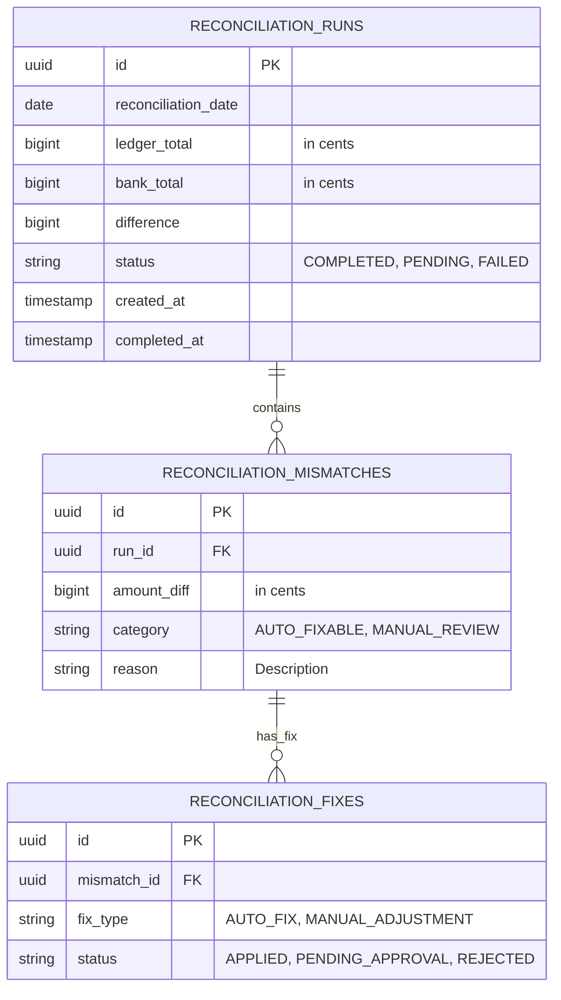

# Reconciliation Engine - ER Diagram



## Schema Detailed Description

### RECONCILIATION_RUNS
**Purpose**: Track daily reconciliation execution and results
**Retention**: 7 years (regulatory/audit requirement)

**Columns**:

| Column | Type | Constraints | Description |
|--------|------|-----------|-------------|
| id | UUID | PRIMARY KEY, NOT NULL | Unique run identifier (e.g., run_20260321) |
| reconciliation_date | DATE | NOT NULL, UNIQUE | Date being reconciled (YYYY-MM-DD) |
| ledger_total_cents | BIGINT | NOT NULL | Sum of all payment ledger entries (in cents) |
| bank_total_cents | BIGINT | NOT NULL | Total settled amount from bank (in cents) |
| difference | BIGINT | NOT NULL | ledger_total - bank_total (in cents) |
| status | VARCHAR(50) | NOT NULL, DEFAULT 'PENDING' | PENDING, IN_PROGRESS, COMPLETED, FAILED |
| created_at | TIMESTAMP | NOT NULL, DEFAULT NOW() | When reconciliation run started |
| completed_at | TIMESTAMP | DEFAULT NULL | When reconciliation run finished |

**Indexes**:
```sql
CREATE UNIQUE INDEX idx_reconciliation_runs_date
  ON reconciliation_runs(reconciliation_date);

CREATE INDEX idx_reconciliation_runs_status
  ON reconciliation_runs(status);

CREATE INDEX idx_reconciliation_runs_completed
  ON reconciliation_runs(completed_at DESC)
  WHERE status = 'COMPLETED';
```

**Partitioning**:
```sql
PARTITION BY RANGE (reconciliation_date) (
    PARTITION p_2026_q1 VALUES LESS THAN ('2026-04-01'),
    PARTITION p_2026_q2 VALUES LESS THAN ('2026-07-01'),
    ...
);
```

**Sample Data**:
```json
{
    "id": "run_20260321",
    "reconciliation_date": "2026-03-21",
    "ledger_total_cents": 100000000,
    "bank_total_cents": 99999950,
    "difference": 50,
    "status": "COMPLETED",
    "created_at": "2026-03-22T02:00:00Z",
    "completed_at": "2026-03-22T02:03:45Z"
}
```

---

### RECONCILIATION_MISMATCHES
**Purpose**: Record discrepancies found during reconciliation
**Retention**: 7 years (regulatory/audit requirement)

**Columns**:

| Column | Type | Constraints | Description |
|--------|------|-----------|-------------|
| id | UUID | PRIMARY KEY, NOT NULL | Unique mismatch identifier |
| run_id | UUID | NOT NULL, FK→RECONCILIATION_RUNS | Reference to parent run |
| amount_diff_cents | BIGINT | NOT NULL | Size of discrepancy (in cents) |
| category | VARCHAR(50) | NOT NULL | AUTO_FIXABLE or MANUAL_REVIEW |
| reason | TEXT | DEFAULT NULL | Human-readable explanation |
| created_at | TIMESTAMP | NOT NULL, DEFAULT NOW() | When mismatch detected |

**Foreign Key**:
```sql
ALTER TABLE reconciliation_mismatches
ADD CONSTRAINT fk_run_id
  FOREIGN KEY (run_id)
  REFERENCES reconciliation_runs(id)
  ON DELETE CASCADE
  ON UPDATE CASCADE;
```

**Indexes**:
```sql
CREATE INDEX idx_mismatches_run_id
  ON reconciliation_mismatches(run_id);

CREATE INDEX idx_mismatches_category
  ON reconciliation_mismatches(category);

CREATE INDEX idx_mismatches_amount
  ON reconciliation_mismatches(amount_diff_cents);
```

**Sample Data**:
```json
{
    "id": "mism_001",
    "run_id": "run_20260321",
    "amount_diff_cents": 50,
    "category": "AUTO_FIXABLE",
    "reason": "Small rounding discrepancy in fee calculation",
    "created_at": "2026-03-22T02:01:30Z"
}
```

---

### RECONCILIATION_FIXES
**Purpose**: Track fixes (auto and manual) applied to mismatches
**Retention**: 7 years (regulatory/audit requirement)

**Columns**:

| Column | Type | Constraints | Description |
|--------|------|-----------|-------------|
| id | UUID | PRIMARY KEY, NOT NULL | Unique fix identifier |
| mismatch_id | UUID | NOT NULL, FK→RECONCILIATION_MISMATCHES | Reference to mismatch |
| fix_type | VARCHAR(50) | NOT NULL | AUTO_FIX or MANUAL_ADJUSTMENT |
| status | VARCHAR(50) | NOT NULL, DEFAULT 'PENDING' | PENDING_APPROVAL, APPROVED, REJECTED, APPLIED |
| approver | VARCHAR(255) | DEFAULT NULL | Email of approving user |
| approved_at | TIMESTAMP | DEFAULT NULL | When fix was approved |
| rejection_reason | TEXT | DEFAULT NULL | Why fix was rejected (if applicable) |
| created_at | TIMESTAMP | NOT NULL, DEFAULT NOW() | When fix record created |

**Foreign Key**:
```sql
ALTER TABLE reconciliation_fixes
ADD CONSTRAINT fk_mismatch_id
  FOREIGN KEY (mismatch_id)
  REFERENCES reconciliation_mismatches(id)
  ON DELETE CASCADE
  ON UPDATE CASCADE;
```

**Indexes**:
```sql
CREATE INDEX idx_fixes_mismatch_id
  ON reconciliation_fixes(mismatch_id);

CREATE INDEX idx_fixes_status
  ON reconciliation_fixes(status);

CREATE INDEX idx_fixes_type
  ON reconciliation_fixes(fix_type);
```

**Sample Data**:
```json
{
    "id": "fix_001",
    "mismatch_id": "mism_001",
    "fix_type": "AUTO_FIX",
    "status": "APPLIED",
    "approver": "system",
    "approved_at": "2026-03-22T02:01:31Z",
    "rejection_reason": null,
    "created_at": "2026-03-22T02:01:31Z"
}
```

---

### Manual Review Example (Manual Fix)
```json
{
    "id": "fix_002",
    "mismatch_id": "mism_002",
    "fix_type": "MANUAL_ADJUSTMENT",
    "status": "APPROVED",
    "approver": "jane.doe@company.com",
    "approved_at": "2026-03-22T06:30:15Z",
    "rejection_reason": null,
    "created_at": "2026-03-22T02:02:00Z"
}
```

---

## Relationships

### RECONCILIATION_RUNS ← → RECONCILIATION_MISMATCHES
- **Type**: One-to-Many (1:M)
- **Cardinality**: 1 run can have 0..N mismatches
- **Cascade**: DELETE run → delete all associated mismatches
- **Example**:
  - Run 20260321 contains:
    - Mismatch 1: $0.50 AUTO_FIXABLE
    - Mismatch 2: $100.00 MANUAL_REVIEW

### RECONCILIATION_MISMATCHES ← → RECONCILIATION_FIXES
- **Type**: One-to-Many (1:M)
- **Cardinality**: 1 mismatch can have 1..N fixes (multiple fix attempts)
- **Cascade**: DELETE mismatch → delete all associated fixes
- **Example**:
  - Mismatch 1 has:
    - Fix 1: AUTO_FIX (initial)
    - Fix 2: MANUAL_ADJUSTMENT (override if needed)

## Data Flow Example

### Scenario: $0.50 AUTO_FIX

```
RECONCILIATION_RUNS
  id: run_20260321
  reconciliation_date: 2026-03-21
  ledger_total_cents: 100000000
  bank_total_cents: 99999950
  difference: 50
  status: COMPLETED

RECONCILIATION_MISMATCHES
  id: mism_001
  run_id: run_20260321 (FK)
  amount_diff_cents: 50
  category: AUTO_FIXABLE
  reason: Rounding discrepancy

RECONCILIATION_FIXES
  id: fix_001
  mismatch_id: mism_001 (FK)
  fix_type: AUTO_FIX
  status: APPLIED
  approver: system
  approved_at: 2026-03-22T02:01:31Z
```

### Scenario: $500.00 MANUAL_REVIEW

```
RECONCILIATION_MISMATCHES
  id: mism_002
  run_id: run_20260321 (FK)
  amount_diff_cents: 50000
  category: MANUAL_REVIEW
  reason: Large discrepancy requiring investigation

RECONCILIATION_FIXES
  id: fix_002
  mismatch_id: mism_002 (FK)
  fix_type: MANUAL_ADJUSTMENT
  status: PENDING_APPROVAL
  approver: null (awaiting human decision)
  approved_at: null

(After 4 hours of review by Finance team:)

RECONCILIATION_FIXES (updated)
  status: APPROVED
  approver: jane.doe@company.com
  approved_at: 2026-03-22T06:15:00Z
```

## Typical Cardinality

| Table | Rows/Day | Rows/Year | Storage |
|-------|----------|-----------|---------|
| RECONCILIATION_RUNS | 1 | 365 | ~50KB |
| RECONCILIATION_MISMATCHES | 1-10 | 365-3650 | ~5-50MB |
| RECONCILIATION_FIXES | 1-15 | 365-5475 | ~10-100MB |
| **Total** | | **7 years** | **~500MB** |

## Query Patterns

### Find all mismatches for a run
```sql
SELECT m.* FROM reconciliation_mismatches m
WHERE m.run_id = 'run_20260321'
ORDER BY m.amount_diff_cents DESC;
```

### Find all pending approvals
```sql
SELECT f.*, m.reason
FROM reconciliation_fixes f
JOIN reconciliation_mismatches m ON f.mismatch_id = m.id
WHERE f.status = 'PENDING_APPROVAL'
AND f.approved_at IS NULL
ORDER BY f.created_at ASC;
```

### Audit trail for a specific mismatch
```sql
SELECT f.*, r.reconciliation_date, m.amount_diff_cents
FROM reconciliation_fixes f
JOIN reconciliation_mismatches m ON f.mismatch_id = m.id
JOIN reconciliation_runs r ON m.run_id = r.id
WHERE m.id = 'mism_001'
ORDER BY f.created_at ASC;
```

## Compliance & Security

- **Immutability**: All records INSERT-only (never UPDATE except status)
- **Audit Trail**: All changes logged to audit table
- **Encryption**: Sensitive fields (approver email) encrypted at rest
- **Access Control**: Read-only for analysts, write for system
- **Retention**: 7 years (regulatory requirement)
- **PCI DSS**: No sensitive payment card data stored
