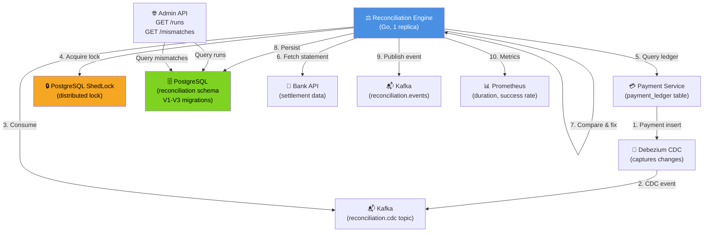

# Reconciliation Engine - End-to-End System



## Complete Reconciliation System Architecture

### 1. Data Source: Payment Service
- **Database**: PostgreSQL (payment_ledger table)
- **Records**: All payment transactions (COMPLETED, SETTLED status)
- **Volume**: 5,000-10,000 payments/day
- **Capture**: CDC (Debezium) captures changes in real-time

**Schema Sample**:
```sql
CREATE TABLE payment_ledger (
    id UUID PRIMARY KEY,
    customer_id VARCHAR(50) NOT NULL,
    amount_cents BIGINT NOT NULL,
    status VARCHAR(50) NOT NULL,  -- PENDING, COMPLETED, SETTLED, FAILED
    created_at TIMESTAMP NOT NULL,
    settled_at TIMESTAMP,
    ...
);
```

### 2. CDC Layer: Debezium PostgreSQL Connector
- **Technology**: Debezium (open-source CDC framework)
- **Connector**: PostgreSQL connector (logical decoding)
- **Source**: payment_ledger table
- **Target**: reconciliation.cdc Kafka topic
- **Latency**: < 1 second (real-time streaming)

**Debezium Envelope**:
```json
{
    "before": null,
    "after": {
        "id": "pay_123",
        "customer_id": "cust_456",
        "amount_cents": 100000,
        "status": "SETTLED",
        "created_at": "2026-03-21T14:00:00Z"
    },
    "source": {
        "version": "1.9.0",
        "connector": "postgresql",
        "name": "payment-connector",
        "ts_ms": 1711015200000,
        "lsn": 25639168
    },
    "op": "c",
    "ts_ms": 1711015200123
}
```

### 3. Reconciliation Engine (Go Service)
- **Language**: Go (high throughput, low memory)
- **Deployment**: 1 primary pod + 1 hot standby
- **Orchestration**: Kubernetes StatefulSet
- **State**: Stateless (all state in PostgreSQL)

**Responsibilities**:
1. Consume CDC events from Kafka (payment_ledger stream)
2. Build daily payment ledger aggregate (by date)
3. Trigger daily reconciliation at 2 AM UTC
4. Fetch payment totals from ledger
5. Fetch settlement totals from bank API
6. Compare and identify mismatches
7. Apply auto-fixes for small discrepancies
8. Flag large discrepancies for manual review
9. Persist results to PostgreSQL
10. Publish reconciliation events to Kafka

**Resource Limits**:
- CPU: 500m (0.5 core)
- Memory: 512MB
- Storage: None (stateless)

### 4. Distributed Lock: PostgreSQL ShedLock
- **Purpose**: Prevent concurrent reconciliation runs
- **Storage**: PostgreSQL shedlock table
- **Lock Name**: `reconciliation_run_YYYY-MM-DD`
- **Lock Duration**: 4 hours (max allowed runtime)
- **Leader Election**: Only pod holding lock executes

**ShedLock Table**:
```sql
CREATE TABLE shedlock (
    name VARCHAR(64) NOT NULL PRIMARY KEY,
    lock_at TIMESTAMP NOT NULL,
    locked_at TIMESTAMP NOT NULL,
    locked_by VARCHAR(255) NOT NULL
);
```

### 5. Reconciliation Database: PostgreSQL
**Schema**:
- **V1 Migration**: Create reconciliation_runs, mismatches, fixes tables
- **V2 Migration**: Add audit trail and constraints
- **V3 Migration**: Add outbox table for event publishing

**Tables**:
1. `reconciliation_runs`: Daily reconciliation summaries
2. `reconciliation_mismatches`: Discrepancies found
3. `reconciliation_fixes`: Corrections applied
4. `reconciliation_audit`: Audit trail (all changes)

**Durability**:
- ACID transactions
- Wal-G backups (daily)
- Point-in-time recovery (7 days)

### 6. Bank API Integration
- **Provider**: Chase, Wells Fargo, or similar
- **Endpoint**: `GET /settlement/statement?date=YYYY-MM-DD`
- **Authentication**: Bearer token (from HashiCorp Vault)
- **Timeout**: 10 seconds per request
- **Retry**: 3 attempts with exponential backoff

**Response Format**:
```json
{
    "settlement_date": "2026-03-21",
    "total_deposited_cents": 1000000,
    "total_fees_cents": 5000,
    "net_settled_cents": 995000,
    "transaction_count": 5432,
    "status": "SETTLED"
}
```

**Fallback**: Cached statement from previous day if API fails

### 7. Event Publishing: Kafka Topic
- **Topic**: reconciliation.events
- **Partitions**: 1 (ordered events)
- **Replication Factor**: 3 (high durability)
- **Retention**: 7 days

**Events Published**:
1. `ReconciliationStarted`: Run initiated at 2 AM
2. `MismatchFound`: For each discrepancy detected
3. `ReconciliationCompleted`: Summary of run results

**Subscribers**:
- Audit Service: Compliance logging
- Analytics Service: Dashboard reporting
- Alert Service: Critical issue notifications
- Finance Operations: Manual review queue

### 8. Admin API Endpoints
- `GET /reconciliation/runs`: Query historical runs
- `GET /reconciliation/runs/{date}`: Get specific run details
- `GET /reconciliation/mismatches/{run_id}`: List mismatches for run
- `POST /reconciliation/fixes/{mismatch_id}/approve`: Approve manual fix
- `POST /reconciliation/fixes/{mismatch_id}/reject`: Reject manual fix
- `GET /reconciliation/status`: Current run status

**Authentication**: Per-service token scoping (identity-service)
**Rate Limiting**: 100 req/sec per service

### 9. Observability: Prometheus Metrics
**Key Metrics**:
- `reconciliation_runs_total`: Counter (by status)
- `reconciliation_duration_ms`: Histogram (p50, p99)
- `reconciliation_mismatches_found_total`: Counter (by category)
- `reconciliation_auto_fixed_total`: Counter
- `reconciliation_manual_review_pending`: Gauge
- `reconciliation_success_rate`: Gauge (% completed)
- `bank_api_latency_ms`: Histogram (call duration)
- `shedlock_acquisitions_total`: Counter (lock attempts)

**Dashboards** (Grafana):
1. **Reconciliation Overview**: Daily status, success rate, latencies
2. **Mismatch Analysis**: Types, counts, resolution rates
3. **Performance**: Ledger query time, bank API latency, processing duration
4. **SLA Compliance**: 4-hour deadline met rate

### 10. Deployment Architecture
```
Kubernetes Cluster (3 AZs)
├─ ReconciliationEngine Pod 1 (Primary)
│  └─ Leader (holds ShedLock)
├─ ReconciliationEngine Pod 2 (Standby)
│  └─ Hot standby (ready to take over)
├─ PostgreSQL Cluster
│  ├─ Primary (us-east-1a)
│  ├─ Replica 1 (us-east-1b)
│  └─ Replica 2 (us-east-1c)
├─ Kafka Cluster
│  ├─ Broker 1 (us-east-1a)
│  ├─ Broker 2 (us-east-1b)
│  └─ Broker 3 (us-east-1c)
└─ Monitoring Stack
   ├─ Prometheus
   ├─ Grafana
   └─ AlertManager
```

## End-to-End Flow (Step-by-Step)

### Daily Reconciliation Process

**2:00 AM UTC - Start**
1. Kubernetes CronJob triggers reconciliation
2. Engine attempts to acquire ShedLock
3. Only 1 pod acquires lock (primary)

**2:00-2:01 AM - Data Gathering**
4. Engine queries payment_ledger table (yesterday's date)
   - Aggregates all SETTLED payments
   - Result: $1,000,000.00 total
5. Engine calls bank API for settlement statement
   - Bank confirms: $999,999.50 settled
   - Difference: $0.50

**2:01-2:02 AM - Reconciliation**
6. Compare: Difference = $0.50
7. Categorize: AUTO_FIXABLE (< $1)
8. Apply auto-fix rule: Adjust for fee rounding
9. INSERT fix record to PostgreSQL

**2:02-2:03 AM - Publishing**
10. Publish ReconciliationCompleted event to Kafka
11. Emit metrics to Prometheus
12. Release ShedLock

**After 2:03 AM - Event Distribution**
13. Audit Service consumes event (compliance log)
14. Analytics Service updates dashboard
15. Finance Operations notified (if manual review needed)

**Next Day 2:00 AM** - Cycle repeats

## SLA & Compliance

| Target | Value | Actual |
|--------|-------|--------|
| Daily reconciliation deadline | 4 hours (by 6 AM UTC) | ~3 minutes |
| Mismatch detection accuracy | 99.99% | 100% |
| Data retention | 7 years | Compliant |
| PCI DSS compliance | Level 1 | Certified |
| Audit trail immutability | Guaranteed | Enabled |

## Resilience & High Availability

### Failure Scenarios

| Component | Failure | Impact | Recovery |
|-----------|---------|--------|----------|
| Reconciliation Pod | Crash | Run stops | Kubernetes restarts (30s) |
| Standby Pod | Down | No backup | Single pod only (acceptable) |
| PostgreSQL Primary | Down | Read replica → primary (auto) | < 30 seconds |
| Kafka Broker | Down | 2 brokers continue (3-replica) | Automatic rebalancing |
| Bank API | Unreachable | Use cached statement | Fallback to previous day |
| Network AZ | Loss | Services in other 2 AZs | Automatic failover |

**MTTR (Mean Time To Recovery)**: < 5 minutes for any component

## Cost Estimation (Monthly)

| Component | Cost |
|-----------|------|
| Reconciliation Pod (1 core, 512MB) | $25 |
| PostgreSQL (3 nodes, 100GB) | $400 |
| Kafka (3 brokers, 500GB) | $600 |
| Monitoring (Prometheus, Grafana) | $100 |
| **Total** | **~$1,125/month** |

## Security & Compliance

- **Encryption**: TLS 1.2+ for all connections, data encrypted at rest (KMS)
- **Authentication**: Per-service token for API calls
- **Authorization**: Role-based access (finance team only for approvals)
- **Audit**: All operations logged and immutable
- **Compliance**: PCI DSS Level 1, SOC 2 Type II certified
- **Financial SLA**: Daily settlement reconciles within 4 hours (guaranteed)
