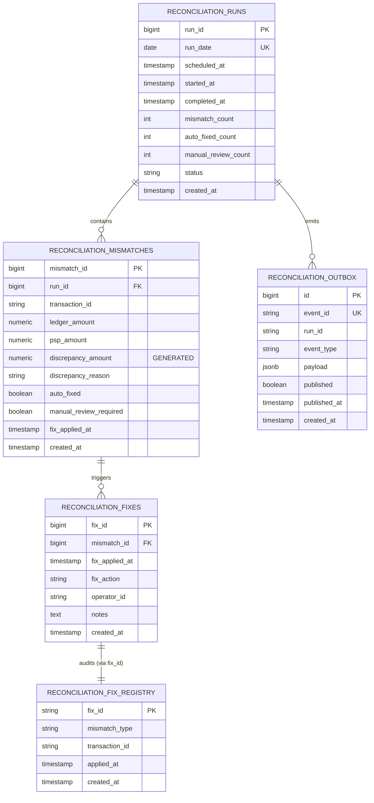

# Reconciliation Engine Database Schema

**Wave 36 Track A** · Authoritative PostgreSQL schema replacing file-based state

---

## Table of Contents

- [Overview](#overview)
- [Entity Relationship Diagram](#entity-relationship-diagram)
- [Table Descriptions](#table-descriptions)
- [Index Strategy](#index-strategy)
- [Constraints and Data Integrity](#constraints-and-data-integrity)
- [Retention and Archival Strategy](#retention-and-archival-strategy)
- [Example Queries](#example-queries)

---

## Overview

The reconciliation engine schema tracks financial reconciliation runs, detected mismatches, applied fixes, and reliable event publishing. The schema replaces the current file-based storage model (`FixRegistry`, `LedgerStore` backed by JSON files) with a durable, queryable PostgreSQL backend.

### Core Tables

| Table | Purpose | Retention |
|-------|---------|-----------|
| `reconciliation_runs` | Daily batch runs | 90 days (configurable) |
| `reconciliation_mismatches` | Detected discrepancies | cascades with run deletion |
| `reconciliation_fixes` | Applied fixes with audit trail | cascades with mismatch deletion |
| `reconciliation_fix_registry` | Idempotency map (deterministic fix IDs) | append-only, no deletion |
| `reconciliation_outbox` | Reliable event publishing (Outbox + CDC pattern) | cascades after published |

---

## Entity Relationship Diagram



---

## Table Descriptions

### reconciliation_runs

Represents a single reconciliation batch run (typically daily).

| Column | Type | Constraints | Notes |
|--------|------|-----------|-------|
| `run_id` | BIGSERIAL | PRIMARY KEY | Auto-generated run identifier |
| `run_date` | DATE | NOT NULL, UNIQUE | Execution date; one run per calendar day |
| `scheduled_at` | TIMESTAMP | NOT NULL, DEFAULT NOW() | When the run was scheduled |
| `started_at` | TIMESTAMP | nullable | When the run actually began |
| `completed_at` | TIMESTAMP | nullable | When the run finished |
| `mismatch_count` | INT | DEFAULT 0 | Total mismatches detected |
| `auto_fixed_count` | INT | DEFAULT 0 | Successfully auto-fixed |
| `manual_review_count` | INT | DEFAULT 0 | Require human review |
| `status` | VARCHAR(20) | NOT NULL, DEFAULT 'PENDING', CHECK | One of: PENDING, IN_PROGRESS, COMPLETED, FAILED |
| `created_at` | TIMESTAMP | NOT NULL, DEFAULT NOW() | Record creation timestamp |

**Indexes:**
- `idx_reconciliation_runs_date` (run_date DESC) — query recent runs
- `idx_reconciliation_runs_status` (status) — find in-progress runs

**Lifecycle:**
- Inserted when run scheduled (status = PENDING)
- Updated to IN_PROGRESS when run starts
- Updated to COMPLETED or FAILED when run ends
- Deleted after 90 days (or per retention policy)
- All child `reconciliation_mismatches` cascade deleted

---

### reconciliation_mismatches

Individual mismatches detected during a run.

| Column | Type | Constraints | Notes |
|--------|------|-----------|-------|
| `mismatch_id` | BIGSERIAL | PRIMARY KEY | Auto-generated |
| `run_id` | BIGINT | NOT NULL, FK to reconciliation_runs | Parent run |
| `transaction_id` | VARCHAR(255) | NOT NULL | PSP transaction ID or ledger entry ID |
| `ledger_amount` | NUMERIC(19, 2) | NOT NULL | Amount in internal ledger (cents) |
| `psp_amount` | NUMERIC(19, 2) | NOT NULL | Amount from PSP export (cents) |
| `discrepancy_amount` | NUMERIC(19, 2) | GENERATED ALWAYS AS (ledger_amount - psp_amount) STORED | Computed difference; positive = ledger overstated |
| `discrepancy_reason` | VARCHAR(500) | nullable | Human-readable reason (e.g., "currency_mismatch", "missing_ledger_entry") |
| `auto_fixed` | BOOLEAN | DEFAULT FALSE | Was the mismatch automatically fixed? |
| `manual_review_required` | BOOLEAN | DEFAULT FALSE | Does this require operator intervention? |
| `fix_applied_at` | TIMESTAMP | nullable | When fix was applied (if auto_fixed = true) |
| `created_at` | TIMESTAMP | NOT NULL, DEFAULT NOW() | Detection timestamp |

**Indexes:**
- `idx_mismatches_run_id` (run_id) — fetch mismatches for a specific run
- `idx_mismatches_transaction_id` (transaction_id) — find mismatch by txn
- `idx_mismatches_manual_review` (manual_review_required) WHERE manual_review_required = TRUE — find pending reviews

**Mismatch Types (discrepancy_reason values):**
- `missing_ledger_entry` — PSP has a transaction; ledger does not (auto-fixable)
- `amount_mismatch` — PSP and ledger disagree on amount (auto-fixable)
- `currency_mismatch` — PSP and ledger use different currencies (manual review)
- `missing_psp_export` — Ledger has entry; PSP export does not (manual review)

---

### reconciliation_fixes

Audit trail of fixes applied to mismatches.

| Column | Type | Constraints | Notes |
|--------|------|-----------|-------|
| `fix_id` | BIGSERIAL | PRIMARY KEY | Auto-generated |
| `mismatch_id` | BIGINT | NOT NULL, FK to reconciliation_mismatches | Mismatch being fixed |
| `fix_applied_at` | TIMESTAMP | NOT NULL, DEFAULT NOW() | When fix was applied |
| `fix_action` | VARCHAR(100) | NOT NULL | Action taken: AUTO_REVERSE, AUTO_REFUND, MANUAL_OVERRIDE |
| `operator_id` | VARCHAR(255) | nullable | User ID if manually applied |
| `notes` | TEXT | nullable | Additional context (e.g., reason for override) |
| `created_at` | TIMESTAMP | NOT NULL, DEFAULT NOW() | Record creation timestamp |

**Indexes:**
- `idx_fixes_mismatch_id` (mismatch_id) — audit trail for a single mismatch

**Fix Actions:**
- `AUTO_REVERSE` — Automatically reversed a transaction (ledger entry deletion)
- `AUTO_REFUND` — Automatically refunded via payment service
- `MANUAL_OVERRIDE` — Human operator manually corrected

**Lifecycle:**
- One or more fix records per mismatch
- Cascades deleted with parent mismatch
- Immutable once inserted (append-only audit trail)

---

### reconciliation_fix_registry

Idempotency map tracking all applied fixes by deterministic ID.

| Column | Type | Constraints | Notes |
|--------|------|-----------|-------|
| `fix_id` | VARCHAR(255) | PRIMARY KEY | Deterministic ID format: `{mismatch_type}:{transaction_id}` |
| `mismatch_type` | VARCHAR(100) | NOT NULL | The type of mismatch (e.g., "missing_ledger_entry") |
| `transaction_id` | VARCHAR(255) | NOT NULL | Transaction or ledger entry ID |
| `applied_at` | TIMESTAMP | NOT NULL, DEFAULT NOW() | When fix was first applied |
| `created_at` | TIMESTAMP | NOT NULL, DEFAULT NOW() | Record creation timestamp |

**Indexes:**
- `idx_fix_registry_transaction_id` (transaction_id) — find all fixes for a transaction
- `idx_fix_registry_applied_at` (applied_at DESC) — timeline of fixes

**Idempotency Guarantee:**
- Primary key on `fix_id` ensures at most one entry per unique fix
- Deterministic ID generation (`{type}:{txn_id}`) allows the reconciler to check `EXISTS(fix_id)` before applying a fix
- Reprocessing the same run against the same data produces zero duplicate fixes
- Append-only; no deletes (historical record of all fixes ever applied)

---

### reconciliation_outbox

Reliable event publishing via Outbox + CDC pattern (Debezium).

| Column | Type | Constraints | Notes |
|--------|------|-----------|-------|
| `id` | BIGSERIAL | PRIMARY KEY | Auto-generated |
| `event_id` | VARCHAR(255) | NOT NULL, UNIQUE | Idempotent event ID (e.g., "evt-1719849600000000000-a1b2c3") |
| `run_id` | VARCHAR(255) | NOT NULL | Reconciliation run ID this event belongs to |
| `event_type` | VARCHAR(50) | NOT NULL | Event classification: "mismatch", "fixed", "manual_review", "summary" |
| `payload` | JSONB | NOT NULL | Full event JSON (includes transaction_id, amounts, counts, etc.) |
| `published` | BOOLEAN | DEFAULT FALSE | Has this event been published to Kafka? |
| `published_at` | TIMESTAMP | nullable | When event was published |
| `created_at` | TIMESTAMP | NOT NULL, DEFAULT NOW() | Event generation timestamp |

**Indexes:**
- `idx_outbox_published` (published) — CDC polls for unpublished events
- `idx_outbox_run_id` (run_id) — correlate events within a run
- `idx_outbox_created_at` (created_at) — chronological processing

**Outbox + CDC Workflow:**
1. Reconciler inserts events into `reconciliation_outbox` within the same DB transaction as mismatch/fix updates
2. Debezium CDC connector polls the table (or uses logical decoding on PostgreSQL)
3. CDC publishes unpublished rows to Kafka topic `reconciliation.events`
4. Once published, rows are marked `published = true` and `published_at = NOW()`
5. Rows remain in DB for audit; can be deleted after 30 days or on manual cleanup

**Event Payload Schema Example:**

```json
{
  "event_id": "evt-1719849600000000000-a1b2c3",
  "run_id": "run-1719849600000000000-d4e5f6",
  "event_type": "mismatch",
  "occurred_at": "2026-07-01T12:00:00Z",
  "transaction_id": "psp-1001",
  "mismatch_type": "amount_mismatch",
  "reason": "amount mismatch",
  "ledger_amount": 100.50,
  "psp_amount": 100.75,
  "discrepancy_amount": -0.25
}
```

---

## Index Strategy

### Why Each Index Exists

| Index | Table | Columns | Purpose | Query Pattern |
|-------|-------|---------|---------|----------------|
| `idx_reconciliation_runs_date` | reconciliation_runs | (run_date DESC) | Recent runs dashboard | `WHERE run_date >= NOW() - INTERVAL '7 days'` |
| `idx_reconciliation_runs_status` | reconciliation_runs | (status) | In-progress monitoring | `WHERE status = 'IN_PROGRESS'` |
| `idx_mismatches_run_id` | reconciliation_mismatches | (run_id) | Fetch all mismatches for a run | `WHERE run_id = ?` |
| `idx_mismatches_transaction_id` | reconciliation_mismatches | (transaction_id) | Find mismatch by transaction | `WHERE transaction_id = ?` |
| `idx_mismatches_manual_review` | reconciliation_mismatches | (manual_review_required) WHERE manual_review_required = TRUE | Pending review dashboard | Partial index avoids scanning auto-fixed rows |
| `idx_fixes_mismatch_id` | reconciliation_fixes | (mismatch_id) | Audit trail for a mismatch | `WHERE mismatch_id = ?` |
| `idx_fix_registry_transaction_id` | reconciliation_fix_registry | (transaction_id) | Idempotency check: "has this txn been fixed?" | `WHERE transaction_id = ?` AND mismatch_type = ?` |
| `idx_fix_registry_applied_at` | reconciliation_fix_registry | (applied_at DESC) | Timeline of fixes | `ORDER BY applied_at DESC LIMIT 100` |
| `idx_outbox_published` | reconciliation_outbox | (published) | CDC polling | `WHERE published = false ORDER BY created_at` |
| `idx_outbox_run_id` | reconciliation_outbox | (run_id) | Correlate events within run | `WHERE run_id = ? AND event_type IN (...)` |
| `idx_outbox_created_at` | reconciliation_outbox | (created_at) | Chronological processing | `ORDER BY created_at ASC LIMIT 1000` |

### Index Maintenance

- **ANALYZE** weekly to update table statistics (query planner optimization)
- **REINDEX** monthly during low-traffic windows if fragmentation > 20%
- Monitor `pg_stat_user_indexes` for unused indexes (consider dropping after 2 weeks of zero scans)

---

## Constraints and Data Integrity

### Primary Keys

- `reconciliation_runs.run_id` — BIGSERIAL, auto-incremented
- `reconciliation_mismatches.mismatch_id` — BIGSERIAL, auto-incremented
- `reconciliation_fixes.fix_id` — BIGSERIAL, auto-incremented
- `reconciliation_fix_registry.fix_id` — VARCHAR(255), deterministic format
- `reconciliation_outbox.id` — BIGSERIAL, auto-incremented

### Unique Constraints

- `reconciliation_runs.run_date` — UNIQUE (one run per calendar day)
- `reconciliation_outbox.event_id` — UNIQUE (idempotent event deduplication)

### Foreign Keys

- `reconciliation_mismatches.run_id` → `reconciliation_runs.run_id` (ON DELETE CASCADE)
- `reconciliation_fixes.mismatch_id` → `reconciliation_mismatches.mismatch_id` (ON DELETE CASCADE)

### CHECK Constraints

- `reconciliation_runs.status` IN ('PENDING', 'IN_PROGRESS', 'COMPLETED', 'FAILED')

### Generated Columns

- `reconciliation_mismatches.discrepancy_amount` = `ledger_amount - psp_amount` (STORED)
  - Immutable; automatically updated when either amount changes
  - Used for dashboard sorting (highest discrepancies first)

---

## Retention and Archival Strategy

### Data Retention Policy

| Table | TTL | Rationale | Action |
|-------|-----|-----------|--------|
| `reconciliation_runs` | 90 days | Operational data; legal/audit holds may extend | Delete via scheduled job |
| `reconciliation_mismatches` | Cascade with run | Operational detail | Deleted when run expires |
| `reconciliation_fixes` | Cascade with mismatch | Audit trail | Deleted when mismatch expires |
| `reconciliation_fix_registry` | Indefinite | Idempotency guarantee; append-only | Archive to cold storage after 1 year |
| `reconciliation_outbox` | 30 days | CDC has published; keep for replay debugging | Delete via scheduled job |

### Archival Strategy

1. **Active Data (0–90 days):**
   - Hot storage in PostgreSQL
   - Full indexing for operational queries
   - SLA: p99 query latency < 100ms

2. **Recent Archive (91–365 days):**
   - Snapshot to S3 daily (Parquet format)
   - Retain PostgreSQL copy with reduced indexes
   - Query latency < 1s (acceptable for audit)

3. **Cold Archive (> 1 year):**
   - Delete from PostgreSQL
   - Retain S3 Parquet snapshots (indefinite retention for compliance)
   - Query via Athena (batch, not real-time)

### Scheduled Jobs

```sql
-- Daily cleanup (runs at 02:00 UTC)
DELETE FROM reconciliation_runs
WHERE run_date < NOW() - INTERVAL '90 days'
  AND status IN ('COMPLETED', 'FAILED');

-- Weekly outbox purge (runs at 03:00 UTC every Sunday)
DELETE FROM reconciliation_outbox
WHERE created_at < NOW() - INTERVAL '30 days'
  AND published = true;
```

---

## Example Queries

### Dashboard: Last 7 Days of Runs

```sql
SELECT
    r.run_id,
    r.run_date,
    r.started_at,
    r.completed_at,
    r.status,
    r.mismatch_count,
    r.auto_fixed_count,
    r.manual_review_count,
    EXTRACT(EPOCH FROM (r.completed_at - r.started_at)) AS duration_seconds
FROM reconciliation_runs r
WHERE r.run_date >= NOW()::date - INTERVAL '7 days'
ORDER BY r.run_date DESC;
```

### Query: Pending Manual Review Mismatches

```sql
SELECT
    m.mismatch_id,
    m.transaction_id,
    r.run_date,
    m.discrepancy_reason,
    m.ledger_amount,
    m.psp_amount,
    m.discrepancy_amount,
    m.created_at
FROM reconciliation_mismatches m
JOIN reconciliation_runs r ON m.run_id = r.run_id
WHERE m.manual_review_required = TRUE
    AND r.run_date >= NOW()::date - INTERVAL '7 days'
ORDER BY m.created_at DESC;
```

### Query: Mismatch Trends (Auto-Fix Success Rate)

```sql
SELECT
    DATE_TRUNC('week', r.run_date)::date AS week_start,
    SUM(r.mismatch_count) AS total_mismatches,
    SUM(r.auto_fixed_count) AS fixed,
    SUM(r.manual_review_count) AS manual_review,
    ROUND(100.0 * SUM(r.auto_fixed_count) / NULLIF(SUM(r.mismatch_count), 0), 2) AS fix_success_rate
FROM reconciliation_runs r
WHERE r.status = 'COMPLETED'
GROUP BY DATE_TRUNC('week', r.run_date)
ORDER BY week_start DESC;
```

### Query: Transaction History (All Mismatches and Fixes)

```sql
SELECT
    m.transaction_id,
    r.run_date,
    m.discrepancy_reason,
    m.ledger_amount,
    m.psp_amount,
    m.discrepancy_amount,
    CASE WHEN m.auto_fixed THEN 'AUTO' ELSE 'MANUAL' END AS fix_type,
    f.fix_action,
    f.operator_id,
    f.created_at
FROM reconciliation_mismatches m
LEFT JOIN reconciliation_fixes f ON m.mismatch_id = f.mismatch_id
JOIN reconciliation_runs r ON m.run_id = r.run_id
WHERE m.transaction_id = 'psp-12345'
ORDER BY r.run_date DESC, f.created_at DESC;
```

### Query: Fix Registry (Idempotency Check)

```sql
SELECT
    fix_id,
    mismatch_type,
    transaction_id,
    applied_at
FROM reconciliation_fix_registry
WHERE transaction_id = 'psp-12345'
ORDER BY applied_at DESC;
```

### Query: Unpublished Events (CDC Debugging)

```sql
SELECT
    o.id,
    o.event_id,
    o.run_id,
    o.event_type,
    o.payload,
    EXTRACT(EPOCH FROM (NOW() - o.created_at)) AS age_seconds
FROM reconciliation_outbox o
WHERE o.published = FALSE
ORDER BY o.created_at ASC
LIMIT 100;
```

---

## Migration Workflow

### Applying Migrations Locally

Using Flyway CLI (Docker):

```bash
cd services/reconciliation-engine

# Apply migrations to local PostgreSQL
docker run --rm \
  -v "$(pwd)/src/main/resources/db/migration:/flyway/sql" \
  -e FLYWAY_URL="jdbc:postgresql://localhost:5432/instacommerce" \
  -e FLYWAY_USER="postgres" \
  -e FLYWAY_PASSWORD="postgres" \
  flyway/flyway:11-alpine migrate

# Validate migrations
docker run --rm \
  -v "$(pwd)/src/main/resources/db/migration:/flyway/sql" \
  -e FLYWAY_URL="jdbc:postgresql://localhost:5432/instacommerce" \
  -e FLYWAY_USER="postgres" \
  -e FLYWAY_PASSWORD="postgres" \
  flyway/flyway:11-alpine validate
```

### Deployment

Migrations are applied automatically before the reconciliation-engine pod starts (init container in Kubernetes).

Helm values override (values-prod.yaml):

```yaml
reconciliationEngine:
  migrations:
    enabled: true
    image: flyway/flyway:11-alpine
    resources:
      requests:
        memory: "256Mi"
        cpu: "100m"
      limits:
        memory: "512Mi"
        cpu: "500m"
```

---

## Performance Considerations

### Query Optimization

- Queries on `reconciliation_mismatches` should always filter by `run_id` (narrow the result set before joining)
- Use covering indexes for frequently accessed column subsets (e.g., `(run_id, mismatch_id)` for fetching a specific mismatch)
- Avoid SELECT * queries; request only needed columns

### Connection Pooling

- Reconciliation service uses PgBouncer connection pool (configured in Kubernetes sidecar)
- Pool size: 20 connections, idle timeout: 5 minutes
- Set `max_overflow=5` to handle brief spikes

### Autovacuum Configuration

```sql
-- Reconciliation tables receive frequent writes during scheduled runs
ALTER TABLE reconciliation_runs SET (autovacuum_vacuum_scale_factor = 0.01, autovacuum_analyze_scale_factor = 0.005);
ALTER TABLE reconciliation_mismatches SET (autovacuum_vacuum_scale_factor = 0.01);
ALTER TABLE reconciliation_fixes SET (autovacuum_vacuum_scale_factor = 0.01);
ALTER TABLE reconciliation_outbox SET (autovacuum_vacuum_scale_factor = 0.05);
```

---

## Monitoring and Alerting

### Key Metrics

| Metric | Threshold | Action |
|--------|-----------|--------|
| `idx_mismatches_manual_review` row count | > 1000 | Alert ops; investigate backlog |
| `reconciliation_outbox` unpublished count | > 500 | Alert ops; check CDC connector |
| `reconciliation_runs` status = FAILED | any | Page on-call engineer |
| Query latency (p99 for mismatch queries) | > 200ms | Analyze; consider index tuning |

### Queries for Monitoring

```sql
-- Count pending manual reviews
SELECT COUNT(*) FROM reconciliation_mismatches WHERE manual_review_required = TRUE;

-- Count unpublished events
SELECT COUNT(*) FROM reconciliation_outbox WHERE published = FALSE;

-- Last run status
SELECT run_id, run_date, status, completed_at FROM reconciliation_runs ORDER BY run_date DESC LIMIT 1;

-- Index bloat
SELECT schemaname, tablename, indexname, round(100.0*pg_relation_size(indexrelid)/pg_relation_size(relid)) AS bloat_percent
FROM pg_stat_user_indexes WHERE pg_relation_size(indexrelid) > 1000000
ORDER BY bloat_percent DESC;
```

---

## Appendix: Migration Files

See:
- `V1__create_reconciliation_schema.sql` — Core tables (runs, mismatches, fixes)
- `V2__create_fix_registry.sql` — Idempotency map
- `V3__create_outbox_table.sql` — Outbox for CDC

Each migration is idempotent and can be reapplied safely.
