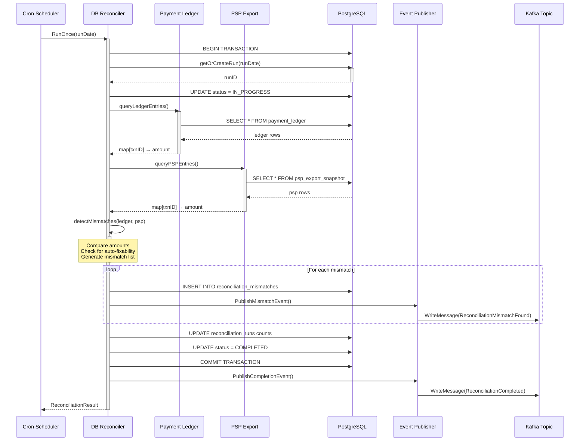
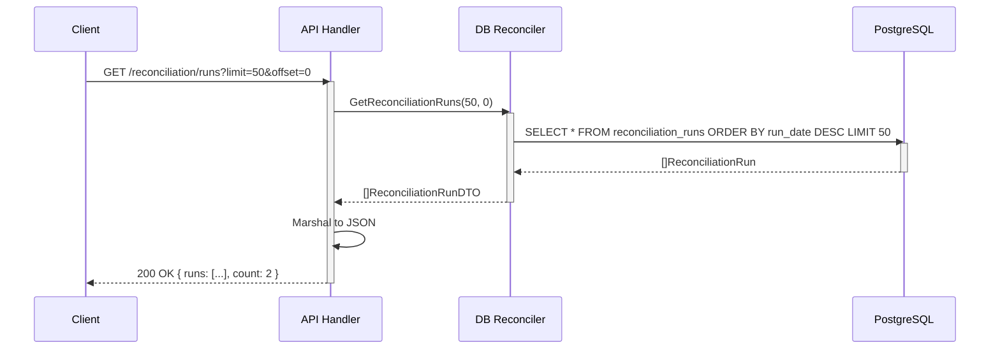
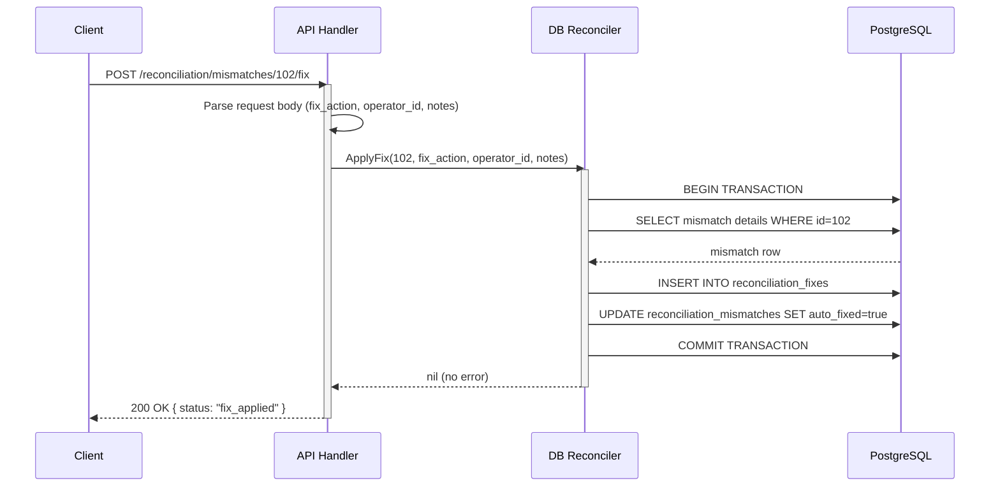
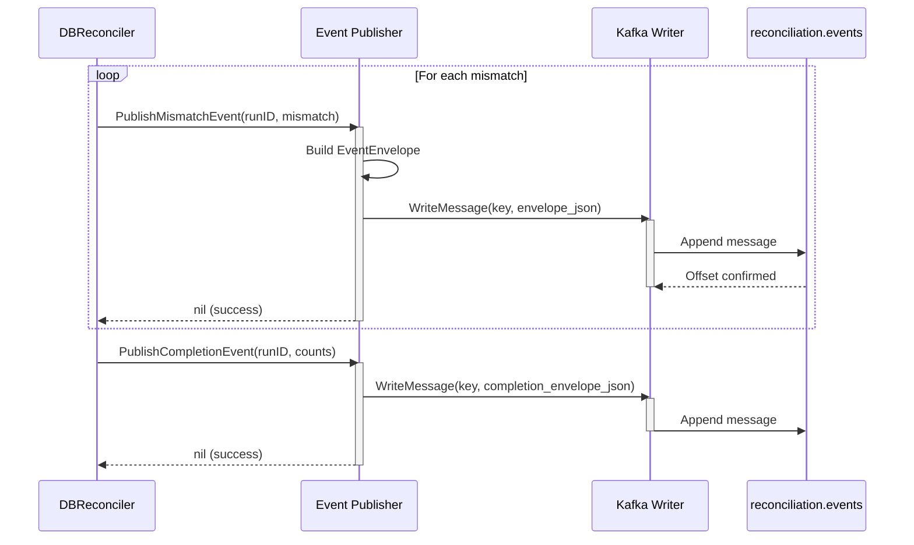
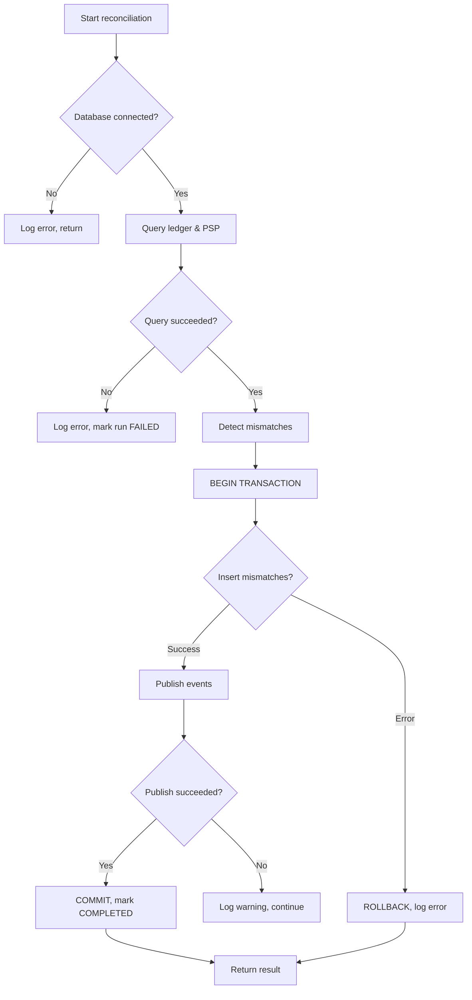

# Reconciliation Engine Low-Level Design

**Wave 36 Track C** · Database-backed reconciliation logic, daily scheduler, and HTTP API

---

## Architecture Overview

The reconciliation engine processes payment ledger vs. PSP exports daily at 2 AM UTC:

```
┌─────────────────┐     ┌──────────────────┐     ┌──────────────┐
│  Daily Trigger  │────▶│ DB Reconciler    │────▶│ PostgreSQL   │
│  (2 AM UTC)     │     │                  │     │ DB           │
└─────────────────┘     └──────────────────┘     └──────────────┘
                              │
                        ┌─────▼──────┐
                        │ Detect     │
                        │ Mismatches │
                        └─────┬──────┘
                              │
                    ┌─────────┼─────────┐
                    │         │         │
              ┌─────▼───┐ ┌───▼────┐ ┌─▼──────────┐
              │ Auto Fix│ │Manual  │ │Event       │
              │         │ │Review  │ │Publisher   │
              └─────────┘ └────────┘ └─┬──────────┘
                                       │
                                   ┌───▼────┐
                                   │ Kafka  │
                                   │.events │
                                   └────────┘
```

---

## Daily Reconciliation Sequence



---

## Mismatch Detection Logic

```
INPUT: ledger map, psp map
OUTPUT: []MismatchDetail

FOR EACH psp transaction:
    IF NOT in ledger:
        ADD mismatch(missing_ledger_entry, AUTO_FIX=true)
    ELSE IF ledger_amount != psp_amount:
        IF shouldAutoFix(ledger_amount, psp_amount):
            ADD mismatch(amount_mismatch, AUTO_FIX=true)
        ELSE:
            ADD mismatch(amount_mismatch, AUTO_FIX=false, MANUAL_REVIEW=true)

FOR EACH ledger transaction:
    IF NOT in psp:
        ADD mismatch(missing_psp_export, AUTO_FIX=false, MANUAL_REVIEW=true)

RETURN mismatches
```

**Auto-Fix Eligibility:**
- Reason: `missing_ledger_entry` → Always auto-fixable (add entry from PSP)
- Reason: `amount_mismatch` if `|ledger_amount - psp_amount| < 5% * psp_amount` → Auto-fixable (adjust to PSP)
- Reason: `missing_psp_export` → Manual review only (ledger has entry PSP doesn't)
- Reason: `currency_mismatch` → Manual review only (data integrity issue)

---

## HTTP API Request/Response Sequence

### Query Runs Sequence



### Apply Fix Sequence



---

## Event Publishing Pipeline



---

## Data Flow: Reconciliation Run

```
1. TRIGGER: Daily cron job at 2 AM UTC
   └─▶ Scheduler.RunOnce(yesterday)

2. QUERY: Fetch today's ledger and PSP snapshot
   ├─▶ SELECT * FROM payment_ledger WHERE created_at >= NOW() - 1 day
   └─▶ SELECT * FROM psp_export_snapshot WHERE export_date = CURRENT_DATE

3. DETECT: Compare in-memory maps
   ├─▶ For each PSP transaction, find in ledger
   ├─▶ Detect: missing, amount_mismatch, currency_mismatch
   └─▶ For each ledger transaction not in PSP → missing_psp_export

4. PERSIST: Store mismatches to DB
   ├─▶ INSERT INTO reconciliation_runs (run_date, status=IN_PROGRESS)
   ├─▶ FOR EACH mismatch:
   │   ├─▶ INSERT INTO reconciliation_mismatches
   │   └─▶ UPDATE reconciliation_runs counts
   └─▶ UPDATE reconciliation_runs status=COMPLETED

5. PUBLISH: Emit events to Kafka
   ├─▶ PublishMismatchEvent (one per mismatch found)
   └─▶ PublishCompletionEvent (summary at end)

6. RESULT: Return reconciliation summary
   └─▶ { runID, mismatchCount, autoFixedCount, manualReviewCount, duration }
```

---

## Database Schema (Referenced)

**Tables used:**
- `reconciliation_runs` — Tracks each daily run
- `reconciliation_mismatches` — Detected discrepancies
- `reconciliation_fixes` — Applied fixes (audit trail)
- `payment_ledger` — Query source (read-only for reconciliation)
- `psp_export_snapshot` — Query source (read-only for reconciliation)

**Key columns:**
- `reconciliation_runs.run_date` — Unique per day (index: DESC for recent queries)
- `reconciliation_runs.status` — PENDING, IN_PROGRESS, COMPLETED, FAILED
- `reconciliation_mismatches.run_id` — Foreign key to runs
- `reconciliation_mismatches.auto_fixed` — Boolean flag for auto-fixed mismatches
- `reconciliation_mismatches.manual_review_required` — Flag for manual review

---

## Performance Characteristics

| Operation | Complexity | Time (P99) |
|-----------|----------|-----------|
| Query ledger (100K rows) | O(n) | <500ms |
| Query PSP export (100K rows) | O(n) | <500ms |
| Detect mismatches (in-memory) | O(n) hash lookup | <100ms |
| Insert 1000 mismatches | O(n * m) batch insert | <2s |
| List runs (paginated) | O(log n) index + O(m) scan | <100ms |
| Get mismatches for run | O(log n) index + O(k) scan | <150ms |
| Apply fix (single mismatch) | O(1) update | <50ms |

---

## Error Handling



---

## Monitoring & Observability

### OpenTelemetry Spans

```go
span := tracer.Start(ctx, "reconciliation.daily_run")
span.SetAttributes(
    attribute.String("run_date", "2026-03-21"),
    attribute.Int("reconciliation.mismatches", 42),
    attribute.Int("reconciliation.auto_fixed", 35),
    attribute.Int("reconciliation.manual_review", 7),
    attribute.Float64("reconciliation.duration_seconds", 3.45),
)
```

### Prometheus Metrics

- `reconciliation_run_duration_seconds` (histogram) — Time taken per run
- `reconciliation_mismatches_total` (counter) — Total mismatches detected
- `reconciliation_auto_fixed_total` (counter) — Auto-fixed count
- `reconciliation_manual_review_total` (counter) — Manual review count

### Structured Logging

```json
{
  "level": "info",
  "message": "reconciliation completed",
  "run_id": 42,
  "run_date": "2026-03-21",
  "mismatches": 15,
  "auto_fixed": 12,
  "manual_review": 3,
  "duration_ms": 3450,
  "trace_id": "...",
  "span_id": "..."
}
```

---

## Concurrency & Thread Safety

- **Scheduler:** Single-threaded cron runner (prevents concurrent runs via `atomic.Bool`)
- **Database:** Connection pooling via `sql.DB` (thread-safe, max 20 connections)
- **Kafka Publisher:** Thread-safe `kafka.Writer` (async writes with ordering guarantees per key)
- **HTTP Handlers:** Stateless, concurrent access safe (no shared mutable state)

---

## SLO Targets

| SLI | Target | Rationale |
|-----|--------|-----------|
| Daily run completes within 4 hours | 99% | Allows manual review before next run |
| Mismatch detection latency (P99) | <2 seconds | 100K transactions comparison |
| Event publish success | 99.9% | Transient Kafka failures retried |
| API endpoint latency (P99) | <200ms | Index-backed queries |
| Manual review backlog ≤ 100 | 95% of days | Operational target |
