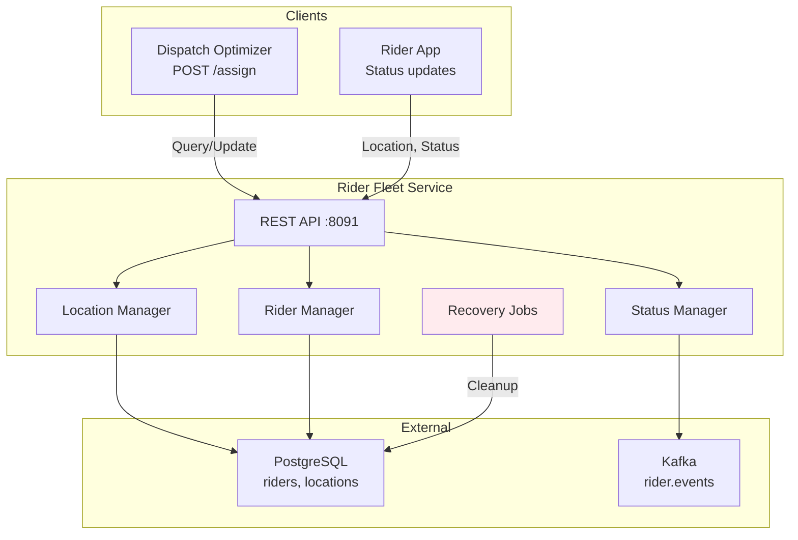

# Rider Fleet Service - High-Level Design (HLD)

## Overview

Rider Fleet Service manages rider profiles, availability, location tracking, and assignment history.

## Key Features

- Rider availability tracking (AVAILABLE, ASSIGNED, ON_DELIVERY, OFF_DUTY)
- Optimistic locking for concurrent assignments
- Real-time location stream via Kafka
- Stuck rider detection
- SLO: 99.9% availability, <1.5s P99

