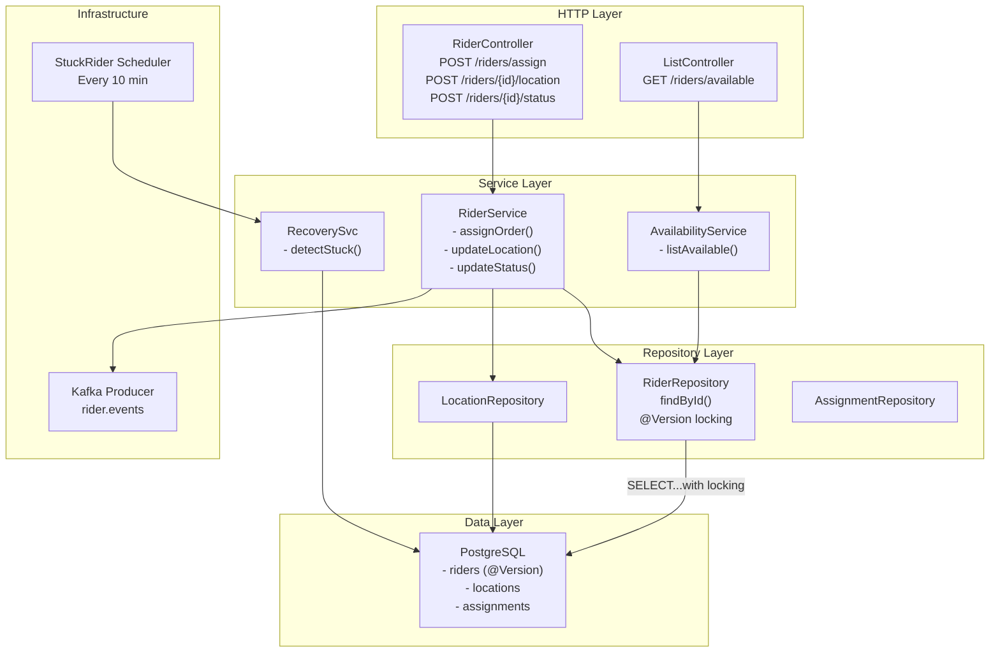

# Rider Fleet Service - Low-Level Design (LLD)



## Rider Status Transitions

```sql
create table riders (
    id uuid primary key,
    phone varchar unique,
    status varchar(20) not null,  -- AVAILABLE, ASSIGNED, ON_DELIVERY, OFF_DUTY
    current_order_id uuid,
    current_lat decimal,
    current_long decimal,
    created_at timestamp,
    updated_at timestamp,
    version bigint  -- Optimistic locking
);

create table rider_locations (
    id uuid primary key,
    rider_id uuid references riders(id),
    latitude decimal,
    longitude decimal,
    updated_at timestamp
);

create table assignment_history (
    id uuid primary key,
    rider_id uuid references riders(id),
    order_id uuid,
    assigned_at timestamp,
    completed_at timestamp,
    status varchar(20)
);

create index idx_riders_status on riders(status);
create index idx_riders_phone on riders(phone);
create index idx_locations_rider_id on rider_locations(rider_id);
```
