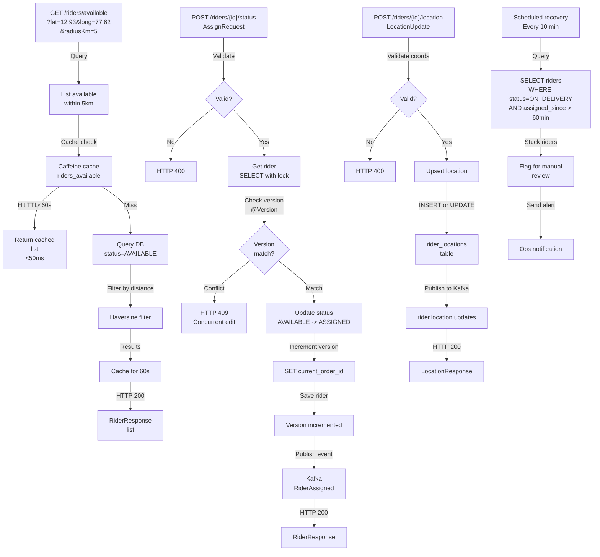
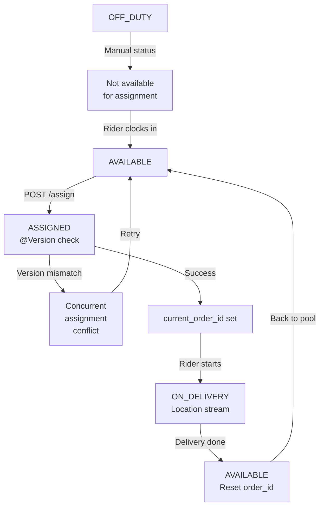

# Rider Fleet Service - Flowchart

```mermaid
flowchart TD
    A["GET /riders/available<br/>?lat=12.93&long=77.62<br/>&radiusKm=5"] -->|Query| B["List available<br/>within 5km"]
    B -->|Cache check| C["Caffeine cache<br/>riders_available"]
    C -->|Hit TTL<60s| D["Return cached<br/>list<br/><50ms"]
    C -->|Miss| E["Query DB<br/>status=AVAILABLE"]
    E -->|Filter by distance| F["Haversine filter"]
    F -->|Results| G["Cache for 60s"]
    G -->|HTTP 200| H["RiderResponse<br/>list"]

    I["POST /riders/{id}/status<br/>AssignRequest"] -->|Validate| J{Valid?}
    J -->|No| K["HTTP 400"]
    J -->|Yes| L["Get rider<br/>SELECT with lock"]
    L -->|Check version<br/>@Version| M{"Version<br/>match?"}
    M -->|Conflict| N["HTTP 409<br/>Concurrent edit"]
    M -->|Match| O["Update status<br/>AVAILABLE -> ASSIGNED"]
    O -->|Increment version| P["SET current_order_id"]
    P -->|Save rider| Q["Version incremented"]
    Q -->|Publish event| R["Kafka<br/>RiderAssigned"]
    R -->|HTTP 200| S["RiderResponse"]

    T["POST /riders/{id}/location<br/>LocationUpdate"] -->|Validate coords| U{Valid?}
    U -->|No| V["HTTP 400"]
    U -->|Yes| W["Upsert location"]
    W -->|INSERT or UPDATE| X["rider_locations<br/>table"]
    X -->|Publish to Kafka| Y["rider.location.updates"]
    Y -->|HTTP 200| Z["LocationResponse"]

    AA["Scheduled recovery<br/>Every 10 min"] -->|Query| AB["SELECT riders<br/>WHERE status=ON_DELIVERY<br/>AND assigned_since > 60min"]
    AB -->|Stuck riders| AC["Flag for manual<br/>review"]
    AC -->|Send alert| AD["Ops notification"]
```

## Assignment State Transitions

```mermaid
graph TD
    A["AVAILABLE"] -->|POST /assign| B["ASSIGNED<br/>@Version check"]
    B -->|Version mismatch| C["Concurrent<br/>assignment<br/>conflict"]
    C -->|Retry| A
    B -->|Success| D["current_order_id set"]
    D -->|Rider starts| E["ON_DELIVERY<br/>Location stream"]
    E -->|Delivery done| F["AVAILABLE<br/>Reset order_id"]
    F -->|Back to pool| A

    G["OFF_DUTY"] -->|Manual status| H["Not available<br/>for assignment"]
    H -->|Rider clocks in| A
```
