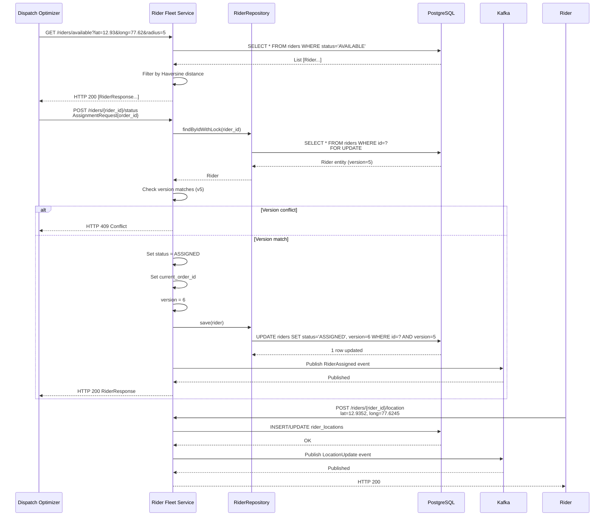
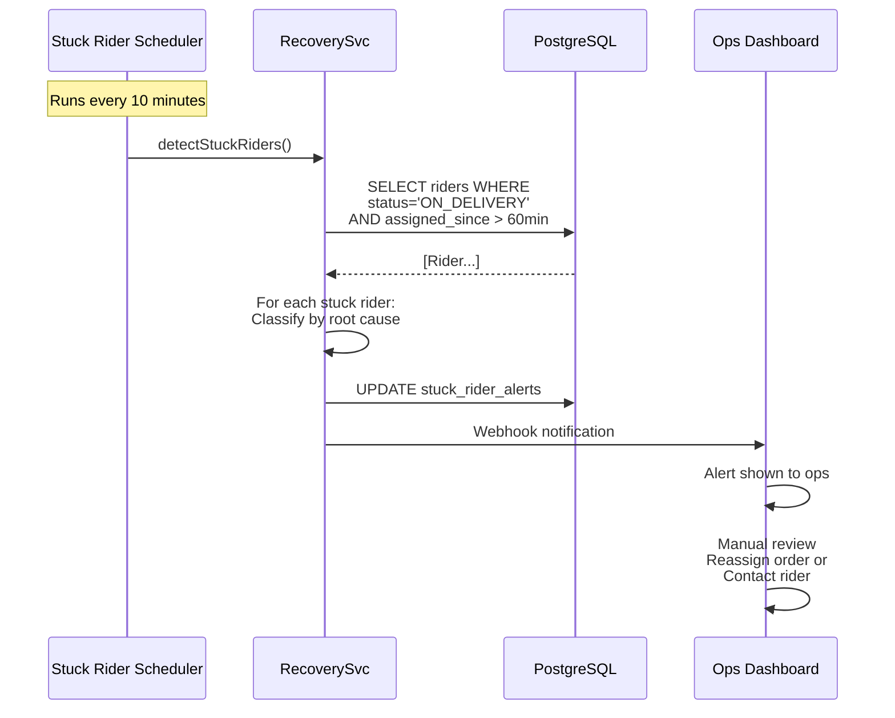

# Rider Fleet Service - Sequence Diagram

```mermaid
sequenceDiagram
    participant Dispatch as Dispatch Optimizer
    participant RiderSvc as Rider Fleet Service
    participant RiderRepo as RiderRepository
    participant PostgreSQL as PostgreSQL
    participant Kafka as Kafka

    Dispatch->>RiderSvc: GET /riders/available?lat=12.93&long=77.62&radius=5
    RiderSvc->>PostgreSQL: SELECT * FROM riders WHERE status='AVAILABLE'
    PostgreSQL-->>RiderSvc: List [Rider...]
    RiderSvc->>RiderSvc: Filter by Haversine distance
    RiderSvc-->>Dispatch: HTTP 200 [RiderResponse...]

    Dispatch->>RiderSvc: POST /riders/{rider_id}/status<br/>AssignmentRequest{order_id}

    RiderSvc->>RiderRepo: findByIdWithLock(rider_id)
    RiderRepo->>PostgreSQL: SELECT * FROM riders WHERE id=?<br/>FOR UPDATE
    PostgreSQL-->>RiderRepo: Rider entity (version=5)
    RiderRepo-->>RiderSvc: Rider

    RiderSvc->>RiderSvc: Check version matches (v5)
    alt Version conflict
        RiderSvc-->>Dispatch: HTTP 409 Conflict
    else Version match
        RiderSvc->>RiderSvc: Set status = ASSIGNED
        RiderSvc->>RiderSvc: Set current_order_id
        RiderSvc->>RiderSvc: version = 6
        RiderSvc->>RiderRepo: save(rider)
        RiderRepo->>PostgreSQL: UPDATE riders SET status='ASSIGNED', version=6 WHERE id=? AND version=5
        PostgreSQL-->>RiderRepo: 1 row updated
        RiderSvc->>Kafka: Publish RiderAssigned event
        Kafka-->>RiderSvc: Published
        RiderSvc-->>Dispatch: HTTP 200 RiderResponse
    end

    Rider->>RiderSvc: POST /riders/{rider_id}/location<br/>lat=12.9352, long=77.6245
    RiderSvc->>PostgreSQL: INSERT/UPDATE rider_locations
    PostgreSQL-->>RiderSvc: OK
    RiderSvc->>Kafka: Publish LocationUpdate event
    Kafka-->>RiderSvc: Published
    RiderSvc-->>Rider: HTTP 200
```

## Stuck Rider Detection Flow

```mermaid
sequenceDiagram
    participant Scheduler as Stuck Rider Scheduler
    participant RecoverySvc as RecoverySvc
    participant PostgreSQL as PostgreSQL
    participant OpsDashboard as Ops Dashboard

    Note over Scheduler: Runs every 10 minutes
    Scheduler->>RecoverySvc: detectStuckRiders()
    RecoverySvc->>PostgreSQL: SELECT riders WHERE<br/>status='ON_DELIVERY'<br/>AND assigned_since > 60min
    PostgreSQL-->>RecoverySvc: [Rider...]
    RecoverySvc->>RecoverySvc: For each stuck rider:<br/>Classify by root cause
    RecoverySvc->>PostgreSQL: UPDATE stuck_rider_alerts
    RecoverySvc->>OpsDashboard: Webhook notification

    OpsDashboard->>OpsDashboard: Alert shown to ops
    OpsDashboard->>OpsDashboard: Manual review<br/>Reassign order or<br/>Contact rider
```
