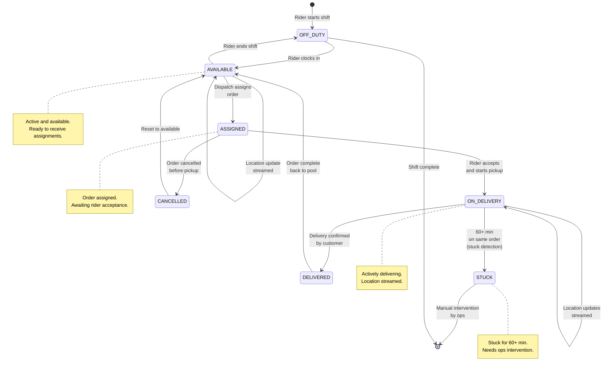
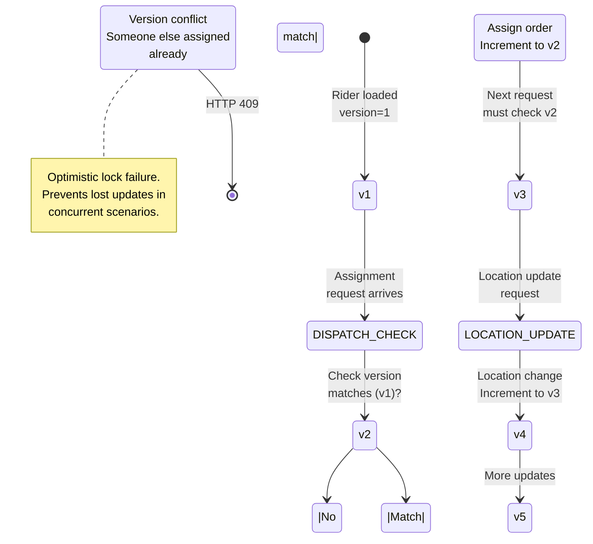
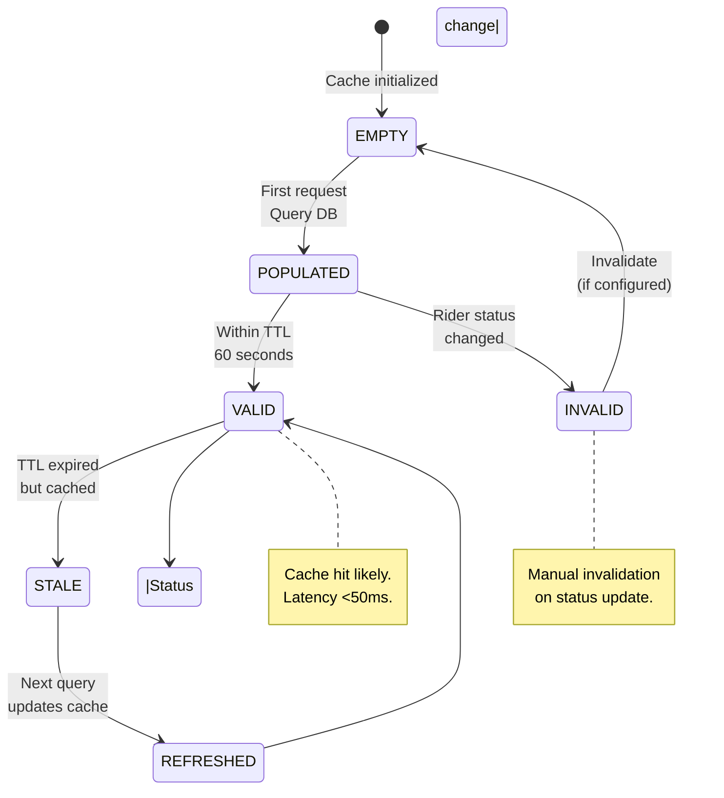

# Rider Fleet Service - State Machine Diagram

```mermaid
stateDiagram-v2
    [*] --> OFF_DUTY: Rider starts shift

    OFF_DUTY --> AVAILABLE: Rider clocks in
    AVAILABLE --> AVAILABLE: Location update<br/>streamed

    AVAILABLE --> ASSIGNED: Dispatch assigns<br/>order

    ASSIGNED --> ON_DELIVERY: Rider accepts<br/>and starts pickup

    ON_DELIVERY --> ON_DELIVERY: Location updates<br/>streamed

    ON_DELIVERY --> DELIVERED: Delivery confirmed<br/>by customer

    DELIVERED --> AVAILABLE: Order complete<br/>back to pool

    ON_DELIVERY --> STUCK: 60+ min<br/>on same order<br/>(stuck detection)

    STUCK --> [*]: Manual intervention<br/>by ops

    ASSIGNED --> CANCELLED: Order cancelled<br/>before pickup

    CANCELLED --> AVAILABLE: Reset to available

    AVAILABLE --> OFF_DUTY: Rider ends shift

    OFF_DUTY --> [*]: Shift complete

    note right of AVAILABLE
        Active and available.
        Ready to receive assignments.
    end note

    note right of ASSIGNED
        Order assigned.
        Awaiting rider acceptance.
    end note

    note right of ON_DELIVERY
        Actively delivering.
        Location streamed.
    end note

    note right of STUCK
        Stuck for 60+ min.
        Needs ops intervention.
    end note
```

## Version-Based Concurrency Control

```mermaid
stateDiagram-v2
    [*] --> v1: Rider loaded<br/>version=1

    v1 --> DISPATCH_CHECK: Assignment<br/>request arrives

    DISPATCH_CHECK --> v2: Check version<br/>matches (v1)?

    v2 -->|No match| CONFLICT: Version conflict<br/>Someone else assigned<br/>already

    CONFLICT --> [*]: HTTP 409

    v2 -->|Match| ASSIGN: Assign order<br/>Increment to v2

    ASSIGN --> v3: Next request<br/>must check v2

    v3 --> LOCATION_UPDATE: Location update<br/>request

    LOCATION_UPDATE --> v4: Location change<br/>Increment to v3

    v4 --> v5: More updates

    note right of CONFLICT
        Optimistic lock failure.
        Prevents lost updates in
        concurrent scenarios.
    end note
```

## Availability Cache Lifecycle

```mermaid
stateDiagram-v2
    [*] --> EMPTY: Cache initialized

    EMPTY --> POPULATED: First request<br/>Query DB

    POPULATED --> VALID: Within TTL<br/>60 seconds

    VALID --> STALE: TTL expired<br/>but cached

    STALE --> REFRESHED: Next query<br/>updates cache

    REFRESHED --> VALID

    POPULATED --> INVALID: Rider status<br/>changed

    INVALID --> EMPTY: Invalidate<br/>(if configured)

    VALID -->|Status change| INVALID

    note right of VALID
        Cache hit likely.
        Latency <50ms.
    end note

    note right of INVALID
        Manual invalidation
        on status update.
    end note
```
