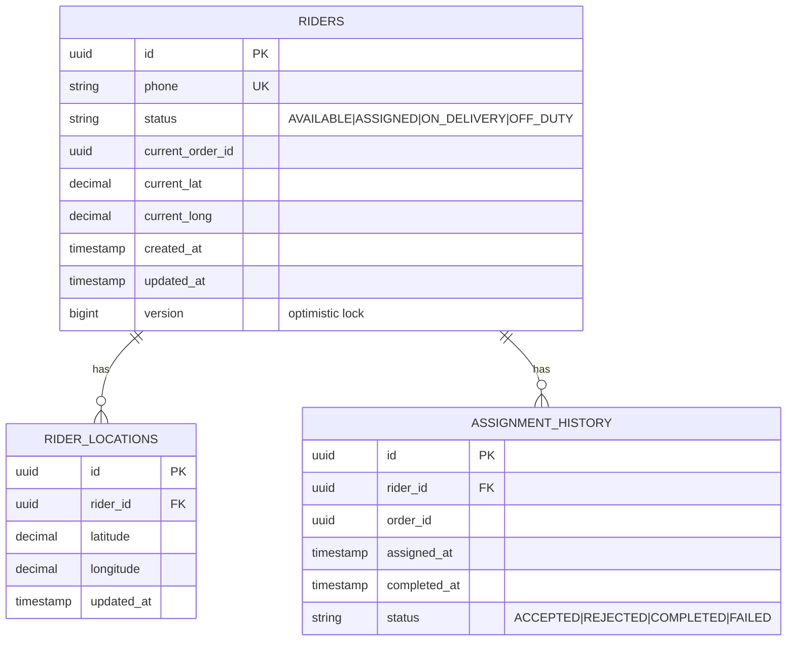
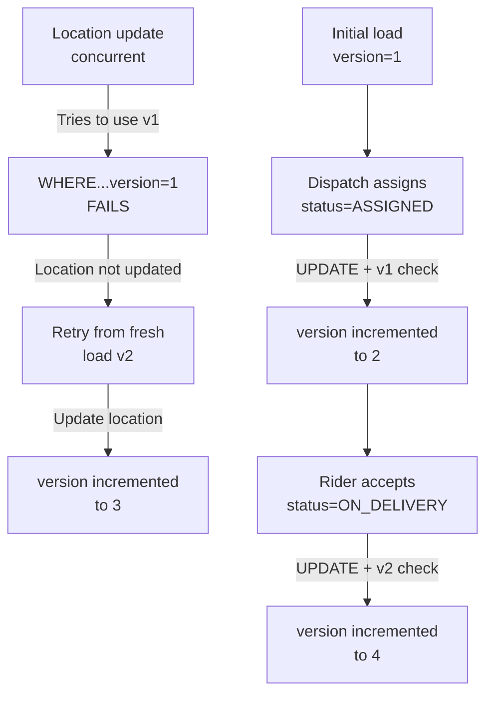

# Rider Fleet Service - Entity-Relationship Diagram (ERD)



## Indexes

```sql
CREATE INDEX idx_riders_status ON riders(status);
CREATE INDEX idx_riders_phone ON riders(phone);
CREATE INDEX idx_riders_current_order_id ON riders(current_order_id);
CREATE INDEX idx_locations_rider_id ON rider_locations(rider_id);
CREATE INDEX idx_locations_updated_at ON rider_locations(updated_at DESC);
CREATE INDEX idx_assignments_rider_id ON assignment_history(rider_id);
CREATE INDEX idx_assignments_order_id ON assignment_history(order_id);
CREATE INDEX idx_assignments_assigned_at ON assignment_history(assigned_at DESC);
```

## Concurrency Control

```markdown
## Optimistic Locking (@Version)

- Each rider has a version column (bigint)
- On UPDATE, check WHERE id=? AND version=current_version
- If match: Update succeeds, version incremented
- If no match: 0 rows updated, throw OptimisticLockException

## Scenario

1. Rider v1 loaded from DB
2. Another request updates Rider to v2
3. First request tries to save v1 (incremented to v2)
4. WHERE clause fails (version already 2)
5. HTTP 409 Conflict returned

## Benefits

- No row locks needed (better concurrency)
- Fail-fast on conflicts
- Application handles retry logic
```

## Version Tracking


