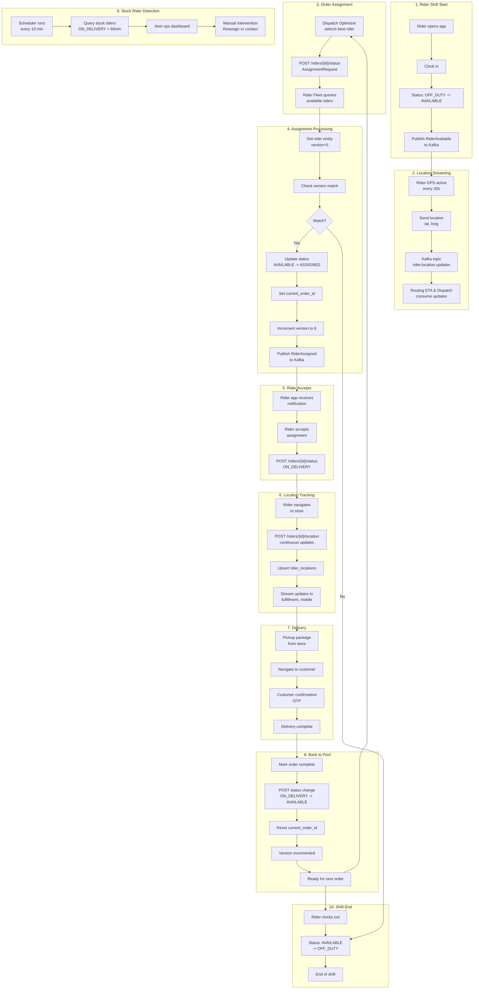
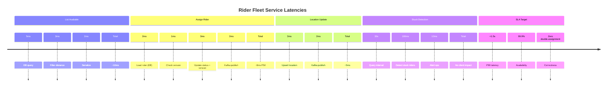
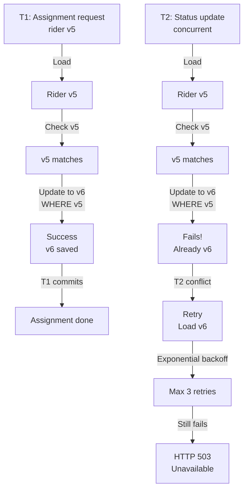
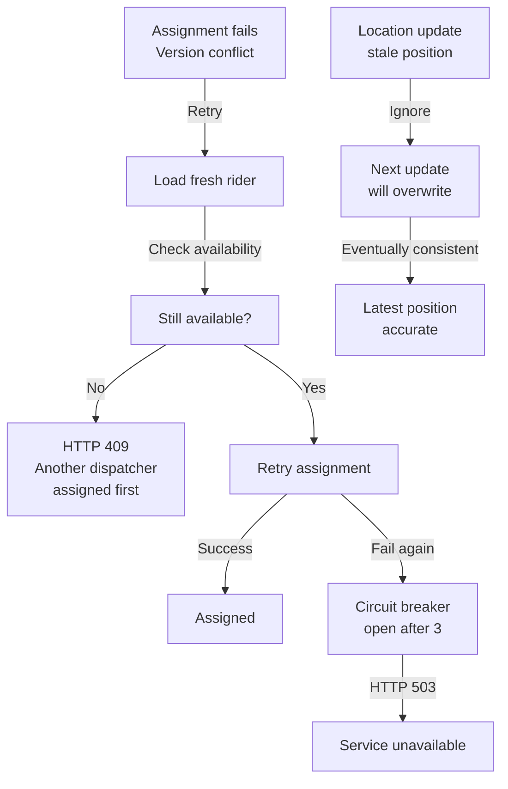

# Rider Fleet Service - End-to-End Flow

```mermaid
graph TB
    subgraph "1. Rider Shift Start"
        A["Rider opens app"]
        B["Clock in"]
        C["Status: OFF_DUTY -> AVAILABLE"]
        D["Publish RiderAvailable<br/>to Kafka"]
    end

    subgraph "2. Location Streaming"
        E["Rider GPS active<br/>every 30s"]
        F["Send location<br/>lat, long"]
        G["Kafka topic<br/>rider.location.updates"]
        H["Routing ETA & Dispatch<br/>consume updates"]
    end

    subgraph "3. Order Assignment"
        I["Dispatch Optimizer<br/>selects best rider"]
        J["POST /riders/{id}/status<br/>AssignmentRequest"]
        K["Rider Fleet queries<br/>available riders"]
    end

    subgraph "4. Assignment Processing"
        L["Get rider entity<br/>version=5"]
        M["Check version match"]
        N{"Match?"}
        O["Update status<br/>AVAILABLE -> ASSIGNED"]
        P["Set current_order_id"]
        Q["Increment version to 6"]
        R["Publish RiderAssigned<br/>to Kafka"]
    end

    subgraph "5. Rider Accepts"
        S["Rider app receives<br/>notification"]
        T["Rider accepts<br/>assignment"]
        U["POST /riders/{id}/status<br/>ON_DELIVERY"]
    end

    subgraph "6. Location Tracking"
        V["Rider navigates<br/>to store"]
        W["POST /riders/{id}/location<br/>continuous updates"]
        X["Upsert rider_locations"]
        Y["Stream updates to<br/>fulfillment, mobile"]
    end

    subgraph "7. Delivery"
        Z["Pickup package<br/>from store"]
        AA["Navigate to customer"]
        AB["Customer confirmation<br/>OTP"]
        AC["Delivery complete"]
    end

    subgraph "8. Back to Pool"
        AD["Mark order complete"]
        AE["POST status change<br/>ON_DELIVERY -> AVAILABLE"]
        AF["Reset current_order_id"]
        AG["Version incremented"]
        AH["Ready for next order"]
    end

    subgraph "9. Stuck Rider Detection"
        AI["Scheduler runs<br/>every 10 min"]
        AJ["Query stuck riders<br/>ON_DELIVERY > 60min"]
        AK["Alert ops dashboard"]
        AL["Manual intervention<br/>Reassign or contact"]
    end

    subgraph "10. Shift End"
        AM["Rider clocks out"]
        AM2["Status: AVAILABLE<br/>-> OFF_DUTY"]
        AN["End of shift"]
    end

    A --> B
    B --> C
    C --> D
    D --> E
    E --> F
    F --> G
    G --> H

    I --> J
    J --> K
    K --> L
    L --> M
    M --> N
    N -->|Yes| O
    N -->|No| AM2
    O --> P
    P --> Q
    Q --> R
    R --> S
    S --> T
    T --> U

    U --> V
    V --> W
    W --> X
    X --> Y
    Y --> Z
    Z --> AA
    AA --> AB
    AB --> AC

    AC --> AD
    AD --> AE
    AE --> AF
    AF --> AG
    AG --> AH
    AH --> I

    AI --> AJ
    AJ --> AK
    AK --> AL

    AH --> AM
    AM --> AM2
    AM2 --> AN
```

## Performance Metrics

```mermaid
timeline
    title Rider Fleet Service Latencies
    section List Available
        5ms : DB query
        3ms : Filter distance
        2ms : Serialize
        Total: ~10ms
    section Assign Rider
        2ms : Load rider (DB)
        1ms : Check version
        3ms : Update status + version
        2ms : Kafka publish
        Total: ~8ms P50
    section Location Update
        3ms : Upsert location
        2ms : Kafka publish
        Total: ~5ms
    section Stuck Detection
        30s : Query interval
        100ms : Detect stuck riders
        10ms : Alert ops
        Total: No client impact
    section SLA Target
        <1.5s : P99 latency
        99.9% : Availability
        Zero double-assignment : Correctness
```

## Concurrency Handling

```mermaid
graph TD
    A["T1: Assignment request<br/>rider v5"] -->|Load| B["Rider v5"]
    C["T2: Status update<br/>concurrent"] -->|Load| D["Rider v5"]

    B -->|Check v5| E["v5 matches"]
    D -->|Check v5| F["v5 matches"]

    E -->|Update to v6<br/>WHERE v5| G["Success<br/>v6 saved"]
    F -->|Update to v6<br/>WHERE v5| H["Fails!<br/>Already v6"]

    G -->|T1 commits| I["Assignment done"]
    H -->|T2 conflict| J["Retry<br/>Load v6"]
    J -->|Exponential backoff| K["Max 3 retries"]
    K -->|Still fails| L["HTTP 503<br/>Unavailable"]
```

## Error Recovery

```mermaid
graph TD
    A["Assignment fails<br/>Version conflict"] -->|Retry| B["Load fresh rider"]
    B -->|Check availability| C["Still available?"]
    C -->|No| D["HTTP 409<br/>Another dispatcher<br/>assigned first"]
    C -->|Yes| E["Retry assignment"]
    E -->|Success| F["Assigned"]
    E -->|Fail again| G["Circuit breaker<br/>open after 3"]
    G -->|HTTP 503| H["Service unavailable"]

    I["Location update<br/>stale position"] -->|Ignore| J["Next update<br/>will overwrite"]
    J -->|Eventually consistent| K["Latest position<br/>accurate"]
```
