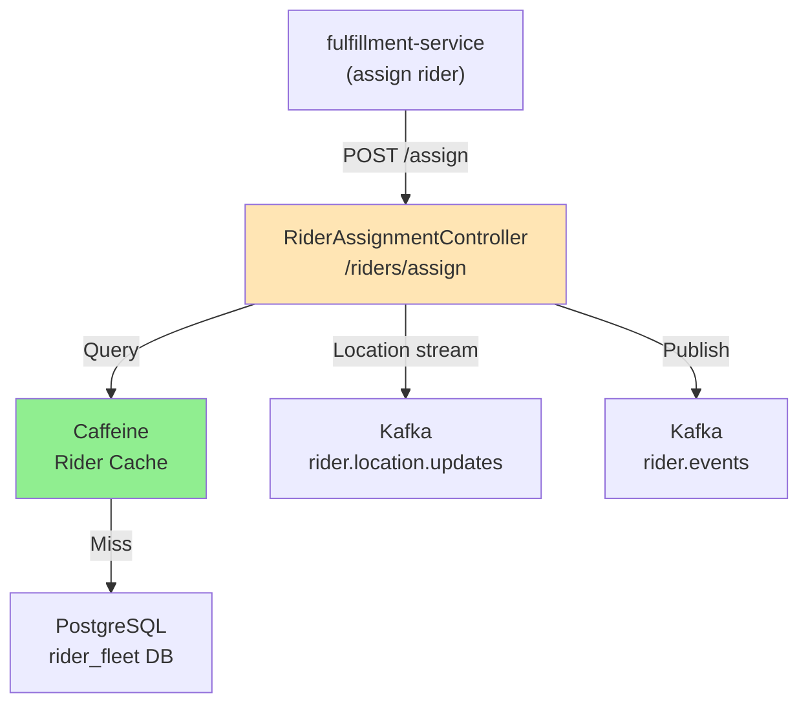

# Rider Fleet Service - HLD & Assignment Logic

## High-Level Architecture



## Components

### RiderController
**Endpoints**:
- `POST /riders/{id}/status` - Update status (AVAILABLE → ASSIGNED → ON_DELIVERY → AVAILABLE)
- `POST /riders/{id}/location` - Update location (consumed from rider.location.updates topic)
- `GET /riders/available` - List available riders

### RiderAssignmentController
**Endpoints**:
- `POST /riders/assign` - Assign nearest available rider

**Assignment Logic**:
```java
public RiderAssignment assignRider(OrderId orderId, Coordinates deliveryLocation) {
    // 1. Query available riders near delivery_location (5km radius)
    List<Rider> candidates = findAvailableRiders(deliveryLocation, 5.0);

    // 2. Sort by distance
    Rider closest = candidates.stream()
        .min(Comparator.comparingDouble(r -> r.distanceFrom(deliveryLocation)))
        .orElseThrow();

    // 3. Update rider status to ASSIGNED (optimistic lock)
    closest.setStatus(ASSIGNED);
    closest.setCurrentOrderId(orderId);
    riderRepository.save(closest);

    // 4. Publish RiderAssigned event
    outboxEventRepository.save(createEvent("RiderAssigned", closest.getId()));

    return new RiderAssignment(closest.getId(), closest.getLocation());
}
```

### Location Tracking
- Consumes `rider.location.updates` topic (real-time)
- Updates rider's current location in DB
- Cached for fast availability queries

---

## Database Schema

```sql
CREATE TABLE riders (
    id UUID PRIMARY KEY,
    phone VARCHAR(20) NOT NULL UNIQUE,
    status VARCHAR(20) NOT NULL DEFAULT 'AVAILABLE',
    current_order_id UUID,
    created_at TIMESTAMPTZ NOT NULL DEFAULT now(),
    version BIGINT NOT NULL DEFAULT 0
);

CREATE TABLE rider_locations (
    id UUID PRIMARY KEY,
    rider_id UUID NOT NULL REFERENCES riders(id),
    latitude NUMERIC(10, 8) NOT NULL,
    longitude NUMERIC(11, 8) NOT NULL,
    updated_at TIMESTAMPTZ NOT NULL DEFAULT now()
);

CREATE TABLE rider_assignments (
    id UUID PRIMARY KEY,
    rider_id UUID NOT NULL REFERENCES riders(id),
    order_id UUID NOT NULL,
    assigned_at TIMESTAMPTZ NOT NULL DEFAULT now(),
    completed_at TIMESTAMPTZ
);

CREATE TABLE outbox_events (
    id UUID PRIMARY KEY,
    aggregate_type VARCHAR(50) NOT NULL,
    aggregate_id VARCHAR(255) NOT NULL,
    event_type VARCHAR(50) NOT NULL,
    payload JSONB NOT NULL,
    created_at TIMESTAMPTZ NOT NULL DEFAULT now(),
    sent BOOLEAN NOT NULL DEFAULT false
);

CREATE INDEX idx_riders_status ON riders(status);
CREATE INDEX idx_locations_rider ON rider_locations(rider_id);
CREATE INDEX idx_assignments_rider ON rider_assignments(rider_id);
CREATE INDEX idx_outbox_unsent ON outbox_events(sent) WHERE sent = false;
```

---

## API Examples

### Assign Rider
```bash
POST /riders/assign
{
  "orderId": "order-550e8400-...",
  "deliveryLocation": {
    "latitude": 40.7128,
    "longitude": -74.0060
  }
}

Response (201):
{
  "assignmentId": "assign-550e8400-...",
  "riderId": "rider-550e8400-...",
  "status": "ASSIGNED",
  "estimatedEtaMinutes": 15
}
```

### Update Rider Location
```bash
POST /riders/{riderId}/location
{
  "latitude": 40.7150,
  "longitude": -74.0080
}

Response (204 No Content)
```

### Update Rider Status
```bash
POST /riders/{riderId}/status
{
  "status": "ON_DELIVERY"
}

Response (200):
{
  "riderId": "rider-550e8400-...",
  "status": "ON_DELIVERY"
}
```

---

## Kafka Events

### RiderAssigned
```json
{
  "eventType": "RiderAssigned",
  "aggregateId": "rider-550e8400-...",
  "payload": {
    "riderId": "rider-550e8400-...",
    "orderId": "order-550e8400-...",
    "latitude": 40.7128,
    "longitude": -74.0060
  }
}
```

### RiderLocationUpdated
```json
{
  "eventType": "RiderLocationUpdated",
  "aggregateId": "rider-550e8400-...",
  "payload": {
    "riderId": "rider-550e8400-...",
    "latitude": 40.7150,
    "longitude": -74.0080,
    "timestamp": "2026-03-21T10:00:00Z"
  }
}
```

---

## Concurrency & Locking

**Optimistic Locking** (@Version):
```java
@Entity
public class Rider {
    @Version
    private Long version;

    private RiderStatus status;
    private UUID currentOrderId;
}
```

**Flow**:
- Read rider (version=0)
- Update status=ASSIGNED (version=1)
- Update save: WHERE version=0 AND id=?
- If mismatch: OptimisticLockingFailureException
- Retry or fail (not reassigned by another thread)

---

## Recovery (Wave 30+)

**Stuck Rider Job**:
```java
@Scheduled(cron = "0 */10 * * * *")  // Every 10 minutes
@SchedulerLock(name = "rider_recovery_stuck")
public void recoveryStuckRiders() {
    List<Rider> stuck = riderRepository.findStuckRiders(
        threshold = 60 minutes ago,
        status = ASSIGNED
    );
    // Trigger manual reconciliation or auto-reassignment
}
```

**Criteria**: assigned >60 min ago, still status=ASSIGNED → likely stuck

---

## Performance

- **Assignment Latency**: <500ms (with cache)
- **Cache**: 1000 available riders, 60s TTL
- **Concurrency**: High (many concurrent assignments)
