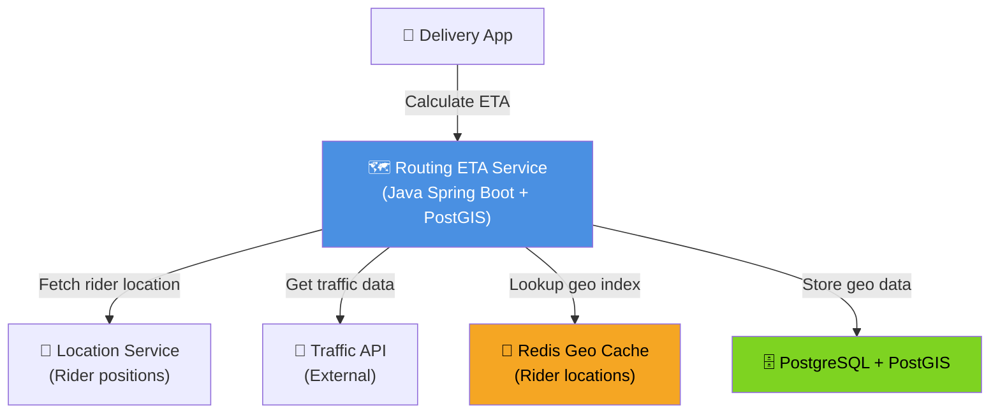
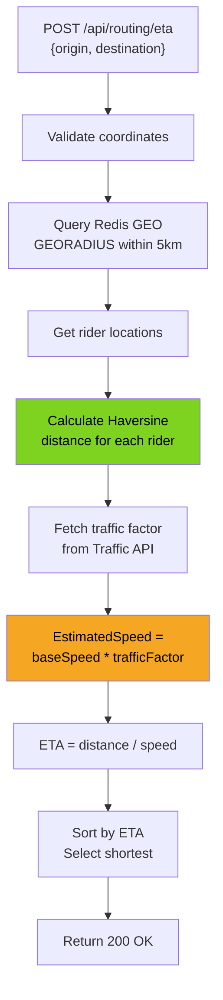
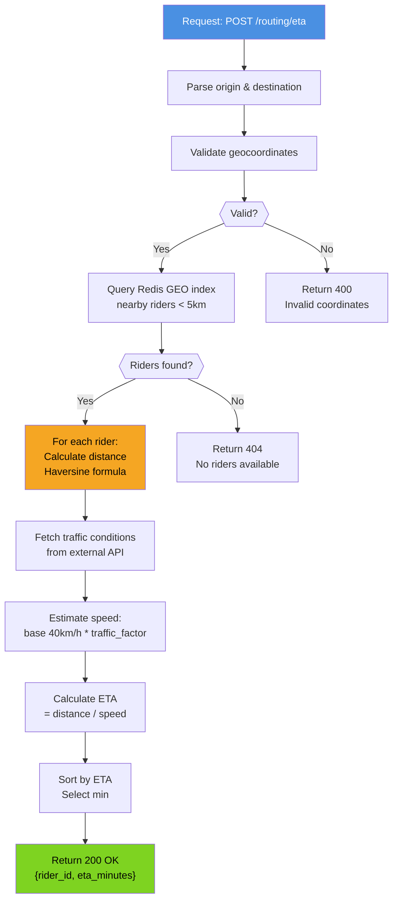
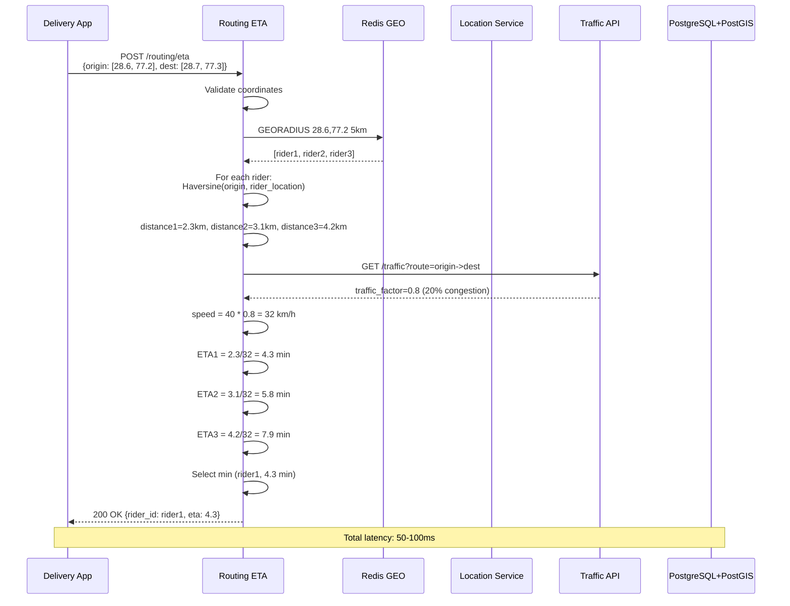
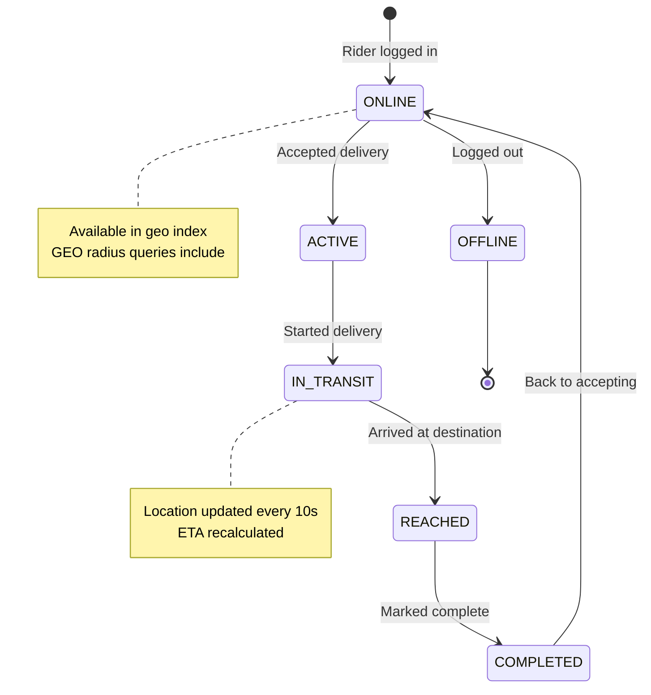
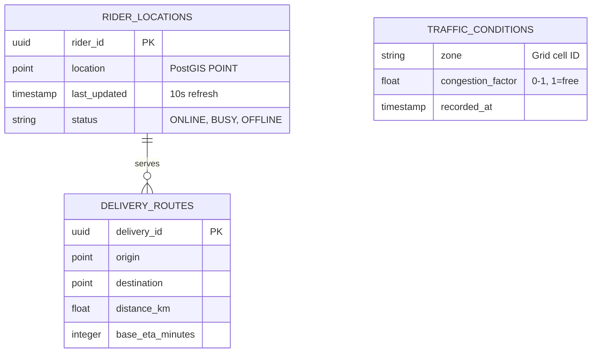

# Routing ETA Service - All 7 Diagrams

## 1. High-Level Design



## 2. Low-Level Design - ETA Calculation



## 3. Flowchart - ETA Query Read Path



## 4. Sequence - ETA Calculation



## 5. State Machine - Rider Availability



## 6. ER - Geo & Traffic Data



## 7. End-to-End - Complete ETA Flow

```mermaid
graph TB
    User["👤 User<br/>(Delivery App)"]
    Mobile["📱 Mobile<br/>(Pickup: 28.6°N, 77.2°E<br/>Dropoff: 28.7°N, 77.3°E)"]
    LB["⚖️ Load Balancer"]
    Router["🗺️ ETA Service<br/>(Pod1, Pod2, Pod3)"]
    Redis["📍 Redis GEO Cache<br/>rider1: [28.5, 77.1]<br/>rider2: [28.65, 77.25]<br/>rider3: [28.72, 77.35]"]
    TrafficAPI["🚗 Google Maps<br/>Traffic API"]
    PostgreSQL["🗄️ PostgreSQL<br/>with PostGIS"]
    Kafka["📬 Kafka<br/>(eta_calculated)"]

    User -->|1. Tap Pickup/Dropoff| Mobile
    Mobile -->|2. POST /routing/eta| LB
    LB -->|3. Route request| Router
    Router -->|4. GEORADIUS query| Redis
    Redis -->|5. Return nearby riders| Router
    Router -->|6. Haversine calc| Router
    Router -->|7. Query traffic| TrafficAPI
    TrafficAPI -->|8. traffic_factor=0.8| Router
    Router -->|9. Calculate ETAs| Router
    Router -->|10. Publish event| Kafka
    Router -->|11. Log to audit| PostgreSQL
    Kafka -->|event: eta_calculated| Kafka
    Router -->|12. 200 OK {eta: 5min}| Mobile
    Mobile -->|13. Show "5 min arrival"| User

    style Router fill:#4A90E2,color:#fff
    style Redis fill:#F5A623,color:#000
    style TrafficAPI fill:#50E3C2,color:#000
```
