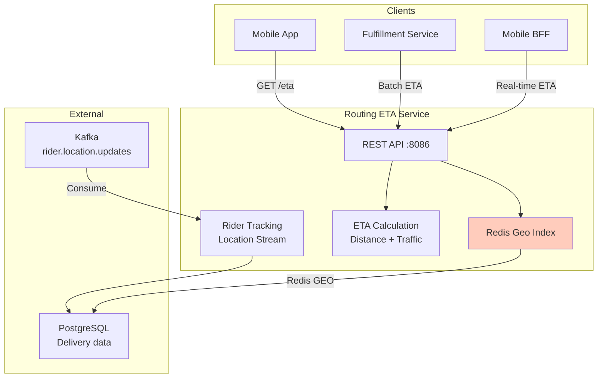

# Routing ETA Service - High-Level Design (HLD)

## Key Features

- Distance calculation: Haversine formula
- Traffic data: Historical averages
- Rider tracking: Real-time location indexing
- Batch ETA: Optimize multiple orders
- SLO: 99%, <200ms P99

