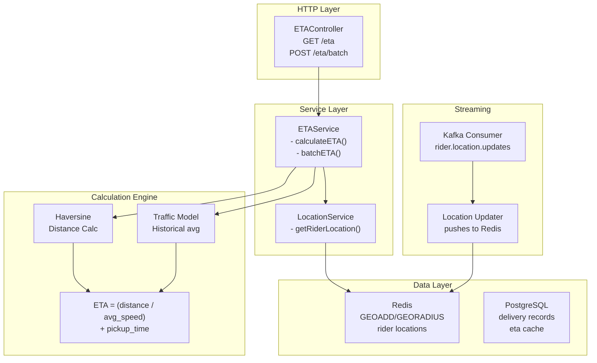
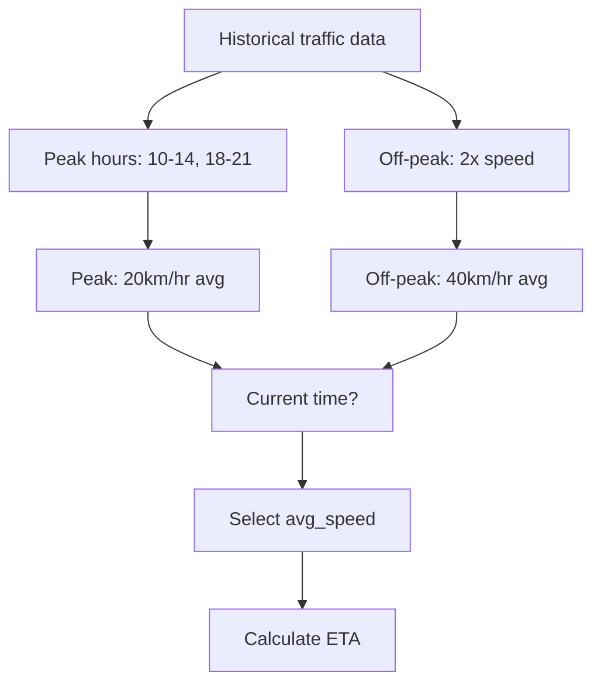

# Routing ETA Service - Low-Level Design (LLD)



## Distance Formula

```markdown
## Haversine Formula

Distance = 2 * R * arcsin(sqrt(
    sin((lat2-lat1)/2)^2 +
    cos(lat1) * cos(lat2) * sin((long2-long1)/2)^2
))

where R = 6371 km (Earth radius)

Time = distance / average_speed + 5 min (pickup + security)
```

## Traffic Model


