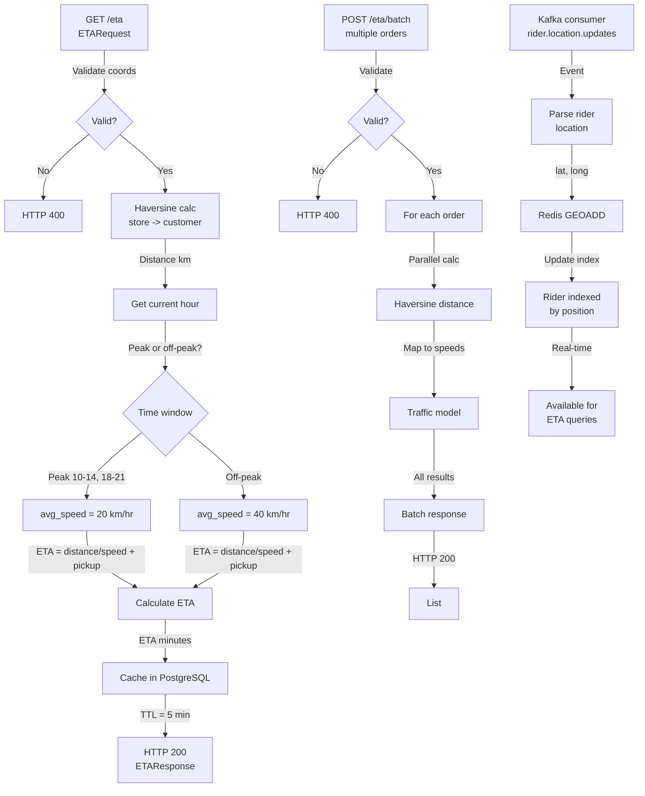
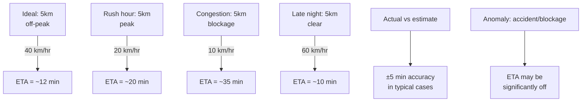

# Routing ETA Service - Flowchart

```mermaid
flowchart TD
    A["GET /eta<br/>ETARequest"] -->|Validate coords| B{Valid?}
    B -->|No| C["HTTP 400"]
    B -->|Yes| D["Haversine calc<br/>store -> customer"]
    D -->|Distance km| E["Get current hour"]
    E -->|Peak or off-peak?| F{Time window}
    F -->|Peak 10-14, 18-21| G["avg_speed = 20 km/hr"]
    F -->|Off-peak| H["avg_speed = 40 km/hr"]
    G -->|ETA = distance/speed + pickup| I["Calculate ETA"]
    H -->|ETA = distance/speed + pickup| I
    I -->|ETA minutes| J["Cache in PostgreSQL"]
    J -->|TTL = 5 min| K["HTTP 200<br/>ETAResponse"]

    L["POST /eta/batch<br/>multiple orders"] -->|Validate| M{Valid?}
    M -->|No| N["HTTP 400"]
    M -->|Yes| O["For each order"]
    O -->|Parallel calc| P["Haversine distance"]
    P -->|Map to speeds| Q["Traffic model"]
    Q -->|All results| R["Batch response"]
    R -->|HTTP 200| S["List<ETAResponse>"]

    T["Kafka consumer<br/>rider.location.updates"] -->|Event| U["Parse rider<br/>location"]
    U -->|lat, long| V["Redis GEOADD"]
    V -->|Update index| W["Rider indexed<br/>by position"]
    W -->|Real-time| X["Available for<br/>ETA queries"]
```

## ETA Accuracy Scenarios

```mermaid
graph TD
    A["Ideal: 5km<br/>off-peak"] -->|40 km/hr| B["ETA = ~12 min"]
    C["Rush hour: 5km<br/>peak"] -->|20 km/hr| D["ETA = ~20 min"]
    E["Congestion: 5km<br/>blockage"] -->|10 km/hr| F["ETA = ~35 min"]
    G["Late night: 5km<br/>clear"] -->|60 km/hr| H["ETA = ~10 min"]

    I["Actual vs estimate"] --> J["±5 min accuracy<br/>in typical cases"]
    K["Anomaly: accident/blockage"] --> L["ETA may be<br/>significantly off"]
```
