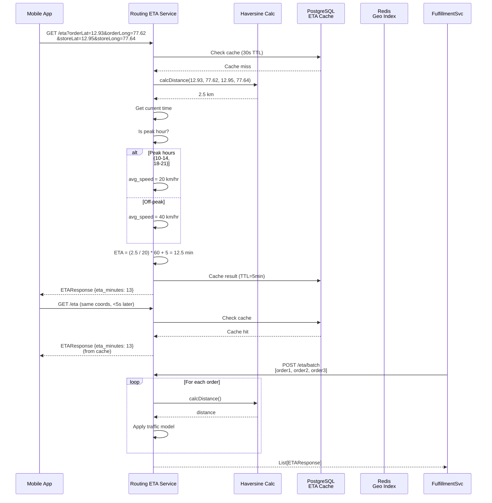
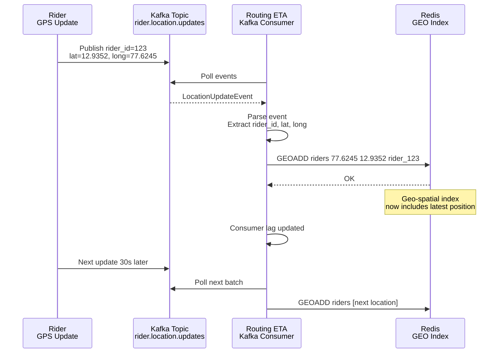

# Routing ETA Service - Sequence Diagram

```mermaid
sequenceDiagram
    participant Mobile as Mobile App
    participant RoutingSvc as Routing ETA Service
    participant HaversineLib as Haversine Calc
    participant PostgreSQL as PostgreSQL<br/>ETA Cache
    participant Redis as Redis<br/>Geo Index

    Mobile->>RoutingSvc: GET /eta?orderLat=12.93&orderLong=77.62<br/>&storeLat=12.95&storeLong=77.64
    RoutingSvc->>PostgreSQL: Check cache (30s TTL)
    PostgreSQL-->>RoutingSvc: Cache miss
    RoutingSvc->>HaversineLib: calcDistance(12.93, 77.62, 12.95, 77.64)
    HaversineLib-->>RoutingSvc: 2.5 km
    RoutingSvc->>RoutingSvc: Get current time
    RoutingSvc->>RoutingSvc: Is peak hour?
    alt Peak hours (10-14, 18-21)
        RoutingSvc->>RoutingSvc: avg_speed = 20 km/hr
    else Off-peak
        RoutingSvc->>RoutingSvc: avg_speed = 40 km/hr
    end
    RoutingSvc->>RoutingSvc: ETA = (2.5 / 20) * 60 + 5 = 12.5 min
    RoutingSvc->>PostgreSQL: Cache result (TTL=5min)
    RoutingSvc-->>Mobile: ETAResponse {eta_minutes: 13}

    Mobile->>RoutingSvc: GET /eta (same coords, <5s later)
    RoutingSvc->>PostgreSQL: Check cache
    PostgreSQL-->>RoutingSvc: Cache hit
    RoutingSvc-->>Mobile: ETAResponse {eta_minutes: 13} <br/>(from cache)

    FulfillmentSvc->>RoutingSvc: POST /eta/batch<br/>[order1, order2, order3]
    loop For each order
        RoutingSvc->>HaversineLib: calcDistance()
        HaversineLib-->>RoutingSvc: distance
        RoutingSvc->>RoutingSvc: Apply traffic model
    end
    RoutingSvc-->>FulfillmentSvc: List[ETAResponse]
```

## Location Stream Processing

```mermaid
sequenceDiagram
    participant Rider as Rider<br/>GPS Update
    participant Kafka as Kafka Topic<br/>rider.location.updates
    participant RoutingSvc as Routing ETA<br/>Kafka Consumer
    participant Redis as Redis<br/>GEO Index

    Rider->>Kafka: Publish rider_id=123<br/>lat=12.9352, long=77.6245

    RoutingSvc->>Kafka: Poll events
    Kafka-->>RoutingSvc: LocationUpdateEvent

    RoutingSvc->>RoutingSvc: Parse event<br/>Extract rider_id, lat, long

    RoutingSvc->>Redis: GEOADD riders 77.6245 12.9352 rider_123
    Redis-->>RoutingSvc: OK
    Note over Redis: Geo-spatial index<br/>now includes latest position

    RoutingSvc->>RoutingSvc: Consumer lag updated

    Rider->>Kafka: Next update 30s later
    RoutingSvc->>Kafka: Poll next batch
    RoutingSvc->>Redis: GEOADD riders [next location]
```
