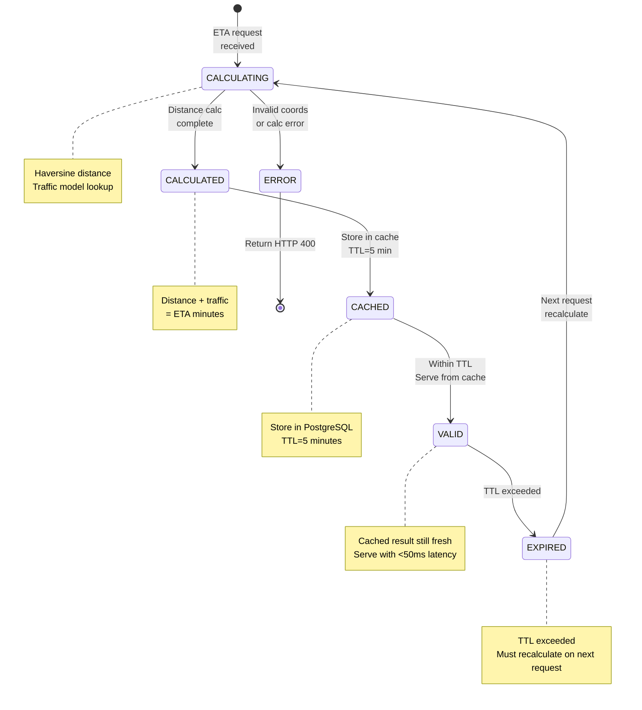
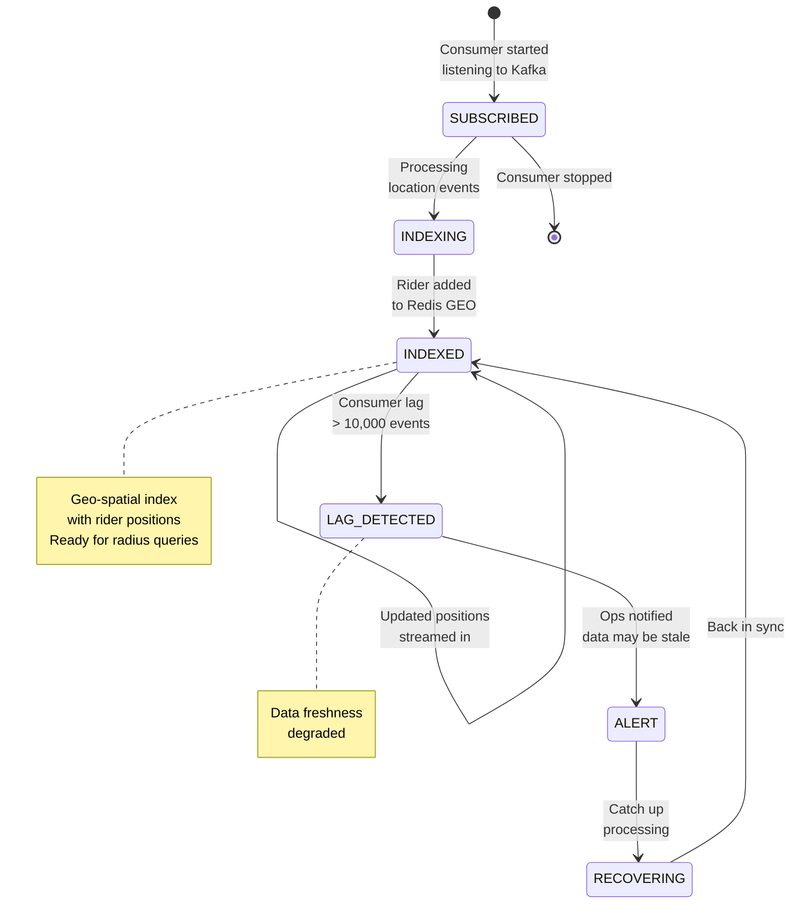

# Routing ETA Service - State Machine Diagram

```mermaid
stateDiagram-v2
    [*] --> CALCULATING: ETA request<br/>received

    CALCULATING --> CALCULATED: Distance calc<br/>complete

    CALCULATED --> CACHED: Store in cache<br/>TTL=5 min

    CACHED --> VALID: Within TTL<br/>Serve from cache

    VALID --> EXPIRED: TTL exceeded

    EXPIRED --> CALCULATING: Next request<br/>recalculate

    CALCULATING --> ERROR: Invalid coords<br/>or calc error

    ERROR --> [*]: Return HTTP 400

    note right of CALCULATING
        Haversine distance
        Traffic model lookup
    end note

    note right of CALCULATED
        Distance + traffic
        = ETA minutes
    end note

    note right of CACHED
        Store in PostgreSQL
        TTL=5 minutes
    end note

    note right of VALID
        Cached result still fresh
        Serve with <50ms latency
    end note

    note right of EXPIRED
        TTL exceeded
        Must recalculate on next request
    end note
```

## Location Index Lifecycle

```mermaid
stateDiagram-v2
    [*] --> SUBSCRIBED: Consumer started<br/>listening to Kafka

    SUBSCRIBED --> INDEXING: Processing<br/>location events

    INDEXING --> INDEXED: Rider added<br/>to Redis GEO

    INDEXED --> INDEXED: Updated positions<br/>streamed in

    INDEXED --> LAG_DETECTED: Consumer lag<br/>> 10,000 events

    LAG_DETECTED --> ALERT: Ops notified<br/>data may be stale

    ALERT --> RECOVERING: Catch up<br/>processing

    RECOVERING --> INDEXED: Back in sync

    SUBSCRIBED --> [*]: Consumer stopped

    note right of INDEXED
        Geo-spatial index<br/>with rider positions
        Ready for radius queries
    end note

    note right of LAG_DETECTED
        Data freshness<br/>degraded
    end note
```
