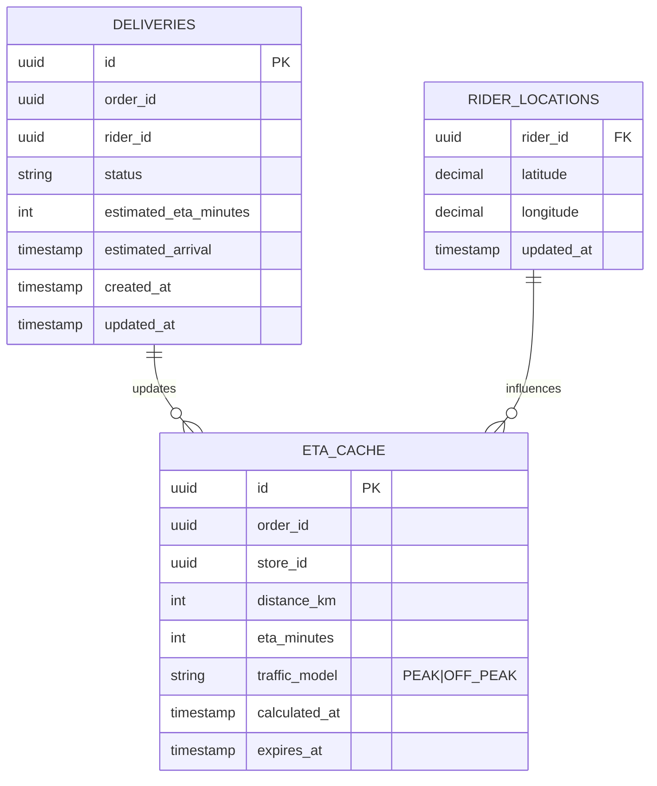

# Routing ETA Service - Entity-Relationship Diagram (ERD)



## Cache Table

```sql
CREATE TABLE eta_cache (
    id UUID PRIMARY KEY,
    order_id UUID NOT NULL,
    store_id UUID,
    distance_km DECIMAL(10, 2),
    eta_minutes INT,
    traffic_model VARCHAR(20),  -- PEAK, OFF_PEAK
    calculated_at TIMESTAMP,
    expires_at TIMESTAMP,
    created_at TIMESTAMP DEFAULT NOW()
);

CREATE INDEX idx_eta_cache_order_id ON eta_cache(order_id);
CREATE INDEX idx_eta_cache_expires_at ON eta_cache(expires_at);
```

## Redis Geo Index

```markdown
## Redis GEOADD Commands

```bash
# Add rider location
GEOADD riders 77.6245 12.9352 rider_123

# Find nearest to order
GEORADIUS riders 77.5000 12.9000 5 km

# Calculate distance between two points
GEODIST riders rider_123 rider_456 km
```

## Data Structures

- **Key**: `riders` (ZSET with geo coordinates)
- **Members**: `rider_123`, `rider_456`, ...
- **Coordinates**: (longitude, latitude) as ZSET score
```
