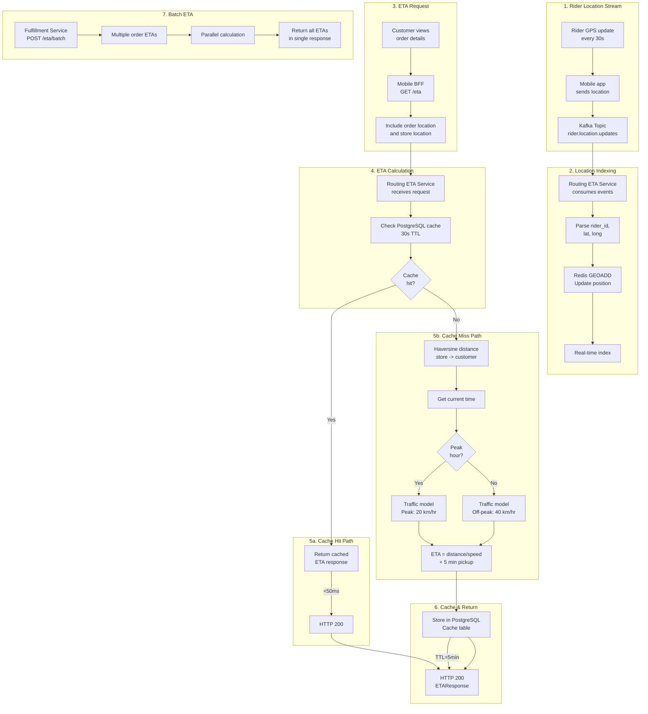
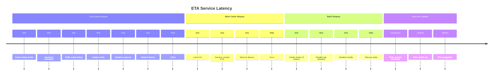
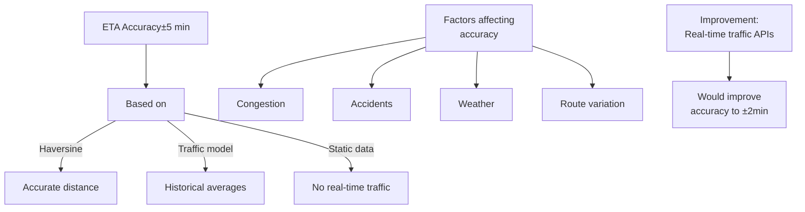

# Routing ETA Service - End-to-End Flow

```mermaid
graph TB
    subgraph "1. Rider Location Stream"
        A["Rider GPS update<br/>every 30s"]
        B["Mobile app<br/>sends location"]
        C["Kafka Topic<br/>rider.location.updates"]
    end

    subgraph "2. Location Indexing"
        D["Routing ETA Service<br/>consumes events"]
        E["Parse rider_id,<br/>lat, long"]
        F["Redis GEOADD<br/>Update position"]
        G["Real-time index"]
    end

    subgraph "3. ETA Request"
        H["Customer views<br/>order details"]
        I["Mobile BFF<br/>GET /eta"]
        J["Include order location<br/>and store location"]
    end

    subgraph "4. ETA Calculation"
        K["Routing ETA Service<br/>receives request"]
        L["Check PostgreSQL cache<br/>30s TTL"]
        M{Cache<br/>hit?}
    end

    subgraph "5a. Cache Hit Path"
        N["Return cached<br/>ETA response"]
        N -->|<50ms| O["HTTP 200"]
    end

    subgraph "5b. Cache Miss Path"
        P["Haversine distance<br/>store -> customer"]
        Q["Get current time"]
        R{Peak<br/>hour?}
        S["Traffic model<br/>Peak: 20 km/hr"]
        T["Traffic model<br/>Off-peak: 40 km/hr"]
        U["ETA = distance/speed<br/>+ 5 min pickup"]
    end

    subgraph "6. Cache & Return"
        V["Store in PostgreSQL<br/>Cache table"]
        V -->|TTL=5min| W["HTTP 200<br/>ETAResponse"]
    end

    subgraph "7. Batch ETA"
        X["Fulfillment Service<br/>POST /eta/batch"]
        Y["Multiple order ETAs"]
        Z["Parallel calculation"]
        AA["Return all ETAs<br/>in single response"]
    end

    A --> B
    B --> C
    C --> D
    D --> E
    E --> F
    F --> G

    H --> I
    I --> J
    J --> K
    K --> L
    L --> M
    M -->|Yes| N
    M -->|No| P
    P --> Q
    Q --> R
    R -->|Yes| S
    R -->|No| T
    S --> U
    T --> U
    U --> V
    V --> W
    O --> W

    X --> Y
    Y --> Z
    Z --> AA
```

## Performance Timeline

```mermaid
timeline
    title ETA Service Latency
    section Cold Cache Request
        2ms : Cache lookup (miss)
        3ms : Haversine calculation
        1ms : Traffic model lookup
        2ms : Update cache
        1ms : Serialize response
        1ms : Network latency
        Total: ~10ms
    section Warm Cache Request
        1ms : Cache hit
        1ms : Serialize cached ETA
        1ms : Network latency
        Total: <5ms
    section Batch Request
        2ms : Cache checks (3 orders)
        5ms : Parallel calc (misses)
        2ms : Serialize results
        Total: ~9ms per order
    section Real-time Updates
        Continuous : Rider location streaming
        <100ms : Index update lag
        <500ms : ETA propagation
```

## Accuracy Characteristics

```mermaid
graph TD
    A["ETA Accuracy±5 min"] --> B["Based on"]
    B -->|Haversine| C["Accurate distance"]
    B -->|Traffic model| D["Historical averages"]
    B -->|Static data| E["No real-time traffic"]

    F["Factors affecting<br/>accuracy"] --> G["Congestion"]
    F --> H["Accidents"]
    F --> I["Weather"]
    F --> J["Route variation"]

    K["Improvement:<br/>Real-time traffic APIs"] --> L["Would improve<br/>accuracy to ±2min"]
```
