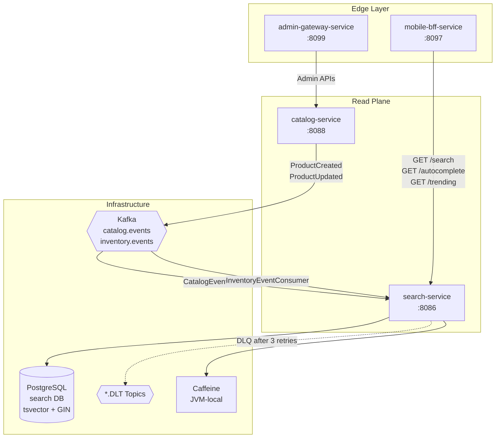
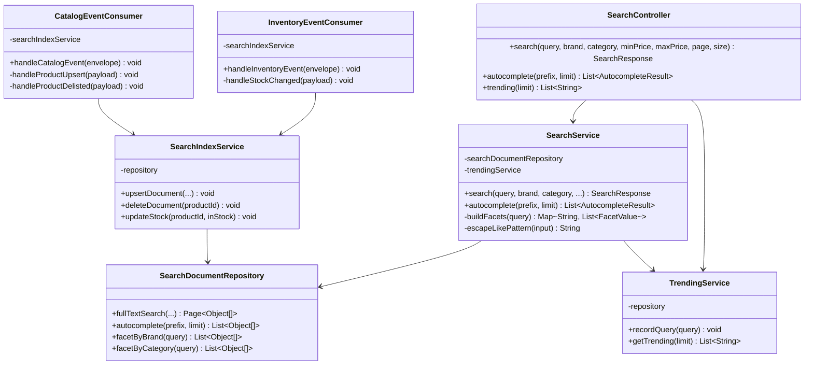

# Search Service

**Full-text product search, autocomplete, and trending queries — a read-projection over the catalog domain, powered by PostgreSQL tsvector FTS, Kafka-driven index sync, and Caffeine caching.**

| Property | Value |
|----------|-------|
| **Module** | `:services:search-service` |
| **Port** | `8086` |
| **Runtime** | Spring Boot 4.0 · Java 21 |
| **Database** | PostgreSQL 15+ (tsvector FTS, Flyway-managed) |
| **Messaging** | Kafka consumer (`catalog.events`, `inventory.events`) |
| **Cache** | Caffeine (JVM-local, 300s TTL) |
| **Auth** | JWT RS256 (issuer: `instacommerce-identity`) |
| **Owner** | Search & Discovery Team |
| **SLO** | P50: 50ms, P99: 200ms (search), 99.9% availability |

---

## Service Role & Ownership

**Owns:**
- `search_documents` table — denormalized catalog projection with PostgreSQL tsvector
- `trending_queries` table — query analytics and hit-count aggregation
- `shedlock` table — distributed lock infrastructure for scheduled jobs

**Does NOT own:**
- Product master data (→ `catalog-service`)
- Stock/inventory truth (→ `inventory-service`)
- Effective pricing (→ `pricing-service`)
- Store/zone resolution (→ `warehouse-service`)

**Upstream dependencies:**
- `catalog-service` publishes `ProductCreated`, `ProductUpdated`, `ProductDelisted` to `catalog.events`
- `inventory-service` publishes `ProductStockChanged` to `inventory.events`

---

## High-Level Design



The service sits on the **read path** between the BFF and data layer. It never writes to catalog or Kafka (except DLQ forwards). All search state is derived and rebuildable from catalog domain.

---

## Low-Level Design

### Component Diagram



---

## Database Schema

### Primary Tables

**search_documents**
```sql
id              UUID PRIMARY KEY DEFAULT gen_random_uuid()
product_id      UUID NOT NULL UNIQUE
name            VARCHAR(512) NOT NULL
description     TEXT
brand           VARCHAR(255)
category        VARCHAR(255)
price_cents     BIGINT NOT NULL DEFAULT 0
image_url       VARCHAR(2048)
in_stock        BOOLEAN NOT NULL DEFAULT TRUE
store_id        UUID
search_vector   TSVECTOR (auto-maintained trigger)
created_at      TIMESTAMP NOT NULL DEFAULT now()
updated_at      TIMESTAMP NOT NULL DEFAULT now()

Indexes:
- idx_search_documents_search_vector (GIN on search_vector)
- idx_search_documents_category
- idx_search_documents_brand
- idx_search_documents_price
- idx_search_documents_in_stock
- idx_search_documents_store_id
```

**trending_queries**
```sql
id              UUID PRIMARY KEY DEFAULT gen_random_uuid()
query           VARCHAR(256) NOT NULL
hit_count       BIGINT NOT NULL DEFAULT 1
last_searched   TIMESTAMP NOT NULL DEFAULT now()
created_at      TIMESTAMP NOT NULL DEFAULT now()
updated_at      TIMESTAMP NOT NULL DEFAULT now()

Indexes:
- UNIQUE (query)
- idx_trending_queries_hit_count
- idx_trending_queries_last_searched
```

**shedlock** (ShedLock infrastructure)
```sql
name            VARCHAR(64) PRIMARY KEY
lock_at         TIMESTAMP NOT NULL
locked_at       TIMESTAMP
locked_by       VARCHAR(255)
run_at          TIMESTAMP NOT NULL
```

---

## API Endpoints

### Search

**GET /search**
```
Parameters:
  query: string (1-256 chars) - Required search term
  brand: string - Optional brand filter
  category: string - Optional category filter
  minPriceCents: long - Optional minimum price (cents)
  maxPriceCents: long - Optional maximum price (cents)
  page: int (0-based) - Default: 0
  size: int (1-100) - Default: 20

Response:
{
  "results": [
    {
      "productId": "uuid",
      "name": "Product Name",
      "brand": "Brand",
      "category": "Category",
      "priceCents": 9999,
      "imageUrl": "https://...",
      "inStock": true,
      "rank": 0.85
    }
  ],
  "total": 150,
  "page": 0,
  "totalPages": 8,
  "facets": {
    "brand": [
      {"value": "Brand1", "count": 45},
      {"value": "Brand2", "count": 32}
    ],
    "category": [
      {"value": "Groceries", "count": 78}
    ]
  }
}
```
**Caching:** Cached by (query, brand, category, minPrice, maxPrice, page, size) for 300s

---

### Autocomplete

**GET /search/autocomplete**
```
Parameters:
  prefix: string (1-128 chars) - Search prefix
  limit: int (1-50) - Default: 10

Response:
[
  {
    "name": "Product Name",
    "brand": "Brand",
    "productId": "uuid"
  }
]
```
**Caching:** Cached by (prefix, limit) for 300s (min length: 2 chars)

---

### Trending

**GET /search/trending**
```
Parameters:
  limit: int (1-50) - Default: 10

Response:
["trending search 1", "trending search 2", ...]
```

---

## Kafka Events

### Consumed Topics

**catalog.events** (Consumer Group: `search-service`)
```
Event Type: ProductCreated
Payload:
{
  "productId": "uuid",
  "name": "...",
  "description": "...",
  "brand": "...",
  "category": "...",
  "priceCents": 9999,
  "imageUrl": "...",
  "inStock": true,
  "storeId": "uuid"
}
→ Action: UPSERT into search_documents

Event Type: ProductUpdated
→ Same as ProductCreated (UPSERT)

Event Type: ProductDeactivated | ProductDelisted
Payload:
{
  "productId": "uuid"
}
→ Action: DELETE from search_documents
```

**inventory.events** (Consumer Group: `search-service`)
```
Event Type: ProductStockChanged
Payload:
{
  "productId": "uuid",
  "inStock": true|false,
  "quantity": 100
}
→ Action: UPDATE in_stock flag in search_documents
```

### DLQ Topic

**catalog.events.DLT, inventory.events.DLT**
- Kafka consumer error after 3 retries → DLQ forward
- **Root cause investigation:** Check DLT for malformed events, poison pills, or transient failures
- **Recovery:** Replay from DLT or rebuild index from catalog snapshot

---

## Resilience Configuration

### Timeouts
- Database statement timeout: 5s (application.yml)
- HikariCP connection timeout: 3s
- JPA query timeout: inherited from DB

### Circuit Breaker
No external service calls (read-only projection), but catalog/inventory Kafka consumes:
- Error rate threshold: 50%
- Slow call rate threshold: N/A (async consumption)
- Wait duration: 30s

### Retries
- Kafka consumer: automatic exponential backoff (3 retries) → DLQ

### Cache Configuration
- **Cache Name:** `searchResults`
  - Size: 10,000 entries
  - TTL: 300s (expireAfterWrite)

- **Cache Name:** `autocomplete`
  - Size: 10,000 entries
  - TTL: 300s

- **Cache Invalidation:** Automatic on ttvector recalculation in DB trigger

---

## Observability

### Health Checks

**Liveness:** `/actuator/health/live`
- JVM heap usage, GC pauses

**Readiness:** `/actuator/health/ready`
- PostgreSQL connection
- Kafka consumer group status

### Metrics

- `search.query.count` — Total search queries
- `search.query.duration_ms` — Query latency (p50, p99)
- `search.autocomplete.count` — Autocomplete requests
- `search.trending.count` — Trending queries
- `cache.caffeine.hits` — Cache hit rate
- `kafka.consumer.lag` — Catalog/inventory consumer lag

### Tracing

- OpenTelemetry OTLP exporter → otel-collector:4318
- Sampling probability: 100% (configurable via TRACING_PROBABILITY)
- Trace context: W3C Trace Context propagation

### Logging

```yaml
com.instacommerce.search: INFO
org.springframework.kafka: WARN
```

---

## Deployment & Runbook

### Build & Test

```bash
./gradlew :services:search-service:build
./gradlew :services:search-service:test
./gradlew :services:search-service:integrationTest
```

### Local Development

```bash
# Prerequisites
export SEARCH_DB_URL=jdbc:postgresql://localhost:5432/search
export SEARCH_DB_USER=postgres
export SEARCH_DB_PASSWORD=postgres
export KAFKA_BOOTSTRAP_SERVERS=localhost:9092

./gradlew :services:search-service:bootRun
```

### Docker Build

```bash
cd services/search-service
docker build -t search-service:latest .
docker run -p 8086:8080 \
  -e SEARCH_DB_URL=jdbc:postgresql://postgres:5432/search \
  -e KAFKA_BOOTSTRAP_SERVERS=kafka:9092 \
  search-service:latest
```

### Kubernetes Deployment

```bash
kubectl apply -f k8s/search-service/deployment.yaml
kubectl set image deployment/search-service \
  search-service=search-service:v1.2.3 \
  -n default
```

### Health Check

```bash
# Liveness
curl http://localhost:8086/actuator/health/live

# Readiness
curl http://localhost:8086/actuator/health/ready

# Metrics
curl http://localhost:8086/actuator/metrics
```

### Debugging

**Check Kafka Consumer Lag:**
```bash
kafka-consumer-groups --bootstrap-server localhost:9092 \
  --group search-service --describe
```

**Check DLQ for Failed Events:**
```bash
kafka-console-consumer --bootstrap-server localhost:9092 \
  --topic catalog.events.DLT \
  --from-beginning
```

**Rebuild Index from Scratch:**
```sql
-- Via admin API or cron job
DELETE FROM search_documents;
-- Kafka consumer will rebuild on next catalog events or trigger replay
```

### Rollback

```bash
# If deployment causes search outages
kubectl rollout undo deployment/search-service -n default
kubectl rollout history deployment/search-service -n default
```

---

## Known Limitations

1. **English-only** — No multilingual/Hindi support (hardcoded `to_tsvector('english', ...)`)
2. **No fuzzy matching** — Typos cause zero results (e.g., "choclate" != "chocolate")
3. **No synonym handling** — Separate queries for "curd" vs "dahi" vs "yogurt"
4. **No personalization** — No user history or reorder boosting
5. **No popularity ranking** — All in-stock items ranked equally
6. **Synchronous trending writes** — Database write on every search query (latency risk)
7. **No stock-aware ranking** — Out-of-stock items ranked same as in-stock
8. **ILIKE autocomplete** — Full table scan without trigram index at scale

**Roadmap (Wave 34+):**
- Fuzzy matching via Levenshtein distance
- Synonym dictionaries per category
- OpenSearch migration (future)
- Personalization with user affinity vectors
- Async trending writes (fire-and-forget)

---

## Dependencies & Tech Stack

| Component | Version | Purpose |
|-----------|---------|---------|
| Spring Boot | 4.0 | Web framework |
| Spring Data JPA | 4.0 | Database ORM |
| PostgreSQL | 15+ | Full-text search, GIN indexes |
| Kafka | 3.x | Event streaming |
| Caffeine | 3.1.8 | JVM-local caching |
| Flyway | Latest | Schema migrations |
| JWT (JJWT) | 0.12.5 | Token validation |
| Micrometer | Latest | Observability (metrics, tracing) |
| Testcontainers | 1.19.3 | Integration testing |

---

## Testing

```bash
# Unit tests
./gradlew :services:search-service:test

# Integration tests (PostgreSQL testcontainer)
./gradlew :services:search-service:integrationTest

# E2E tests
./gradlew :services:search-service:e2eTest

# Load testing
./gradlew :services:search-service:loadTest
```

---

## Contact & Support

| Role | Team |
|------|------|
| On-call | search-discovery-oncall@instacommerce.com |
| Slack | #search-service |
| Docs | /docs/services/search-service |

