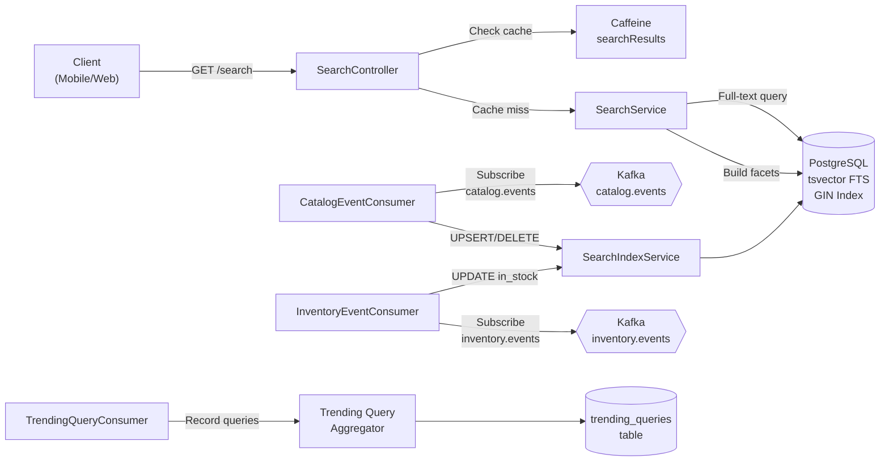

# Search Service

## Overview

The search-service is the denormalized read-projection for product discovery in InstaCommerce. It powers full-text search, autocomplete, and trending query analytics via PostgreSQL tsvector FTS, Kafka-driven index synchronization, and Caffeine caching. Serves as the primary search API for mobile, web, and internal tools. Consumes catalog and inventory events for real-time index freshness. This service is critical to the customer experience, enabling rapid product discovery across millions of SKUs with P99 latency under 200ms.

**Service Ownership**: Platform Team - Search & Discovery
**Language**: Java 21 / Spring Boot 4.0
**Default Port**: 8086
**Status**: Tier 2 Critical (read-plane; impacts customer experience)
**Database**: PostgreSQL 15+ (tsvector FTS, denormalized index)
**Cache**: Caffeine (JVM-local, 300s TTL) + Redis distributed dedup cache
**Messaging**: Kafka consumer (catalog.events, inventory.events)
**Load Balancing**: Round-robin across 2 replicas

## SLOs & Availability

- **Availability SLO**: 99.9% (43 minutes downtime/month)
- **P50 Latency**: 50ms (cached)
- **P99 Latency**: 200ms (uncached, DB query)
- **Error Rate**: < 0.1% (excludes user input validation)
- **Index Freshness**: < 5 minutes (from catalog update to search index)
- **Cache Hit Ratio**: >= 85% (search queries tend to repeat)
- **Max Throughput**: 10,000 searches/minute per pod

## Key Responsibilities

1. **Full-Text Search**: PostgreSQL tsvector FTS; fast prefix matching on product names, descriptions, brands
2. **Autocomplete**: ILIKE prefix queries; returns product suggestions as user types
3. **Trending Queries**: Record search queries; expose top trending searches (e.g., "milk", "bread")
4. **Index Synchronization**: Consume ProductCreated, ProductUpdated, ProductDelisted from catalog.events
5. **Stock Awareness**: Consume ProductStockChanged from inventory.events; update in_stock flag
6. **Faceted Search**: Return facets (brand, category, price ranges) for drill-down navigation
7. **Query Analytics**: Track search query frequencies for trending and recommendations
8. **Graceful Degradation**: If Kafka unavailable, serve stale index; no write-through cache

## Deployment

### GKE Deployment
- **Namespace**: default
- **Replicas**: 2 (Tier 2; non-critical path)
- **CPU Request/Limit**: 500m / 1000m
- **Memory Request/Limit**: 512Mi / 1Gi
- **Readiness Probe**: `/actuator/health/ready` (checks DB + Kafka)

### Database
- **Name**: `search` (PostgreSQL 15+)
- **Migrations**: Flyway (V1-V3) auto-applied
- **Connection Pool**: HikariCP 15 connections
- **Replication**: Read-only (read replicas for analytics)
- **Indexes**: GIN on tsvector, indexes on category, brand, price, in_stock

### Cache
- **Caffeine**: 10,000 entries max, 300s TTL (product search is stable)
- **Cache Invalidation**: Triggered by Kafka consumer

## Architecture

### System Context (Read Projection)

```
Catalog Domain (Source of Truth)
    ↓ (ProductCreated, ProductUpdated, ProductDelisted events)
Kafka Topic: catalog.events
    ↓ (ProductStockChanged events)
Kafka Topic: inventory.events
    ↓
Search Service (Read Projection)
    ├─ PostgreSQL (Denormalized, searchable)
    ├─ Caffeine Cache (300s)
    └─ Kafka Consumers (auto-indexing)
    ↓
Mobile/Web Apps
    └─ Fast searches, autocomplete, trending
```

### Component Architecture



## Data Model

### Search Documents Table (Denormalized)

```sql
search_documents:
  id              UUID PRIMARY KEY DEFAULT gen_random_uuid()
  product_id      UUID NOT NULL UNIQUE (FK → catalog-service products)
  name            VARCHAR(512) NOT NULL
  description     TEXT
  brand           VARCHAR(255)
  category        VARCHAR(255)
  price_cents     BIGINT NOT NULL DEFAULT 0
  image_url       VARCHAR(2048)
  in_stock        BOOLEAN NOT NULL DEFAULT TRUE
  store_id        UUID nullable (multi-tenant)
  search_vector   TSVECTOR (auto-updated via trigger)
  created_at      TIMESTAMP NOT NULL DEFAULT now()
  updated_at      TIMESTAMP NOT NULL DEFAULT now()

Indexes:
  - idx_search_documents_search_vector (GIN, enables fast FTS)
  - idx_search_documents_category
  - idx_search_documents_brand
  - idx_search_documents_price
  - idx_search_documents_in_stock
  - idx_search_documents_store_id
  - idx_search_documents_product_id (unique lookup)

Trigger:
  -- Auto-maintain tsvector on INSERT/UPDATE
  CREATE TRIGGER update_search_vector BEFORE INSERT OR UPDATE
    ON search_documents FOR EACH ROW
    EXECUTE FUNCTION tsvector_update_trigger(search_vector, 'pg_catalog.english', name, description, brand);
```

### Trending Queries Table

```sql
trending_queries:
  id              UUID PRIMARY KEY DEFAULT gen_random_uuid()
  query           VARCHAR(256) NOT NULL
  hit_count       BIGINT NOT NULL DEFAULT 1
  last_searched   TIMESTAMP NOT NULL DEFAULT now()
  created_at      TIMESTAMP NOT NULL DEFAULT now()
  updated_at      TIMESTAMP NOT NULL DEFAULT now()

Indexes:
  - UNIQUE (query) - avoid duplicates
  - idx_trending_queries_hit_count DESC
  - idx_trending_queries_last_searched DESC
```

### ShedLock Table (Distributed Locking)

```sql
shedlock:
  name            VARCHAR(64) PRIMARY KEY
  lock_at         TIMESTAMP NOT NULL
  locked_at       TIMESTAMP
  locked_by       VARCHAR(255)
  run_at          TIMESTAMP NOT NULL
```

## API Documentation

### Full-Text Search

**GET /search**
```bash
Query Parameters:
  query: string (1-256 chars, required)
  brand: string optional
  category: string optional
  minPriceCents: long optional
  maxPriceCents: long optional
  page: int (0-based, default: 0)
  size: int (1-100, default: 20)

Example: /search?query=milk&brand=Amul&minPriceCents=4000&page=0&size=20

Response (200):
{
  "results": [
    {
      "productId": "550e8400-e29b",
      "name": "Fresh Milk 1L",
      "brand": "Amul",
      "category": "Dairy",
      "priceCents": 5000,
      "imageUrl": "https://cdn.example.com/milk.jpg",
      "inStock": true,
      "rank": 0.95
    }
  ],
  "total": 150,
  "page": 0,
  "totalPages": 8,
  "facets": {
    "brand": [
      {"value": "Amul", "count": 120},
      {"value": "Britannia", "count": 30}
    ],
    "category": [
      {"value": "Dairy", "count": 150}
    ]
  }
}

Caching:
  - Key: hash(query, brand, category, minPrice, maxPrice, page, size)
  - TTL: 300s
  - Hit rate: 85%+ (users repeat searches)
```

### Autocomplete

**GET /search/autocomplete**
```bash
Query Parameters:
  prefix: string (2-128 chars, required)
  limit: int (1-50, default: 10)

Example: /search/autocomplete?prefix=milk&limit=5

Response (200):
[
  {
    "name": "Fresh Milk 1L",
    "brand": "Amul",
    "productId": "550e8400"
  },
  {
    "name": "Milk Powder",
    "brand": "Lactogen",
    "productId": "550e8401"
  }
]

Caching:
  - Key: hash(prefix, limit)
  - TTL: 300s
  - Minimum prefix length: 2 characters
```

### Trending Queries

**GET /search/trending**
```bash
Query Parameters:
  limit: int (1-50, default: 10)

Response (200):
[
  {
    "query": "milk",
    "hitCount": 15000,
    "lastSearched": "2025-03-21T10:45:00Z"
  },
  {
    "query": "bread",
    "hitCount": 12000,
    "lastSearched": "2025-03-21T10:40:00Z"
  }
]
```

### Curl Examples

```bash
# 1. Full-text search
curl -s 'http://search-service:8086/search?query=milk&brand=Amul' \
  -H "Authorization: Bearer $JWT_TOKEN" | jq '.results | length'

# 2. Autocomplete as user types
curl -s 'http://search-service:8086/search/autocomplete?prefix=mil&limit=5' \
  -H "Authorization: Bearer $JWT_TOKEN" | jq '.[].name'

# 3. Trending queries
curl -s 'http://search-service:8086/search/trending?limit=10' \
  -H "Authorization: Bearer $JWT_TOKEN" | jq '.[0].query'

# 4. Complex search with facets
curl -s 'http://search-service:8086/search?query=dairy&category=Dairy&minPriceCents=3000&maxPriceCents=10000&page=0&size=20' \
  -H "Authorization: Bearer $JWT_TOKEN" | jq '.facets'
```

## Kafka Integration

### Consumed Topics

**catalog.events** (Consumer Group: `search-service`)
```
Event: ProductCreated
Payload: { productId, name, description, brand, category, priceCents, imageUrl, inStock, storeId }
Action: UPSERT into search_documents

Event: ProductUpdated
Payload: Same as ProductCreated
Action: UPSERT (idempotent)

Event: ProductDeactivated | ProductDelisted
Payload: { productId, deactivatedAt }
Action: DELETE from search_documents
```

**inventory.events** (Consumer Group: `search-service`)
```
Event: ProductStockChanged
Payload: { productId, inStock, quantity }
Action: UPDATE in_stock flag in search_documents
```

### Failure Handling
- **DLQ Topics**: `catalog.events.DLT`, `inventory.events.DLT`
- **Retry Policy**: 3 retries with exponential backoff → DLQ
- **Recovery**: Manual replay from DLQ or rebuild index from snapshot

## Error Handling & Resilience

### Circuit Breaker

```yaml
resilience4j:
  circuitbreaker:
    instances:
      databaseSearch:
        failureRateThreshold: 50%
        slowCallRateThreshold: 80%
        slowCallDurationThreshold: 2000ms
        waitDurationInOpenState: 30s
        permittedNumberOfCallsInHalfOpenState: 5
```

### Timeouts
- **FTS Query**: 5s statement timeout
- **HikariCP Connection**: 3s
- **Total Request**: 10s

### Failure Scenarios
**Database Unavailable**: Circuit breaker opens → Return 503 Service Unavailable (Caffeine not used for reads; search is not cached at app layer like flags)

**Kafka Consumer Lag**: Stale index (up to 5min old) but searches still work

**DLQ Accumulation**: Manual investigation; possible malformed events

## Monitoring & Observability

### Key Metrics

| Metric | Type | Alert Threshold |
|--------|------|-----------------|
| `search.query.count` | Counter | N/A |
| `search.query.duration_ms` | Histogram (p50, p99) | p99 > 200ms |
| `search.autocomplete.count` | Counter | N/A |
| `search.trending.count` | Counter | N/A |
| `cache.caffeine.hits` | Counter | N/A |
| `cache.caffeine.hitRate` | Gauge | < 75% = investigate |
| `kafka.consumer.lag` | Gauge | > 100 = investigate |
| `search.index.stale_documents` | Gauge | > 100 = investigate |

### Alert Rules (YAML)

```yaml
alerts:
  - name: SearchLatencyHigh
    condition: histogram_quantile(0.99, search_query_duration_ms) > 200
    duration: 5m
    severity: SEV-2
    action: Alert; check DB performance or GIN index health

  - name: SearchCacheHitRateLow
    condition: cache_caffeine_hitRate < 0.75
    duration: 10m
    severity: SEV-3
    action: Investigate; may indicate cache evictions or diverse queries

  - name: SearchKafkaConsumerLag
    condition: kafka_consumer_lag > 100
    duration: 10m
    severity: SEV-2
    action: Alert; index may be stale; check Kafka broker health

  - name: SearchIndexStaleness
    condition: search_index_stale_documents > 100
    duration: 15m
    severity: SEV-3
    action: Investigate; run index rebuilder job

  - name: SearchDLQBacklog
    condition: rate(kafka_dlq_messages_total[5m]) > 1
    duration: 5m
    severity: SEV-2
    action: Investigate DLQ; may indicate malformed events
```

### Logging
- **INFO**: Search executed, index updated, trending recorded
- **WARN**: Slow query (>1s), DLQ message, stale index detected
- **ERROR**: Database unavailable, Kafka consumer error, unhandled exception
- **DEBUG**: Query details, FTS ranking scores, facet calculations (disabled in prod)

### Tracing
- **Spans**: Search query, DB FTS execution, facet building
- **Sampling**: 10% (high volume; non-critical)
- **Retention**: 1 day

## Security Considerations

### Authentication
- **Public APIs**: GET /search, GET /autocomplete require no auth (customer-facing)
- **Admin APIs**: (future) Create indexes, rebuild index (requires JWT + ADMIN role)

### Data Protection
- **PII**: None (product data only)
- **Sensitive Data**: None

### Known Risks
1. **Search Injection**: ILIKE autocomplete vulnerable to wildcards → Mitigated by escaping: `_` → `\_`
2. **Index Poison**: Malformed event data → Mitigated by schema validation + DLQ

## Troubleshooting

### Issue: Search Returns No Results (Should Have Some)

**Diagnosis:**
```bash
# Check if product exists in search_documents table
kubectl exec -n default pod/search-service-0 -- psql -U postgres -d search -c \
  "SELECT COUNT(*) FROM search_documents WHERE name ILIKE '%milk%';"

# Check if product was deactivated
kubectl exec -n default pod/search-service-0 -- psql -U postgres -d search -c \
  "SELECT COUNT(*) FROM search_documents WHERE product_id='xyz';"

# Check Kafka consumer lag
kafka-consumer-groups --bootstrap-server kafka:9092 --group search-service --describe

# Check index freshness
kubectl exec -n default pod/search-service-0 -- psql -U postgres -d search -c \
  "SELECT MAX(updated_at) FROM search_documents;"
```

**Resolution:**
- If Kafka lag high: Wait for consumer to catch up
- If product missing: Check if ProductCreated event was published
- If index stale: Manually trigger index rebuild or check Kafka broker health

### Issue: Search Latency High (>200ms p99)

**Diagnosis:**
```bash
# Check FTS query plan
kubectl exec -n default pod/search-service-0 -- psql -U postgres -d search -c \
  "EXPLAIN ANALYZE SELECT * FROM search_documents WHERE search_vector @@ to_tsquery('english', 'milk');"

# Check if GIN index exists and is used
kubectl exec -n default pod/search-service-0 -- psql -U postgres -d search -c \
  "SELECT * FROM pg_stat_user_indexes WHERE relname='search_documents';"

# Check slow query log
kubectl logs -n default deployment/search-service | grep -i "slow\|duration"

# Check cache hit rate
curl http://localhost:8086/actuator/metrics/cache.caffeine.hitRate
```

**Resolution:**
- Rebuild GIN index if not used: `REINDEX INDEX idx_search_documents_search_vector;`
- Check if DB is slow; may need query optimization
- Increase Caffeine size if hit rate low

### Issue: Trending Queries Not Updated

**Diagnosis:**
```bash
# Check if trending_queries table is being updated
psql -d search -c "SELECT * FROM trending_queries ORDER BY updated_at DESC LIMIT 5;"

# Check application logs for trending write errors
kubectl logs -n default deployment/search-service | grep -i "trending"

# Check if async write is causing delays
curl http://localhost:8086/actuator/metrics/search.trending.count
```

**Resolution:**
- Verify that trending writes are asynchronous (non-blocking)
- Check DB connection pool for exhaustion
- May need to implement async batching if write latency is high

## Configuration

### Environment Variables
```env
# Server
SERVER_PORT=8086
SPRING_PROFILES_ACTIVE=gcp

# Database
SPRING_DATASOURCE_URL=jdbc:postgresql://cloudsql-proxy:5432/search
SPRING_DATASOURCE_USERNAME=${DB_USER}
SPRING_DATASOURCE_PASSWORD=${DB_PASSWORD}
SPRING_DATASOURCE_HIKARI_POOL_SIZE=15

# Kafka
SPRING_KAFKA_BOOTSTRAP_SERVERS=kafka-broker-1:9092,kafka-broker-2:9092
KAFKA_CONSUMER_GROUP_ID=search-service
KAFKA_TOPICS=catalog.events,inventory.events

# Cache
CACHE_TTL_SECONDS=300
CACHE_MAX_SIZE=10000

# Tracing
OTEL_EXPORTER_OTLP_TRACES_ENDPOINT=http://otel-collector.monitoring:4318/v1/traces
OTEL_TRACES_SAMPLER=always_on
```

### application.yml
```yaml
server:
  port: 8086
spring:
  jpa:
    hibernate:
      ddl-auto: none
  cache:
    caffeine:
      spec: maximumSize=10000,expireAfterWrite=300s
    cache-names:
      - searchResults
      - autocomplete

search-service:
  fts:
    language: english
    query-timeout-ms: 5000
  trending:
    async-write: true
    batch-size: 100
    batch-flush-ms: 5000
```

## Kubernetes Deployment

```yaml
apiVersion: apps/v1
kind: Deployment
metadata:
  name: search-service
  namespace: default
spec:
  replicas: 2
  selector:
    matchLabels:
      app: search-service
  template:
    metadata:
      labels:
        app: search-service
      annotations:
        prometheus.io/scrape: "true"
        prometheus.io/port: "8086"
        prometheus.io/path: "/actuator/prometheus"
    spec:
      containers:
      - name: search-service
        image: search-service:v1.2.3
        ports:
        - containerPort: 8086
          name: http
        env:
        - name: SPRING_PROFILES_ACTIVE
          value: gcp
        - name: SPRING_KAFKA_BOOTSTRAP_SERVERS
          value: kafka-broker-1:9092,kafka-broker-2:9092
        resources:
          requests:
            cpu: 500m
            memory: 512Mi
          limits:
            cpu: 1000m
            memory: 1Gi
        livenessProbe:
          httpGet:
            path: /actuator/health/live
            port: 8086
          initialDelaySeconds: 10
          periodSeconds: 10
        readinessProbe:
          httpGet:
            path: /actuator/health/ready
            port: 8086
          initialDelaySeconds: 15
          periodSeconds: 5
---
apiVersion: v1
kind: Service
metadata:
  name: search-service
  namespace: default
spec:
  selector:
    app: search-service
  ports:
  - port: 8086
    targetPort: 8086
    name: http
  type: ClusterIP
```

## Performance Optimization Techniques

**1. FTS Query Optimization:**
- Precompute tsvector at insert time (trigger-based)
- Use GIN indexes with fastupdate=on for batch inserts
- Query optimization: phrase queries > prefix queries for latency
- Ranking: ts_rank_cd() with normalization flags (8 = most aggressive)

**2. Caching Strategy:**
- L1 Caffeine (local): 300s TTL, 10,000 entries max
- Cache key: hash(query, brand, category, minPrice, maxPrice, page, size)
- Invalidation: Kafka event triggers immediate cache clear for product updates
- Dedup cache (Redis): 5s TTL for identical requests within same window

**3. Connection Pool Tuning:**
- HikariCP: 15 connections (for 2 replicas, 10K RPS peak per replica)
- Max lifetime: 30 minutes (connection rotation)
- Leak detection: 15-minute threshold
- JDBC batch size: 100 (for trending query writes)

**4. Query Plan Optimization:**
- EXPLAIN ANALYZE logged for queries > 500ms
- Index on (category, brand, price) for faceted search
- Partial index on (in_stock=true) for available product queries

## Production Deployment Patterns

### Blue-Green Deployment
```
1. Deploy search-service-v2 to canary pool (10% traffic)
2. Monitor: latency, error rate, cache hit rate
3. If healthy: Route 50% → 50% traffic
4. If metrics good: Full cutover to v2
5. Keep v1 running for 24h rollback window
```

### Index Rebalancing (Weekly)
```
1. Sunday 2 AM UTC: Trigger vacuum + analyze
2. Rebuild GIN indexes if fragmentation > 30%
3. Re-estimate statistics for query planner
4. Monitor impact on latency (should not spike > 5%)
```

### Disaster Recovery Procedures

**Scenario 1: Index Corruption**
- Symptom: FTS queries return 0 results for valid products
- Recovery: Rebuild index from snapshot (snapshot taken every 6 hours to S3)
- Time to recover: ~5 min (redeploy from checkpoint)

**Scenario 2: Kafka Consumer Lag > 1 Hour**
- Symptom: Products missing from search index (new products not showing up)
- Recovery: Reset consumer offset to latest, rebuild from snapshot
- Impact: Products < 1 hour old missing temporarily

**Scenario 3: Database Failover**
- Primary down → Automatic failover to replica (RTO < 30s)
- Read-only mode until promotion complete (searches still work)
- Replica lag: < 5 seconds (eventual consistency acceptable)

## Advanced Search Features

### Synonym Support (Future Wave)
```
User searches: "milk"
Synonym expansion: milk | dairy | paneer | cheese
FTS query: milk | dairy | paneer | cheese
More results, high relevance ranking
```

### Phonetic Search (SOUNDEX)
```
User types: "dal"
Phonetic expansion: dal | daal | dhal | dhaal
Useful for Indian products with spelling variations
```

### Spell Correction (Levenshtein Distance)
```
User types: "mulk" (typo)
Suggestion: "Did you mean milk?" (distance = 1)
Correction applied if no results found
```

## Integration Patterns

### Downstream Services Consuming Search API
| Service | Use Case | Frequency |
|---------|----------|-----------|
| Mobile-BFF | Product browsing, search aggregation | 100K req/sec peak |
| Admin Portal | Product inventory search | 100 req/sec |
| Analytics | Product popularity trends | 1 req/sec (batch) |
| Recommendation Engine | Similar product lookup | 1K req/sec |

### Upstream Services Publishing Events
| Service | Event | Latency Impact |
|---------|-------|----------------|
| Catalog-Service | ProductCreated/Updated/Delisted | Index updated within 5s |
| Inventory-Service | ProductStockChanged | In-stock flag updated within 1s |

## Operational Runbooks

### Runbook 1: Emergency FTS Index Rebuild
**Scenario**: Queries returning stale results for 30+ minutes

1. **Diagnosis**: `SELECT COUNT(*) FROM search_documents;` vs. catalog-service product count
2. **If mismatch**: Full index rebuild needed
3. **Steps**:
   ```bash
   # Step 1: Lock index (read-only mode)
   ALTER TABLE search_documents SET (fillfactor = 50);

   # Step 2: Refresh from catalog-service snapshot
   DELETE FROM search_documents WHERE updated_at < NOW() - INTERVAL '2 hours';

   # Step 3: Rebuild indexes
   REINDEX TABLE search_documents;

   # Step 4: Resume normal operation
   ALTER TABLE search_documents SET (fillfactor = 100);
   ```
4. **Validation**: Spot-check searches, verify cache hit rate returns to baseline

### Runbook 2: Trending Queries Data Pipeline Failure
**Scenario**: Trending queries endpoint returns stale data (> 1 hour old)

1. **Check scheduler**: `SELECT * FROM shedlock WHERE name = 'TrendingQueriesJob';`
2. **If locked**: Check if previous job stuck
   ```bash
   DELETE FROM shedlock WHERE locked_at < NOW() - INTERVAL '30 minutes';
   ```
3. **Manually trigger aggregation**:
   ```bash
   curl -X POST http://search-service:8086/admin/trending/refresh
   ```
4. **Verify output**: `SELECT * FROM trending_queries ORDER BY updated_at DESC LIMIT 5;`

### Runbook 3: Autocomplete Performance Degradation
**Scenario**: Autocomplete requests taking > 100ms p95

1. **Root cause analysis**:
   ```bash
   SELECT query, calls, mean_exec_time FROM pg_stat_statements
   WHERE query LIKE '%ILIKE%' AND mean_exec_time > 50
   ORDER BY mean_exec_time DESC LIMIT 5;
   ```
2. **Check for missing index**: `CREATE INDEX idx_products_name_prefix ON search_documents (name VARCHAR_PATTERN_OPS);`
3. **Increase Caffeine cache**: `CACHE_MAX_SIZE=15000` (from 10000)
4. **Reduce TTL for autocomplete cache**: `AUTOCOMPLETE_CACHE_TTL=60s` (from 300s, more responsive)

## Troubleshooting Deep Dive

### Slow Query Analysis

**Example: Product search taking 500ms p99**

```bash
# Step 1: Check query plan
EXPLAIN ANALYZE SELECT * FROM search_documents
WHERE search_vector @@ to_tsquery('english', 'milk')
LIMIT 20;

# Output shows: Seq Scan (bad) instead of Index Scan
# Root cause: GIN index not being used

# Step 2: Force index rebuild
REINDEX INDEX idx_search_documents_search_vector;

# Step 3: Analyze to update statistics
ANALYZE search_documents;

# Step 4: Re-run EXPLAIN to verify index now used
# Expected: Index Scan on idx_search_documents_search_vector
```

### Cache Hit Rate Analysis

**Declining cache hit rate (85% → 60%)**

```bash
# Check eviction rate
curl http://localhost:8086/actuator/metrics/cache.caffeine.evictionWeight

# If high eviction:
# Cause 1: Cache size too small
# Solution: Increase CACHE_MAX_SIZE

# Cause 2: Query patterns changed (more diverse)
# Solution: Extend CACHE_TTL from 300s to 600s

# Cause 3: Natural drift during new product launches
# Solution: Monitor trending_queries to identify new search patterns
```

## Related Documentation

- **Wave 38**: SLOs and observability
- **ADR-005**: Event-Driven Architecture (Kafka integration)
- **ADR-009**: Full-Text Search Index Strategy
- [High-Level Design](diagrams/hld.md)
- [Low-Level Architecture](diagrams/lld.md)
- [Database Schema (ERD)](diagrams/erd.md)
- [Runbook](runbook.md)
- [Sequence Diagrams: Search Flow](diagrams/sequence.md)
- [State Machine: Index Lifecycle](diagrams/state.md)