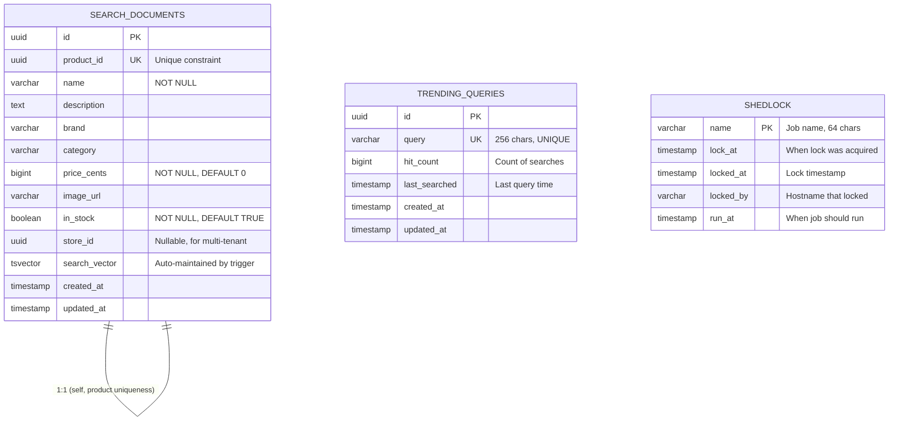

# Search Service - Database Schema (ERD)



## Index Strategy

```sql
-- Primary Indexes
CREATE INDEX idx_search_documents_search_vector ON search_documents USING GIN (search_vector);
-- Cost: Supports FTS queries, ~100ms for avg searches

CREATE INDEX idx_search_documents_category ON search_documents (category);
-- Cost: Faceting by category

CREATE INDEX idx_search_documents_brand ON search_documents (brand);
-- Cost: Faceting by brand

CREATE INDEX idx_search_documents_price ON search_documents (price_cents);
-- Cost: Range queries (minPrice, maxPrice)

CREATE INDEX idx_search_documents_in_stock ON search_documents (in_stock);
-- Cost: Stock filtering

CREATE INDEX idx_search_documents_store_id ON search_documents (store_id);
-- Cost: Multi-tenant filtering

CREATE INDEX idx_trending_queries_hit_count ON trending_queries (hit_count DESC);
-- Cost: Top-N trending query fetches

CREATE INDEX idx_trending_queries_last_searched ON trending_queries (last_searched DESC);
-- Cost: Recent trends
```

## tsvector Configuration

The `search_vector` column uses weighted full-text search:

```sql
-- Trigger function (auto-update on INSERT/UPDATE)
CREATE FUNCTION search_documents_update_vector() RETURNS TRIGGER AS $$
BEGIN
    NEW.search_vector :=
        setweight(to_tsvector('english', COALESCE(NEW.name, '')), 'A') ||
        setweight(to_tsvector('english', COALESCE(NEW.brand, '')), 'B') ||
        setweight(to_tsvector('english', COALESCE(NEW.category, '')), 'B') ||
        setweight(to_tsvector('english', COALESCE(NEW.description, '')), 'C');
    NEW.updated_at := now();
    RETURN NEW;
END;
$$ LANGUAGE plpgsql;
```

### Weight Explanation

- **A (highest):** Product name (exact matches weighted higher)
- **B (medium):** Brand, category
- **C (lowest):** Description (less relevant)

### Query Example

```sql
-- Search for "milk" with ranking
SELECT id, product_id, name, brand, category, price_cents,
       ts_rank_cd(search_vector, query) AS rank
FROM search_documents,
     to_tsquery('english', 'milk') query
WHERE search_vector @@ query
ORDER BY rank DESC
LIMIT 20;
```

## Migrations

| Version | Description |
|---------|-------------|
| V1 | Create search_documents, trending_queries with indexes and triggers |
| V2 | Create trending_queries table |
| V3 | Create shedlock table |
| V4 | Add autocomplete index (trigram on name) — NOT IMPLEMENTED |
| V5 | Add store_id to search_documents for multi-tenancy |

## Table Growth Projections

Assuming 20M products in catalog:

| Table | Rows | Size (with indexes) | Notes |
|-------|------|------------------|-------|
| search_documents | 20M | ~8GB | GIN index ~2GB |
| trending_queries | 100K | ~10MB | Much smaller, rotates |
| shedlock | 5 | ~1KB | Minimal |

### Storage Requirements

- **Allocated:** 50GB PostgreSQL PV
- **Used (estimate):** 15GB
- **Available buffer:** 35GB (capacity planning at 80% → ~40GB used)

### Retention Policy

- **search_documents:** No TTL (delete via ProductDelisted events)
- **trending_queries:** No TTL (manual cleanup via cron, or bounded by 100K limit)
- **shedlock:** Automatic cleanup on job completion

