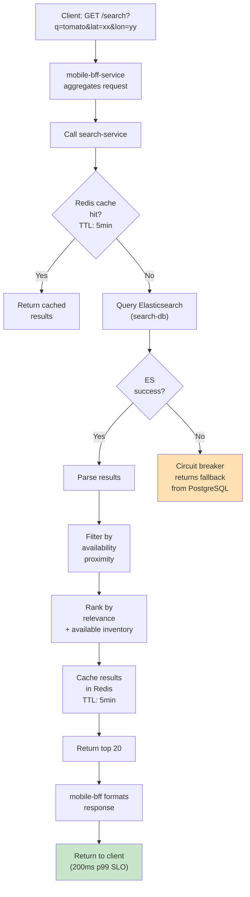
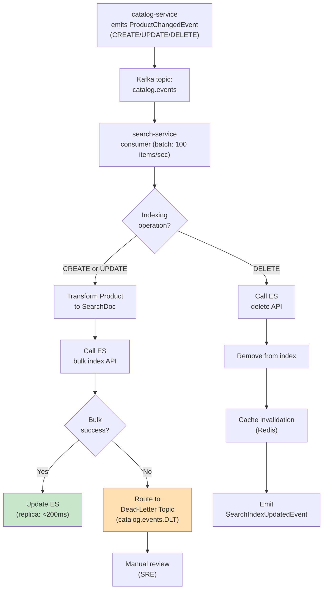

# Search Service - Flowchart

## Search Query Flowchart

```mermaid
flowchart TD
    A["Client: GET /search?q=tomato&lat=xx&lon=yy"] --> B["mobile-bff-service<br/>aggregates request"]
    B --> C["Call search-service"]
    C --> D{"Redis cache<br/>hit?<br/>TTL: 5min"}
    D -->|Yes| D1["Return cached<br/>results"]
    D -->|No| E["Query Elasticsearch<br/>(search-db)"]
    E --> F{"ES<br/>success?"}
    F -->|Yes| G["Parse results"]
    F -->|No| H["Circuit breaker<br/>returns fallback<br/>from PostgreSQL"]
    G --> I["Filter by<br/>availability<br/>proximity"]
    I --> J["Rank by<br/>relevance<br/>+ available inventory"]
    J --> K["Cache results<br/>in Redis<br/>TTL: 5min"]
    K --> L["Return top 20"]
    L --> M["mobile-bff formats<br/>response"]
    M --> N["Return to client<br/>(200ms p99 SLO)"]

    style N fill:#C8E6C9
    style H fill:#FFE0B2
```

## Indexing Flowchart

```mermaid
flowchart TD
    A["catalog-service<br/>emits ProductChangedEvent<br/>(CREATE/UPDATE/DELETE)"]
    A --> B["Kafka topic:<br/>catalog.events"]
    B --> C["search-service<br/>consumer (batch: 100 items/sec)"]
    C --> D{"Indexing<br/>operation?"}
    D -->|CREATE or UPDATE| E["Transform Product<br/>to SearchDoc"]
    E --> F["Call ES<br/>bulk index API"]
    F --> G{"Bulk<br/>success?"}
    G -->|Yes| G1["Update ES<br/>(replica: <200ms)"]
    G -->|No| H["Route to<br/>Dead-Letter Topic<br/>(catalog.events.DLT)"]
    H --> I["Manual review<br/>(SRE)"]
    D -->|DELETE| J["Call ES<br/>delete API"]
    J --> K["Remove from index"]
    K --> L["Cache invalidation<br/>(Redis)"]
    L --> M["Emit<br/>SearchIndexUpdatedEvent"]

    style G1 fill:#C8E6C9
    style H fill:#FFE0B2
```
