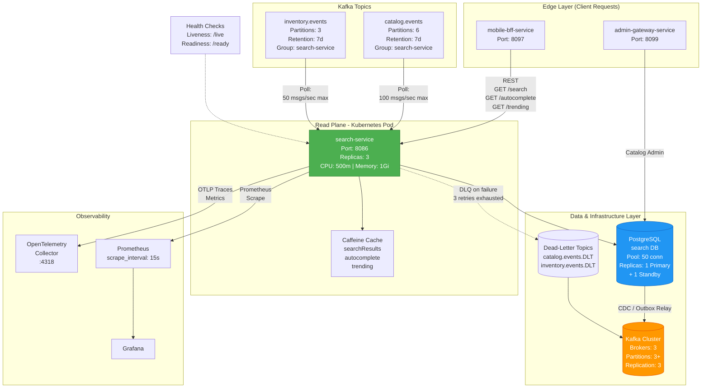

# Search Service - High-Level Deployment



## Service Topology

- **Replicas:** 3 (spread across AZs in asia-south1)
- **CPU Request:** 500m | Limit: 1000m
- **Memory Request:** 1Gi | Limit: 2Gi
- **Storage:** PostgreSQL persistent volume, 50GB provisioned

## Network Policy

```yaml
Egress:
  - PostgreSQL (search DB, port 5432)
  - Kafka brokers (ports 9092, 9093)
  - OpenTelemetry collector (port 4318)

Ingress:
  - mobile-bff-service (port 8086)
  - admin-gateway-service (port 8086)
  - Istio sidecar mesh

DNS:
  - search-service.default.svc.cluster.local
```

## Service Mesh (Istio)

- **Protocol:** HTTP/2
- **mTLS:** STRICT (certificate-based)
- **Circuit Breaker:** Half-open after 50% errors
- **Retry Policy:** Max retries = 3, backoff exponential
- **Timeout:** 30s (per request)
- **Rate Limiting:** 10,000 RPS per replica

