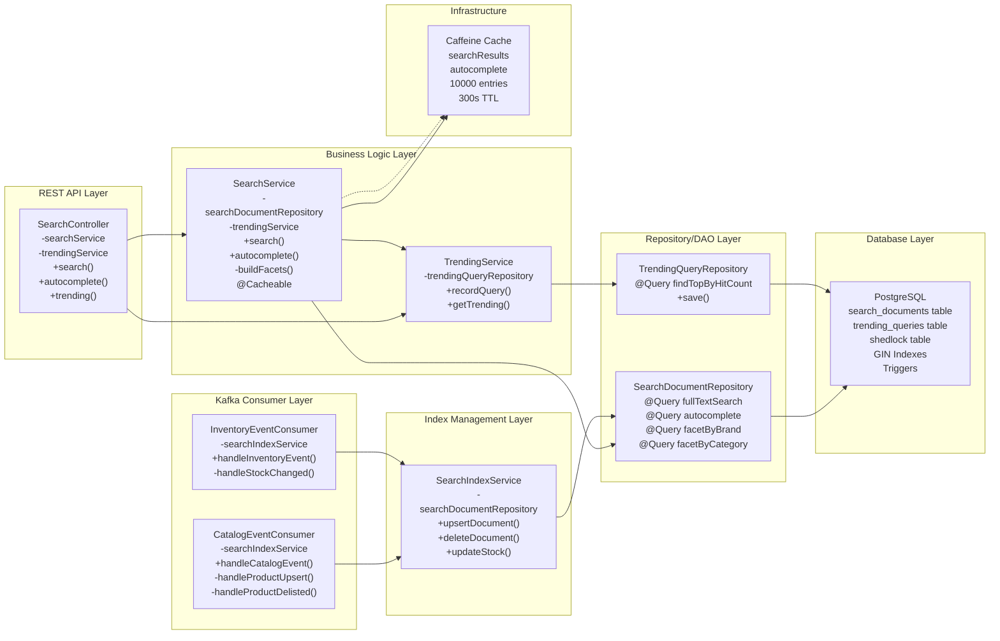
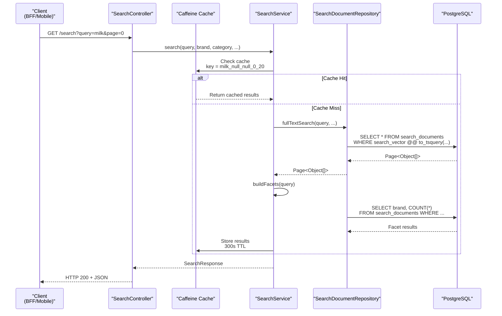
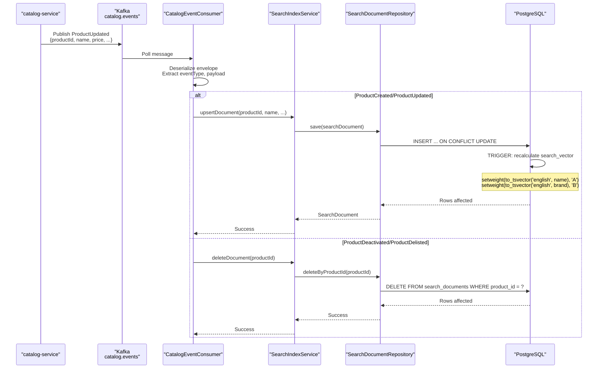
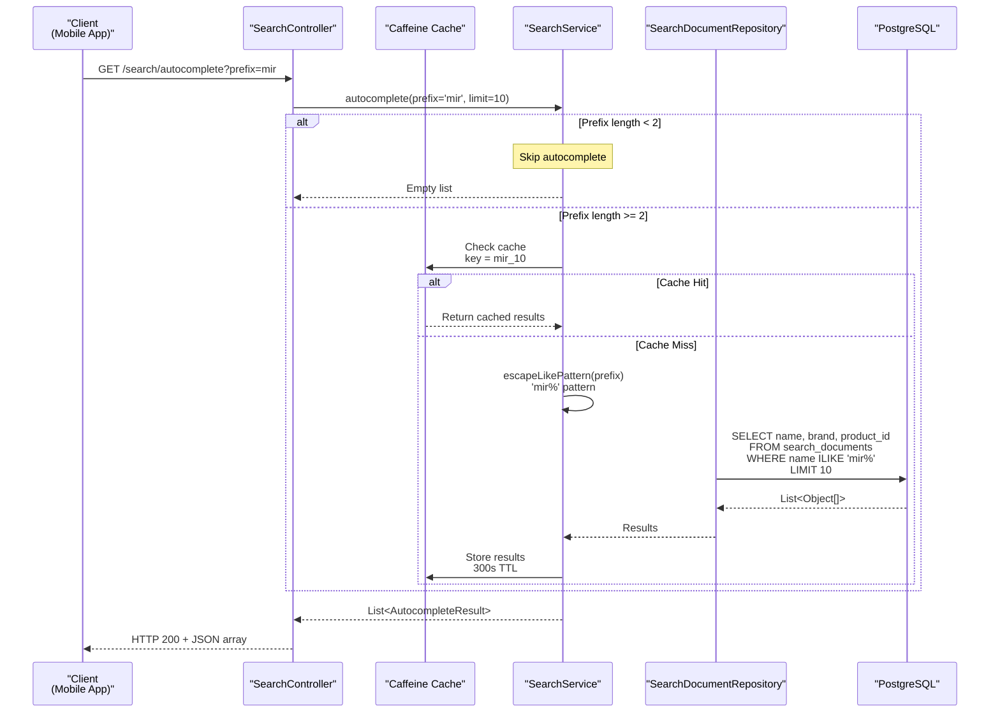
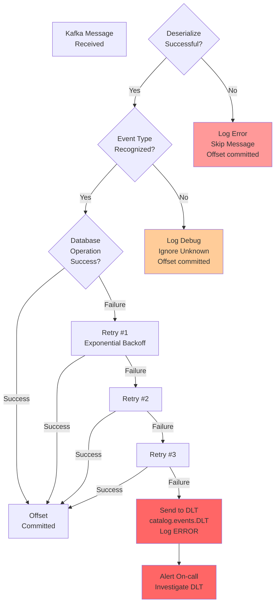

# Search Service - Low-Level Design

## Component Architecture



## Data Flow Diagrams

### Search Query Flow



### Index Update Flow



### Autocomplete Prediction Flow



## State Management

### Distributed Locks (ShedLock)

```mermaid
graph LR
    Job1["Scheduled Job 1<br/>@Scheduled: 5min"]
    Job2["Scheduled Job 2<br/>@Scheduled: 1hour"]
    Job3["Scheduled Job 3<br/>@Scheduled: daily"]

    ShedLock["ShedLock<br/>(Distributed Lock)"]

    DB[("PostgreSQL<br/>shedlock table")]

    Job1 -->|Acquire lock| ShedLock
    Job2 -->|Acquire lock| ShedLock
    Job3 -->|Acquire lock| ShedLock

    ShedLock -->|INSERT/UPDATE| DB

    Note over ShedLock: Prevents concurrent execution<br/>across multiple replicas<br/>Lock held per job, released on completion
```

### Cache Invalidation

```mermaid
graph LR
    Update["Product Updated<br/>in Catalog"]
    KafkaEvent["ProductUpdated<br/>Event on Kafka"]
    Consumer["CatalogEventConsumer"]
    IndexService["SearchIndexService"]
    Repository["SearchDocumentRepository"]

    DBTrigger["PostgreSQL<br/>TRIGGER"]
    CacheInvalidate["Cache Hit:<br/>Automatically invalid<br/>on next query<br/>TTL: 300s"]

    Update -->|Outbox/CDC| KafkaEvent
    KafkaEvent --> Consumer
    Consumer --> IndexService
    IndexService --> Repository
    Repository -->|Upsert| DBTrigger

    DBTrigger -.->|Triggers tsvector<br/>recalculation| CacheInvalidate

    Note over CacheInvalidate: Cache eviction is TTL-based<br/>No explicit invalidation call
```

## Error Handling



## Performance Characteristics

| Operation | Latency (p50) | Latency (p99) | Notes |
|-----------|---------------|---------------|-------|
| Search (cached) | 5ms | 20ms | Caffeine hits |
| Search (DB query) | 45ms | 150ms | tsvector GIN index |
| Autocomplete (cached) | 3ms | 10ms | Caffeine hits |
| Autocomplete (DB query) | 30ms | 80ms | ILIKE without trigram |
| Index update (insert) | 50ms | 200ms | Trigger overhead |
| Trending fetch | 10ms | 30ms | Small table, in-memory |

