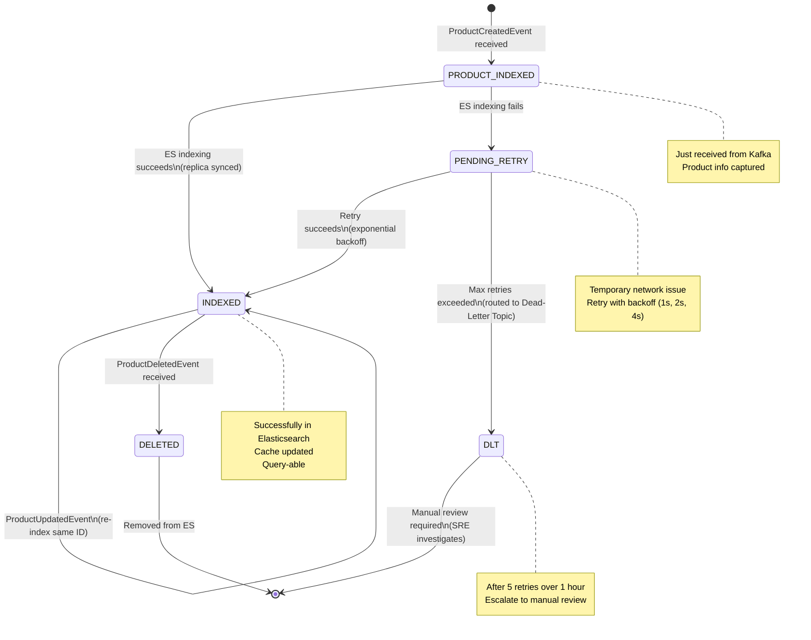
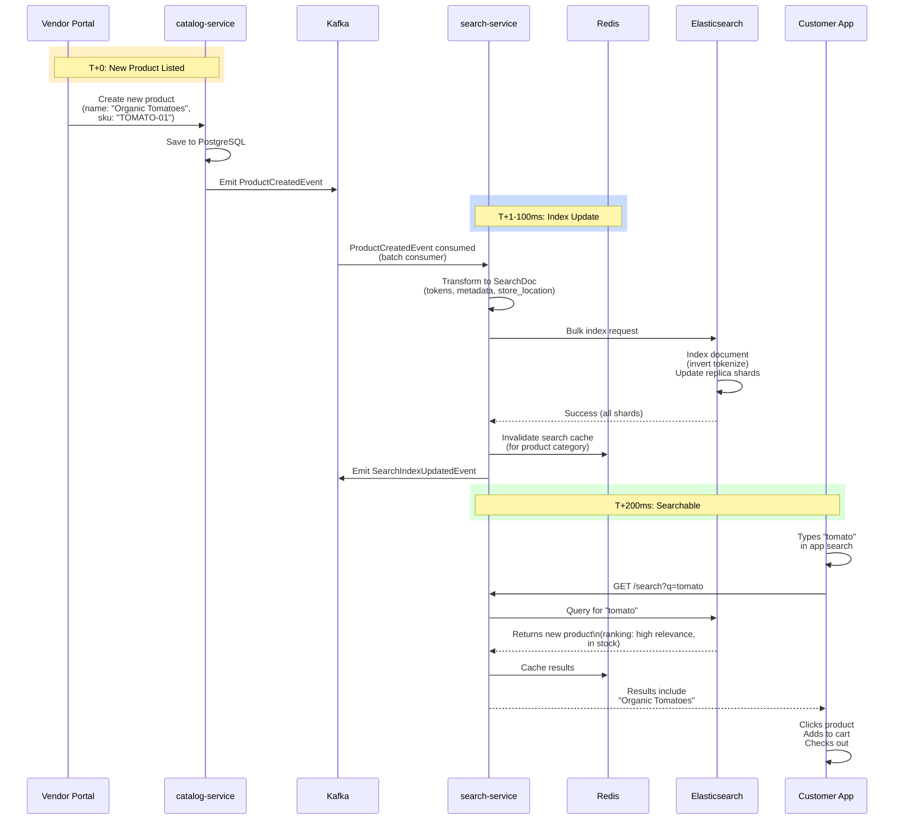

# Search Service - Sequence, State Machine, End-to-End

## Sequence Diagram: Search Query with Caching

```mermaid
sequenceDiagram
    participant Client
    participant BFF as mobile-bff
    participant Search as search-service
    participant Redis as Redis Cache
    participant ES as Elasticsearch
    participant DB as PostgreSQL

    Client->>BFF: GET /search?q=tomato
    BFF->>Search: Call /search?q=tomato&filters=...
    activate Search

    Search->>Redis: GET search_results:tomato:filters_hash
    Redis-->>Search: cache miss (or expired)

    Search->>ES: Query: match(name, description) tomato
    activate ES
    ES-->>Search: Results: [{id, name, store_id, inventory}]
    deactivate ES

    Search->>Search: Post-process: filter by store availability
    Search->>Search: Rank by: relevance + inventory count
    Search->>Redis: SET search_results:tomato (TTL: 5min)
    Redis-->>Search: Cached

    Search-->>BFF: { results: [...], query_time_ms: 45 }
    deactivate Search

    BFF->>BFF: Format for mobile UI
    BFF-->>Client: JSON response

    == Next identical query (within 5 min) ==

    Client->>BFF: GET /search?q=tomato (identical)
    BFF->>Search: Call /search
    Search->>Redis: GET search_results:tomato
    Redis-->>Search: Hit (cached)
    Search-->>BFF: Cached results (from Redis)
    BFF-->>Client: Fast response (<10ms)
```

## State Machine: Indexing Status



## End-to-End: Catalog Update → Search Available



---

**Search SLO**: <200ms p99 latency; 99% availability
**Indexing SLO**: New products searchable within 500ms
**Cache TTL**: 5 minutes (balance freshness vs hit rate)
