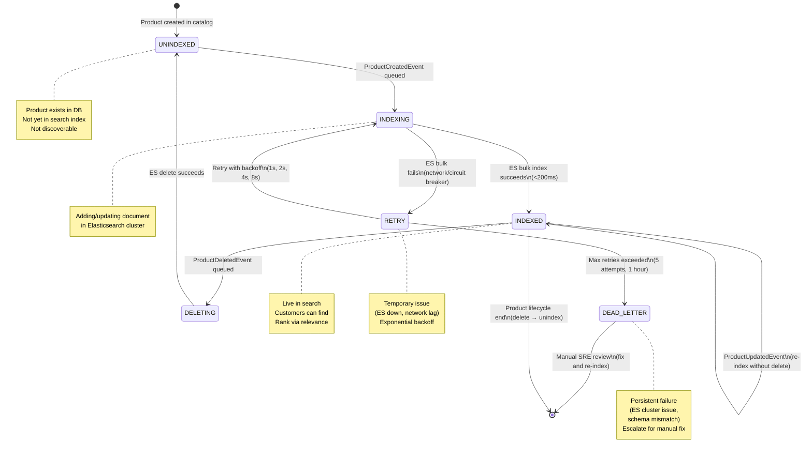

# Search Service - State Machine & End-to-End

## State Machine: Search Index Lifecycle



## End-to-End: Search Availability & Delivery

```
SCENARIO: Fast Product Search with Store Proximity

T+0s: Customer opens app (location: 37.7749° N, -122.4194° W)
      Enters search: "fresh tomatoes"

T+50ms: mobile-bff calls search-service
        Request: q=fresh tomatoes, lat=37.7749, lon=-122.4194

T+80ms: search-service queries Redis
        Cache hit (populated from earlier category search)
        Applies geo-filter (within 5km)
        Ranks by: availability (inventory >0) + distance

T+120ms: Results returned
        Top 3: Store A (2km, 50 units), Store B (3km, 20 units), Store C (4.5km, 100 units)
        {
          results: [
            { id: TOMATO-01, name: "Organic Tomatoes", store: A, distance: 2km, inventory: 50 },
            { id: TOMATO-02, name: "Standard Tomatoes", store: B, distance: 3km, inventory: 20 },
            { id: TOMATO-S1, name: "Cherry Tomatoes", store: C, distance: 4.5km, inventory: 100 }
          ]
        }

T+150ms: mobile-bff formats UI
        Customer sees results with store location map, travel time

T+200ms: Customer clicks "Organic Tomatoes"
        Product detail loaded
        Adds to cart
        Checks out

---

SCENARIO: Product Update → Live Search

T+0s: Vendor Portal: Update "Organic Tomatoes" inventory (50 → 45)
      catalog-service records change

T+5ms: ProductUpdatedEvent emitted to Kafka
       {product_id, sku, inventory: 45, updated_at}

T+50ms: search-service consumer picks up event
        Batch consumer (processes 100 events/sec)

T+80ms: Transform product to SearchDoc
        Call ES bulk update API

T+150ms: ES cluster updates document
         Replica replication syncs (all shards)
         Inventory field now shows 45

T+180ms: Redis invalidates product cache
         Next search will refresh from ES

T+200ms: (If customer searches again)
         Gets updated product with inventory: 45
         Ranking unchanged (still top result if available)

---

FAILURE SCENARIO: ES Cluster Down

T+0s: ES cluster goes offline
      Circuit breaker engages

T+50ms: Customer searches (cache expired)
        Circuit breaker OPEN

T+60ms: search-service fallback:
        Query PostgreSQL search_index table
        Results slower (~500ms) but available
        Return with disclaimer: "Limited results (stale index)"

T+500ms: Results returned (degraded SLO)
         Customer can still search

T+5min: ES cluster back online
        Circuit breaker resets
        ES re-syncs from Kafka backlog (~30 sec catch-up)

T+5:30min: ES fully recovered
           Full search performance restored
```

---

**Search SLA**:
- Normal: <200ms p99 response time, 99% availability
- Degraded: <500ms p99 (PostgreSQL fallback), 99.9% availability (never down)
- Full recovery: <5 min from ES cluster outage
