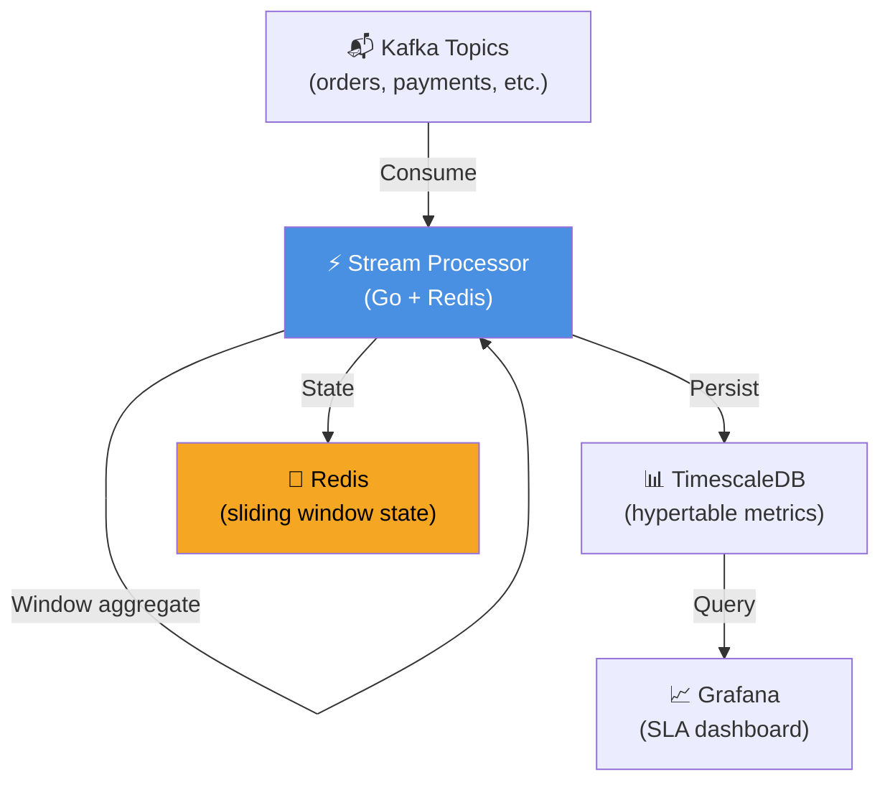
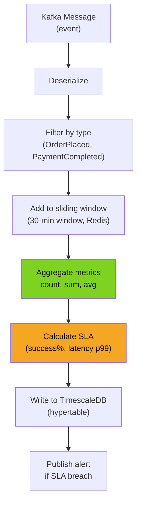
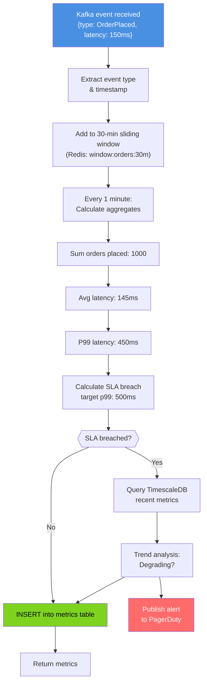
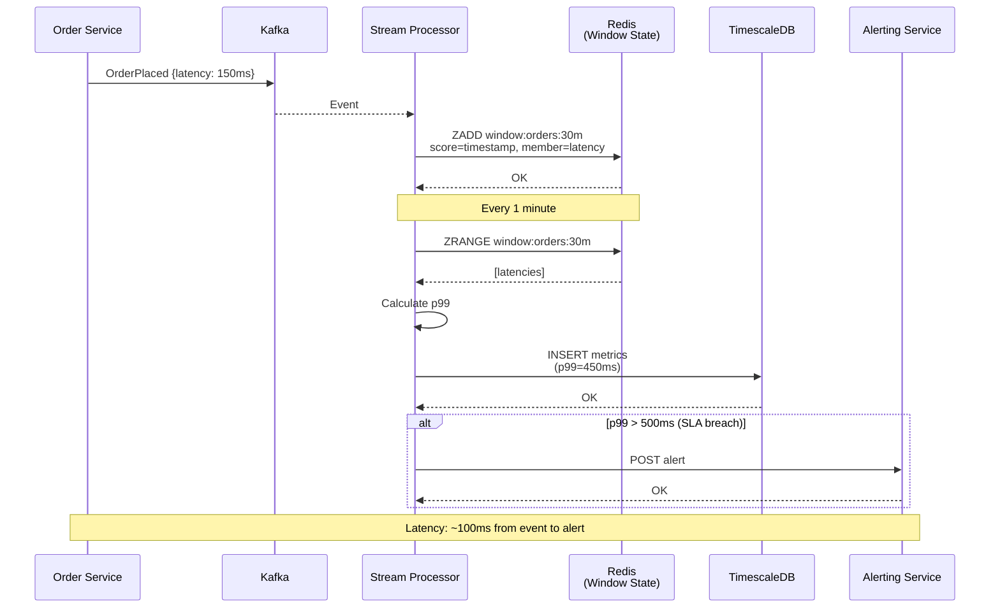
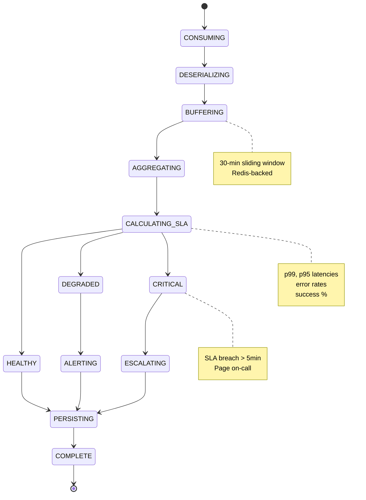
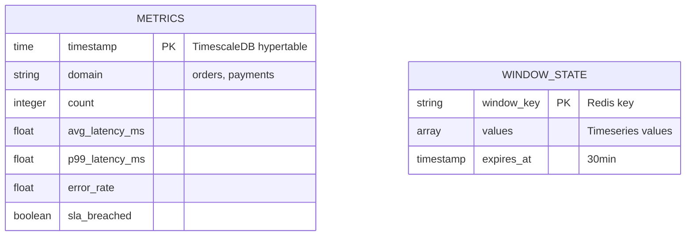
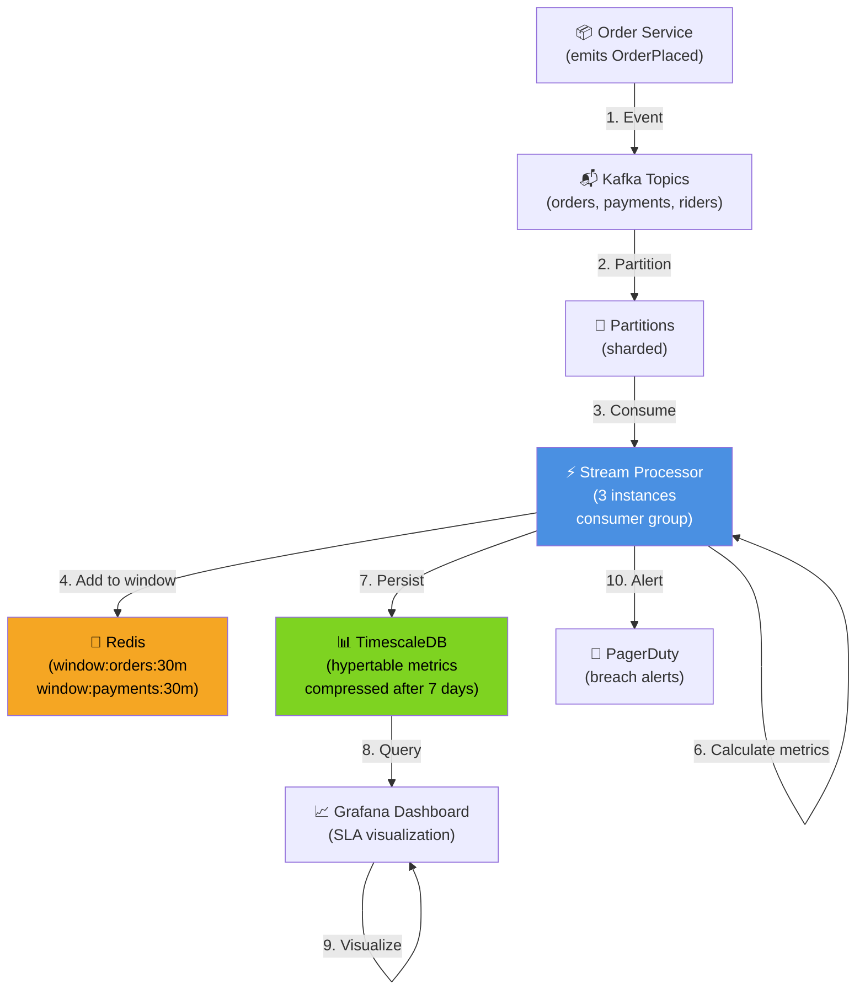

# Stream Processor Service - All 7 Diagrams

## 1. High-Level Design

## 2. Low-Level Design

## 3. Flowchart - Metrics Aggregation

## 4. Sequence - SLA Calculation

## 5. State Machine

## 6. ER - Metrics Schema

## 7. End-to-End

