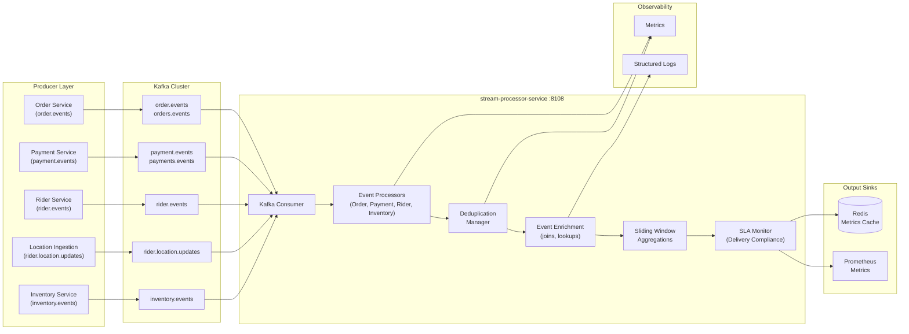

# Stream Processor Service - High-Level Design

## Key Characteristics

- **Multi-Source Streaming**: Order, payment, rider, inventory, location events
- **Real-Time Aggregations**: Sliding windows (30s, 5m, 1h) for counters/gauges
- **Deduplication**: Per-event idempotent processing with offset tracking
- **Event Enrichment**: Join with catalog/pricing lookups
- **SLA Monitoring**: Delivery compliance per zone with 30-min windows
- **Redis Dual Output**: TTL-bounded metrics for ops dashboards
- **Prometheus Native**: Direct metric emission for alerting
- **Stateless Design**: Consumer group tracks offsets
