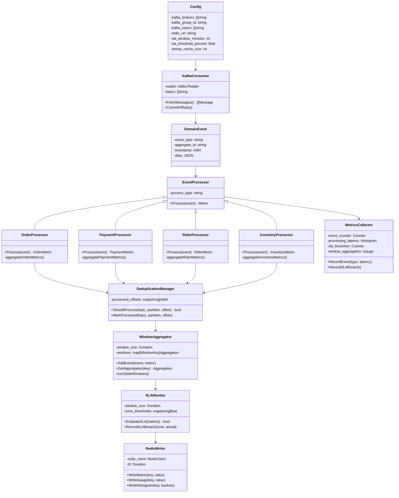

# Stream Processor Service - Low-Level Design

## Component Responsibilities

| Component | Responsibility |
|-----------|-----------------|
| **KafkaConsumer** | Multi-topic Kafka consumption |
| **EventProcessor** | Domain-specific metric extraction |
| **OrderProcessor** | Order event aggregation (created, placed, delivered) |
| **PaymentProcessor** | Payment event aggregation (completed, failed) |
| **RiderProcessor** | Rider event aggregation (accepted, started, completed) |
| **InventoryProcessor** | Inventory event aggregation (reserved, released) |
| **DeduplicationManager** | Per-topic/partition/offset idempotent tracking |
| **WindowAggregator** | Sliding windows (30s, 5m, 1h) |
| **SLAMonitor** | Delivery compliance evaluation per zone |
| **RedisWriter** | TTL-bounded metrics cache |
| **MetricsCollector** | Prometheus emission |
