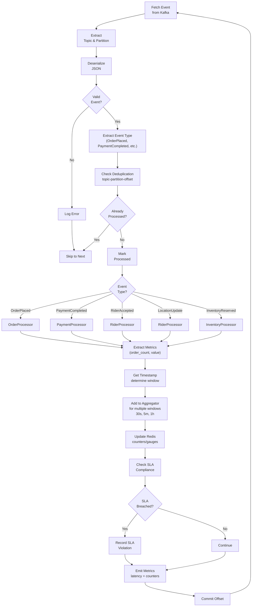

# Stream Processor Service - Event Processing Flowchart

## Flow Details

1. **Event Fetch**: Kafka consumer polling
2. **Deserialization**: JSON parsing and validation
3. **Deduplication**: Check offset to prevent reprocessing
4. **Event Classification**: Route to appropriate processor
5. **Metric Extraction**: Domain-specific aggregation keys
6. **Windowing**: Add to 30s/5m/1h sliding windows
7. **Redis Write**: Update TTL-bounded metric gauges
8. **SLA Evaluation**: Check delivery compliance thresholds
9. **Metrics Emission**: Prometheus counter/gauge updates
10. **Offset Commit**: Mark as processed to Kafka
