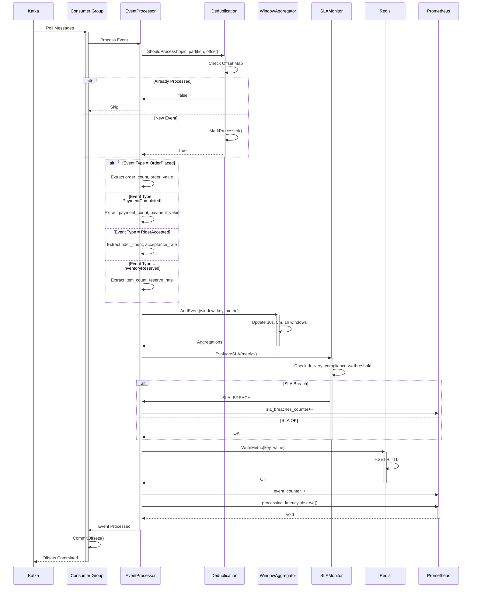

# Stream Processor Service - Event Processing Sequence

## Sequence Patterns

- **Consumer Polling**: Multi-partition polling with group coordination
- **Deduplication Check**: Early exit for already-processed events
- **Event Routing**: Type-based processor selection
- **Multi-Window Aggregation**: Simultaneous 30s/5m/1h updates
- **SLA Evaluation**: Real-time compliance checking
- **Redis Write**: Metrics cache update with TTL
- **Metrics Emission**: Prometheus counter and latency histograms
- **Offset Commit**: Only after successful processing
